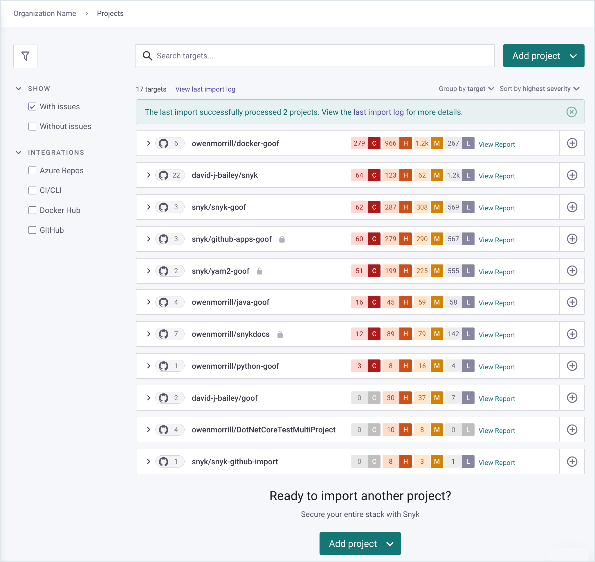
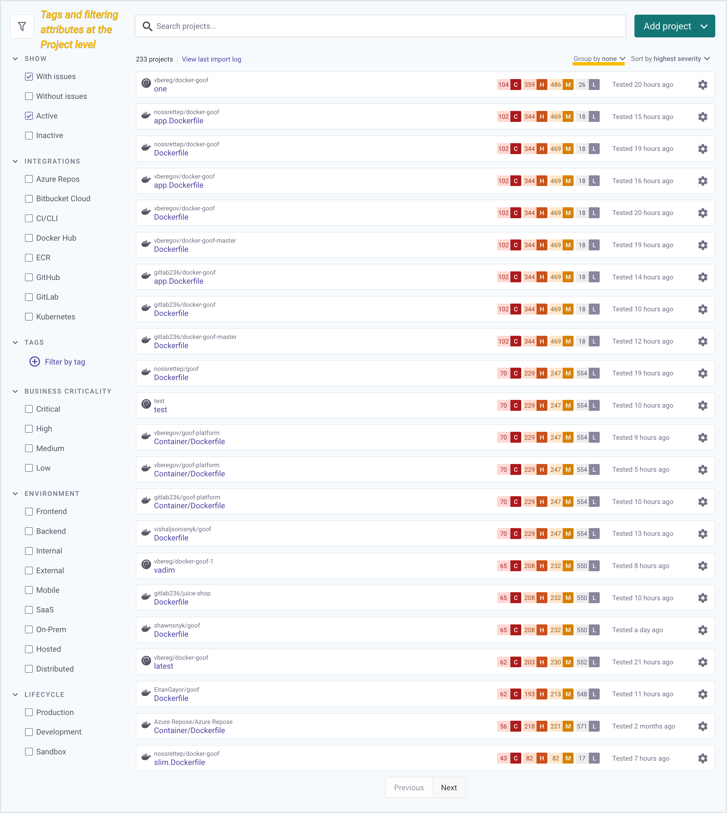
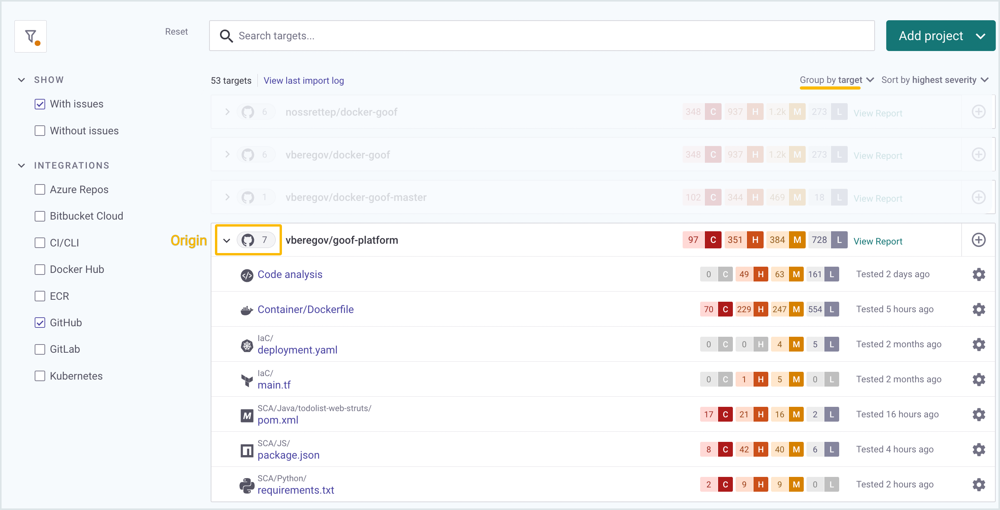

# Projects


See [Snyk Projects](../snyk-web-ui/introduction-to-snyk-projects/) for more details.


Snyk Project information appears in the **Projects** menu in the Snyk dashboard. The filters that are visible depends on the grouping option you choose.

<figure><figcaption>
The Projects menu in the Snyk Web Ui
</figcaption></figure>

### Projects

Snyk Projects define the manifest files that Snyk scans for issues, with configuration information defining how to run that scan.

<figure><figcaption></figcaption></figure>

### Targets

Projects are held in a Target, which is an external resource that Snyk has scanned, such as a code repository.

<figure><figcaption>
Group by target applies filtering attributes at the Target level
</figcaption></figure>

### Origins

The origin indicates the Target ecosystems, such as CLI, GitHub, or Kubernetes:

<figure><figcaption>
An origin defines the Target ecosystem
</figcaption></figure>
