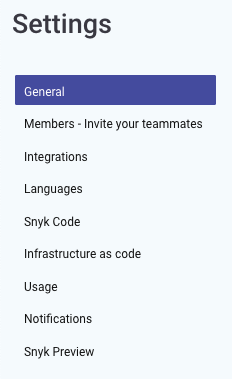

# Snyk settings

Click on settings

to view Snyk application settings:

**Docs**

[Members](https://docs.snyk.io/user-and-group-management/managing-groups-and-organizations/invite-and-collaborate-with-team-members)

[Integrations](https://docs.snyk.io/integrations)

[Languages](https://support.snyk.io/hc/en-us/sections/360001087857-Language-package-manager-support)

[Snyk Code](https://docs.snyk.io/snyk-code)

[Infrastructure as Code](https://docs.snyk.io/snyk-infrastructure-as-code)

[Usage](https://docs.snyk.io/user-and-group-management/managing-settings/usage-page-details)

[Notifications](https://docs.snyk.io/user-and-group-management/notifications/notification-management)

[Snyk Preview](https://docs.snyk.io/getting-started/snyk-billing-plan-onboarding/snyk-preview)

