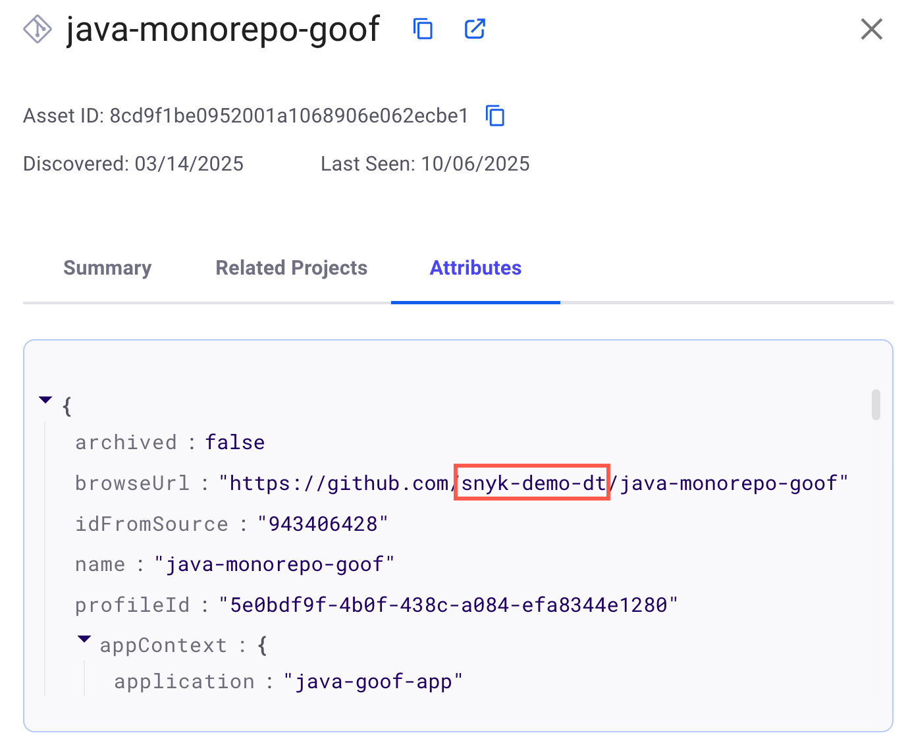

# Assets inventory filters


**Release status**\
Risk factors for Snyk AppRisk are in Early Access and are available only with Snyk Enterprise plans with Snyk AppRisk. If you want to set it up in your Group, contact your Snyk account team.


From the **Inventory** > **All Assets** tab, you can use the search bar to look for specific keywords across assets. Results can include the asset name and data retrieved from the **Attributes** tab of an asset.

## Quick filters

Quick filters are predefined filters that you can apply to assets. Available quick filters:

* **Assets with Risk factors `DEPLOYED` and `PUBLIC FACING` and `COVERAGE GAP`**: displays only the assets that have both `Deployed` and `Public facing` risk factors, and that have a coverage gap for the selected Snyk products.
* **Assets with Risk factors `DEPLOYED` and `COVERAGE GAP`**: displays only the assets that have the `Deployed` risk factor, and with a coverage gap for the selected Snyk products.
* **Assets with Repository freshness** **`ACTIVE` and `COVERAGE GAP`**: displays only the assets from active repositories and with a coverage gap for the selected Snyk products.
* **Assets with Asset Class `A` and `COVERAGE GAP`**: displays only Class A assets that have a coverage gap for the selected Snyk products.

You can change or add additional filters by clicking **Advanced Filters**.

## Advanced filters

Using advanced filters, you can define and apply filters to assets based on specific criteria. For details on how to define filters, see [Define filters](../manage-risk/policies/assets-policies/create-policies.md#define-filters).

When you select advanced filters, you can specify one or more sets of criteria:

* **Property**: a characteristic of the asset. You can select it from a dropdown list.
* **Condition:** depends on the asset selected (such as `contains` or `does not contain` for `asset name`).
* **Value:** depends on the **Property** and **Condition**.

You can add as many filters as needed by clicking **Add Filter**.


If you are using Snyk Essentials for the first time, Snyk recommends starting with the **Coverage** filter to determine where Snyk is already implemented.


You can filter the information for all inventory layouts using the available filters in the **Advanced Filters** section.


The filters **Application**, **Catalog name**, **Category**, **Lifecycle**, **Owner**, **Title** are visible only if you have configured the [application context](../developer-tools/scm-integrations/application-context-for-scm-integrations/) catalog for your SCM integrations.


* **Application**: the applications for which you have configured the application context catalog in Snyk Essentials.
* **Asset ID**: the unique identifier of the asset.
* **Asset name**: the name of the asset.
* **Asset type**: the repository, package, or scanned asset.
* **Attribute**: the asset attributes.
* **Catalog name**: the name of your application context catalog.
* **Category**: the category of a repository asset. For example, a service or a library.
* **Class**: the class of the asset.
* **Clusters**: the cluster names where the asset is deployed. An asset can be deployed in more than one cluster.
* **Coverage**: the Snyk products used to scan the asset. This filter identifies the assets scanned by the products at least once.
* **Coverage gap**: the products for which the asset has not been scanned and that do not meet the Set Coverage Control Policy requirements. The coverage gap applies only if you previously defined the coverage requirements of an asset and the asset has never been scanned, or the last scan is older than the default scanning frequency.
* **Developers**: the developers who contributed to the asset.
* **Discovered**: the period when the asset was discovered.
* **Issue severity**: the severity of the issue: critical, high, medium, or low.
* **Issue source**: where the issue was identified - SCM or third-party integrations. A source category is visible only if there is at least one source present.
* **Last seen:** the most recent time the asset was detected by Snyk in any of the sources.
* **Lifecycle:** the lifecycle state of the application context catalog component.
* **Locked attributes**: specifies if the attribute value is locked.
* **Organizations**: all the Snyk Organizations that are mapped to an asset.
* **Owner:** the team owning the repository for which the application context catalog was configured.
* **Related package**: a package related to the asset.
* **Repository freshness:** the status of the repository and the date of the last commit.
  * **Active**: with commits made in the last 3 months.
  * **Inactive**: with commits made in the last three to six months.
  * **Dormant**: with no commits made in the last six months.
  * **N/A**: with no commits detected by Snyk Essentials. This filter indicates that the repository was detected through a Snyk scan but not directly from the SCM. To detect SCM repositories, you must set up SCM integration at the Group level.
* **Risk factors**: the available risk factors. Risk factors refer to assets that are vulnerable to security threats due to their exposure, sensitivity, compliance with security standards, and vulnerability history.
* **Runtime discovered**: the period when Snyk discovered the runtime image asset.
* **Runtime last seen**: the most recent time Snyk detected this image asset.
* **SCM Integrations**: specifies how the asset is integrated with Snyk - at Group or Org level.
* **SCM Organization**: the SCM Organization or Workspace where this asset is located.
* **SCM Project**: the Project in the Azure DevOps or Bitbucket SCM integrations, where this asset is located.
* **Source**: the source of the asset.
* **Tags**: information about the detected languages and repository update status.
* **Title**: the name of the component for which the application context catalog was configured.
* **Visibility:** the visibility status of the repositories. This can be:
  * **Public**: repositories that are publicly accessible.
  * **Private**: restricted repositories.
  * **Internal**: internal repositories specific to GitHub and GitLab.
* **Source** - specify the asset source.
* **Tags** - information about the detected languages and repository update status.
* **Title\*** - represents the name of the component for which the application context catalog was configured.

## Filtering using the unenriched repository banner

The unenriched repositories banner highlights repositories not discovered by your Group-level SCM integration. These assets are instead discovered through Organization-level integrations or Snyk targets.

You can filter unenriched repositories directly from the banner by selecting the repository count.

<figure><figcaption></figcaption></figure>

#### Unenriched assets with Group SCM integration

If you use a Group-level integration, the banner shows assets not discovered through that integration. Although the integration is in place, some assets are not being pulled in. Possible reasons for unrenriched assets:

* Organization-level integration has broader permissions than the Group-level integration.
* A repository previously tested by Snyk was deleted in the SCM before the Group-level integration was set up.
* Snyk CLI Projects have a different repository URL than the SCM repository URL.
* The SCM Organization is not explicitly configured in the Group-level integration.
* Assets detected by a non-SCM vendor (for example, GitGuardian).

## Troubleshooting

### The assets are not discovered by Group or Organization-level integrations.

The assets are not discovered by Group or Organization-level integrations, but are discovered only through Snyk targets (for example, CLI Projects or old deleted repositories).

To resolve this issue, select the unenriched repositories that are not being discovered through Group-level SCM integration and filter SCM sources to isolate assets not discovered by integrations.

Example:

<figure><figcaption></figcaption></figure>

Check if the repository still exists in the SCM. If it was deleted, remove the asset by deleting its Snyk target.

If the repository was imported but not rediscovered, ensure the Group and Organization-level permissions for the SCM integration are correct.

### The assets are discovered by Organization-level integrations, but not by Group-level integrations

If the assets are discovered by Organization-level integrations but not by Group-level integrations:

* Check for a missing SCM Organization in a Group-level integration.
* Compare permissions between Group- and Organization-level integrations.
* Confirm if the asset was discovered through a different vendor integration.

### Deeper analysis of asset source

For deeper analysis, use the dashboard to see where assets are discovered and how they are enriched. Use the advanced filters to display only assets that have a source other than Snyk (for example, GitHub).

For GitHub and Azure, ensure that the Organization is included in the profile. To see the Organization name, click an asset and navigate to the **Attributes** tab.

<figure><figcaption></figcaption></figure>

If your profile includes the Organization, check the token permissions and ensure access to the unenriched repositories.

For GitLab and BitBucket, ensure that the Group-level tokens have access and the right permissions for the Organization.

If the source of the asset is another vendor, ensure the repository URLs match in order to avoid creating duplicate assets.
