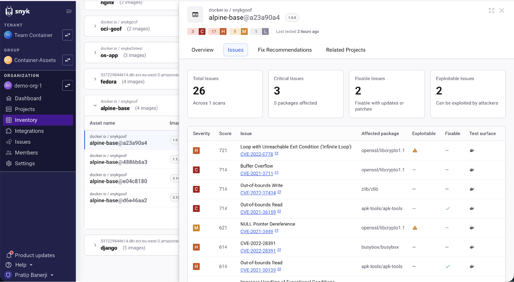
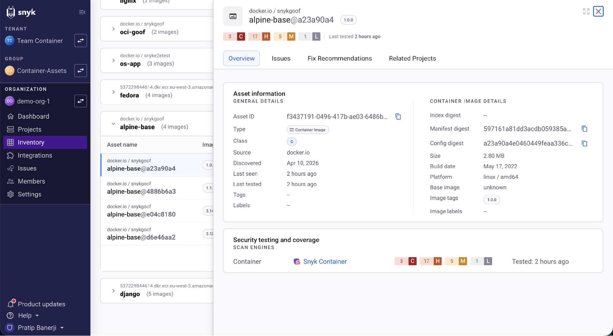
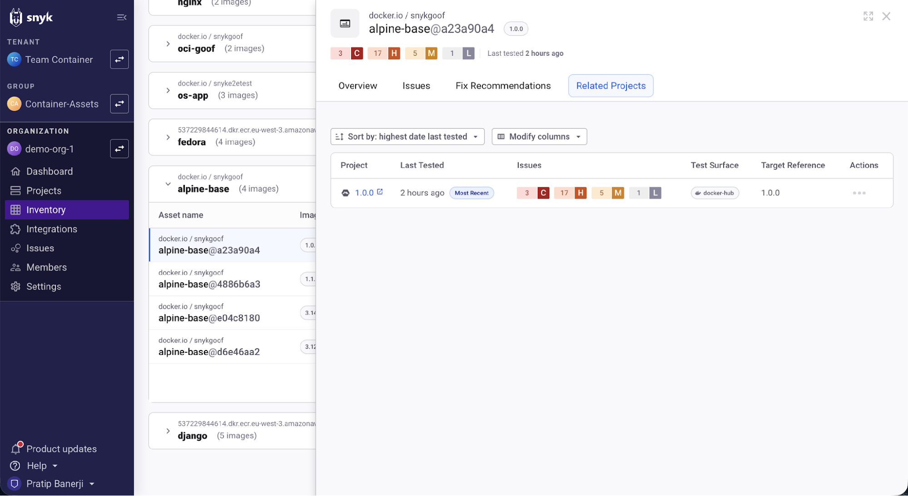
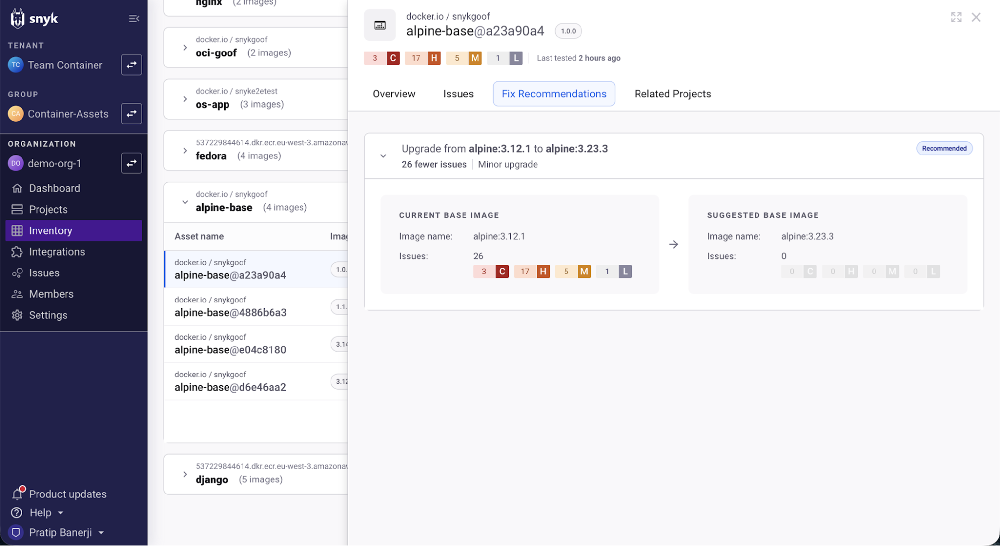
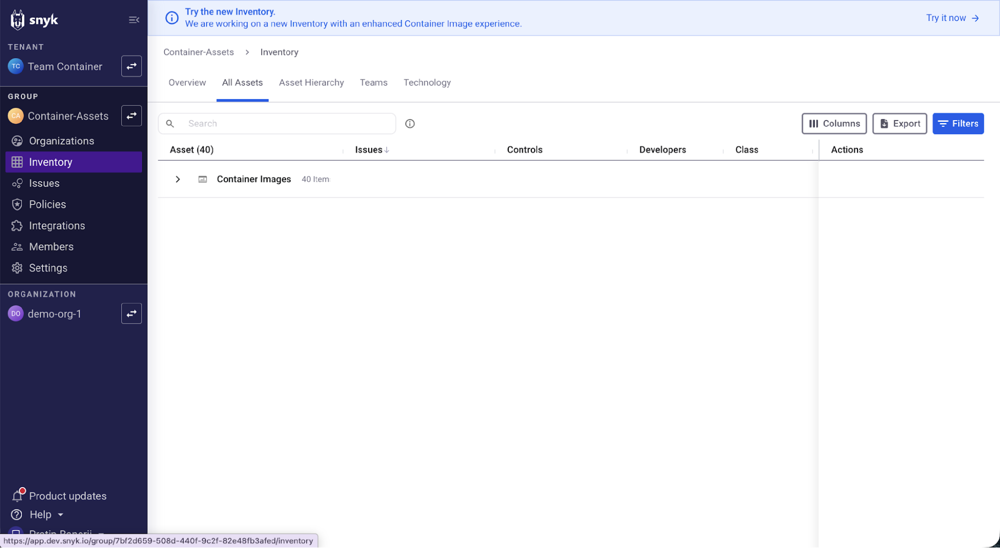
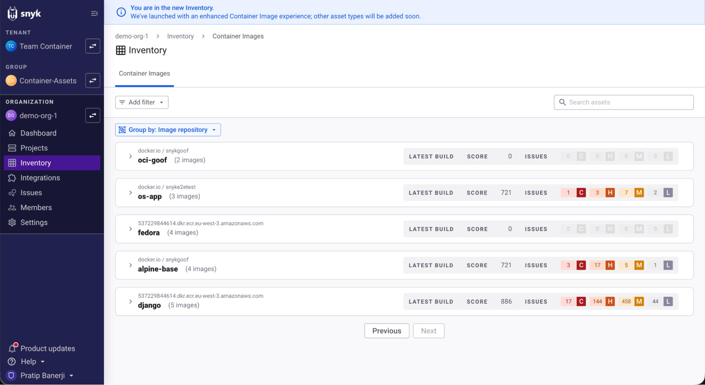
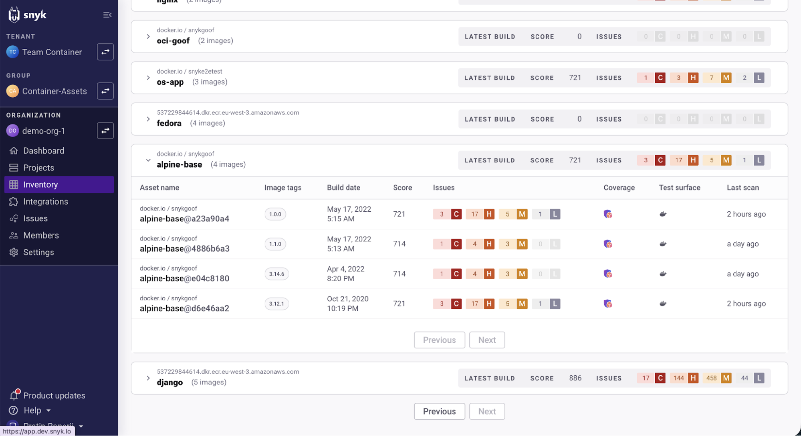
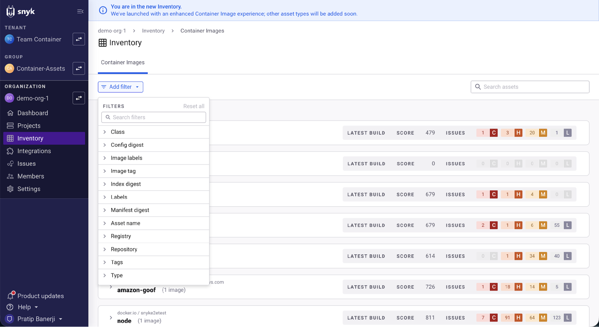
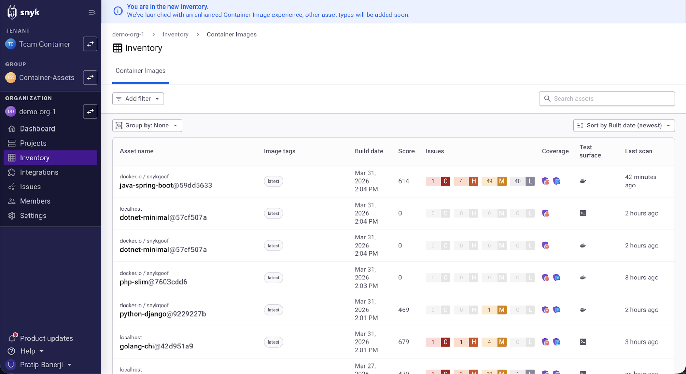

# Container image inventory

Container image inventory is a unified view in the Snyk platform that consolidates all of your container images into a single, manageable list, regardless of where they were scanned.

Instead of navigating a fragmented set of per-scan Projects, you get one authoritative inventory of unique container image assets, each identified by **Registry + Repository + Config Digest**. A single image scanned from a registry import, from the CLI, and a Kubernetes workload all appear as **one asset** with a single, deduplicated issue count.

| Capability | Description |
| :--- | :--- |
| **Unified asset list** | View all unique container images across your Organization or Group in one place |
| **Deduplicated issue counts** | Issues from multiple scan sources are merged — no more inflated counts |
| **Version grouping** | Group images by repository to explore the full version history of an image |
| **Filter** | Filter by registry, image repository, tag, image labels, digest, class, and more |
| **Search** | Quickly find an image by matching against the beginning of the asset name |
| **Base image fix recommendations** | View base image upgrade recommendations with impact analysis |
| **Related Projects** | See all Snyk Projects linked to a single container image asset in one place |

## How it works

Container image inventory identifies each unique image by its **Registry + Repository + Config Digest**. Because this identity is based on the immutable config digest rather than a mutable tag, one image scanned from the CLI, a container registry, and a Kubernetes workload appears as a single asset — not three separate Projects.

Issues from all scan sources are merged and deduplicated, so you see one count per unique vulnerability rather than inflated totals from overlapping scans. Images are grouped by image repository (registry and repository), giving you a version history view where you can compare build dates, risk scores, and issue counts across digests and spot regressions over time. Each asset also surfaces key metadata — tags, inferred base image, test surface, and last scan date — in one place.

## What you need to do

Depending on how you scan containers, you may need to take the following steps to ensure your images appear in the inventory:

- **CLI users** — Upgrade to Snyk CLI version 1.1303.0 or later (which bundles an updated snyk-docker-plugin) and re-run `snyk container monitor` for your images.
- **Container Registry integrations** — Newly imported images automatically populate the inventory. Existing Projects appear in the inventory when they are retested, either manually from the UI or on a recurring test schedule.
- **Kubernetes (`snyk-monitor`)** — Upgrade `snyk-monitor` in your cluster to a version bundled with the updated snyk-docker-plugin, then redeploy your application to the cluster.


Not all existing Projects have the metadata required to compute the new asset identity. To fully populate the inventory for existing Projects, CLI and Kubernetes users must upgrade and re-scan.


## Use container image inventory

Container image inventory is accessible from the **Inventory** navigation item at both the Organization and Group levels.

### Navigate to the inventory

Select **Inventory** in the left-hand navigation to access container image inventory.

**At the Organization level**, selecting Inventory opens the new container image inventory directly. There is no previous inventory experience at the Organization level, so the new view is the only one available. The **Container Images** tab is selected by default, showing all unique container image assets within that Organization.

**At the Group level**, the existing Asset Inventory remains the default view. A banner at the top of the page invites you to try the new container image experience. Click **Try it now** to switch. You can switch back and forth between the existing Asset Inventory and the new container image inventory at any time — both views remain available. Over time, Snyk expects to add more asset types to the new view, and the older experience will eventually be deprecated.

### Grouped view (default)

By default, the inventory groups assets by **Image repository** (Registry + Repository). Each group row shows the repository name, the number of images within the group, and aggregated metadata from the most recent image in that group (by build date), including risk score and issue counts broken down by severity.


Risk score is shown in both the asset table and the issues table only if your Group or Organization has enabled **Risk score** under **Snyk Preview** settings and your Projects have been re-scanned since it was enabled. If risk score is not enabled, the score columns will not be populated.


Groups are sorted by most recent build date by default. You can expand any group to reveal the individual image assets within it. Each asset row within the group displays:

| Column | Description |
| :--- | :--- |
| **Asset name** | Registry, repository, and a short config digest identifier (for example, `alpine-base@a23a90a4`) |
| **Class** | The asset classification (A through E). Class is configurable. |
| **Image tags** | The distinct set of tags seen across all discovery sources for this asset |
| **Build date** | The date the image was built |
| **Score** | The maximum risk score across all related Snyk Project discovery sources |
| **Issues** | The summed issue counts across discovery sources, broken down by severity (critical, high, medium, low) |
| **Coverage** | Security testing and scan engine coverage |
| **Test surface** | The distinct set of test surfaces (for example, CLI, container registry, Kubernetes) |
| **Last scan** | The most recent scan timestamp across all related discovery sources |

Within an expanded group, assets are sorted by build date so you can easily identify the most recent version. Pagination controls (Previous / Next) appear when a group contains more assets than fit on one page.

### Flat (ungrouped) view

To see all assets in a single flat list instead of grouped by repository, click **Group by** and select **None**. This displays every individual image asset as its own row, with the full set of columns visible.

You can sort the flat view by build date, score, issue count, last scan, class, discovered, or updated — in ascending or descending order — using the sort control in the top-right corner. Sorting currently applies to the flat view; support for sorting the grouped view is planned for a future release.

### Filter and search

Click **Add filter** to open the filter panel. Filters are additive (combined with AND logic). The following filter dimensions are available:

| Filter | Description |
| :--- | :--- |
| **Asset name** | Filter by the full asset name (`registry/repository@digest`) |
| **Class** | Filter by asset classification (A, B, C, D, E) |
| **Config digest** | Filter by config digest |
| **Image labels** | Filter by image label key/value pairs |
| **Image tag** | Filter by image tags |
| **Index digest** | Filter by index digest |
| **Manifest digest** | Filter by manifest digest |
| **Registry** | Filter by container registry hostname |
| **Repository** | Filter by image repository |

A **search bar** is also available in the top-right corner. Search uses prefix matching against the asset name field: it matches only from the beginning of the string, so entering text that appears in the middle of an asset name will not return a match. The asset name field includes the registry and repository (where present), so you must search from the start of that prefix — for example, `docker.io/snyk/kubernetes` matches the `kubernetes-monitor` asset, but `kubernetes` on its own does not.


Because the search bar matches from the beginning of the asset name field (including the registry and repository prefix), searching for a partial name or tag from the middle of a string will not find it. If you cannot find a specific image, try using the **Repository** or **Image tag** filters instead.


### Asset details

Click any asset row to open a side drawer with detailed information. The drawer contains four tabs: **Overview**, **Issues**, **Fix Recommendations**, and **Related Projects**.

#### Overview tab

The Overview tab is split into two sections.

**Asset Information** (left side) displays general metadata:

- **Asset ID** — The unique identifier for this asset
- **Type** — The asset type (Container Image)
- **Class** — The risk classification (A through E)
- **Discovered** — When Snyk first identified this asset
- **Last seen** — When Snyk last confirmed the asset exists in your environment
- **Last tested** — When Snyk last scanned the asset
- **Source** — The origin of the asset
- **Test surface** — The distinct set of test surfaces for this asset (for example, CLI, container registry, Kubernetes)

**Container Image Details** (right side) displays image-specific metadata:

- **Index digest** — The OCI index digest (if applicable)
- **Manifest digest** — The manifest digest, usable with `docker pull`
- **Size** — The size of the image
- **Config digest** — The immutable config digest that forms part of the asset identity
- **Build date** — When the image was built
- **Platform** — The OS and architecture (for example, `linux / amd64`)
- **Base image** — The base image used, inferred by Snyk
- **Image tags** — All tags associated with this image across discovery sources
- **Image labels** — Labels set in the Dockerfile or image config

A **Security testing and coverage** section at the bottom shows which scan engines have tested this asset and when.

#### Issues tab

The Issues tab shows all deduplicated vulnerabilities for the asset. Summary cards at the top provide:

- **Total Issues** — The total number of unique issues across all scan sources
- **Critical Issues** — The number of critical-severity issues and how many packages are affected
- **Fixable Issues** — Issues that can be resolved through updates or patches
- **Exploitable Issues** — Issues with known exploits

Below the summary, a table lists each issue with the following columns:

| Column | Description |
| :--- | :--- |
| **Severity** | The severity level (critical, high, medium, low) |
| **Score** | The risk score for this specific issue |
| **Issue** | The vulnerability name and CVE identifier |
| **Affected package** | The package introducing the vulnerability |
| **Exploitable** | Whether the issue has a known exploit |
| **Fixable** | Whether the issue can be fixed through an upgrade |
| **Test surface** | Which scan sources identified this issue |

#### Fix recommendations tab

The Fix Recommendations tab displays base image upgrade recommendations. Each recommendation shows:

- **The upgrade path** — For example, "Upgrade from alpine:3.12.1 to alpine:3.23.3"
- **Impact summary** — The number of issues that would be resolved and the upgrade type (for example, "26 fewer issues - Minor upgrade")
- **Side-by-side comparison** — The current base image and suggested base image with their respective issue counts and severity breakdowns
- **Recommend button** — Which option is recommended by Snyk

#### Related Projects tab

The Related Projects tab lists all Snyk Projects that are linked to this asset as discovery sources. Projects are grouped by target. The table includes:

| Column | Description |
| :--- | :--- |
| **Project** | The Snyk Project name, with a "Most Recent" badge on the latest-tested project |
| **Last Tested** | When the Project was last scanned |
| **Issues** | Issue counts for this specific Project |
| **Test Surface** | The scan source for this Project (for example, CLI, container registry) |
| **Target Reference** | The target reference associated with the Project |
| **Actions** | Links to the Project details page |

You can sort the list by date last tested or issue count, and use **Modify columns** to customize which columns are displayed.

## How it impacts your workflow

### AppSec and security engineers

- Get a consolidated inventory of all unique container image assets and their aggregate risk scores.
- Track the security posture of images over time by exploring version history within a repository grouping.
- Report on real issue counts — no more inflated numbers from duplicate scan sources.

### Developers

- Find the image you own quickly using search and filter (by tag, registry, repository, or label).
- Understand a vulnerability's full context in one place rather than chasing it across multiple Projects.
- Take direct action: view fix recommendations for base image upgrades without leaving the inventory.

### Administrators

- The inventory is available at both **Organization** and **Group** scopes, giving the right visibility level to the right team.
- At the Organization level, the new container image inventory replaces the Inventory page (there was no prior inventory experience at this scope). At the Group level, the existing Asset Inventory remains available alongside the new experience — users can switch between them.
- Access requires an Enterprise entitlement.

## Prerequisites

Container image inventory is available to customers with an **Enterprise** license.

- **Scope:** Organization and Group level
- **Interface:** Accessible from the **Inventory** navigation item, under the **Container Images** tab
- **Organization level:** The new container image inventory is the only inventory experience at this scope.
- **Group level:** The existing Asset Inventory remains the default. A banner allows users to switch to the new container image experience and back at any time.

The existing Projects view for containers remains unchanged.

## Known limitations

| Limitation | Details |
| :--- | :--- |
| **Search scope** | The search bar matches from the beginning of the asset name field. Searching for a partial image name or tag within a longer string may not return expected results. Use the **Repository** or **Image tag** filters for more precise lookups. |
| **CLI scans without a registry hostname** | Images scanned directly from a tar file (`snyk container test image.tar`) may not associate with their registry counterpart because the registry field is null. |
| **Mutable asset fields** | Fields such as class and owner cannot be edited directly in the UI in this milestone. Editing is planned for a future release. |
| **Tag staleness** | Because tags are scoped per discovery source, two assets in the same repository could temporarily show the same tag if a discovery source has not yet been refreshed. This can cause the inventory to show images that no longer carry the `latest` tag in your Projects view. |
| **Backfilling existing Projects** | Not all existing Projects have the metadata required to compute the new asset identity. CLI and Kubernetes users must upgrade to the latest Snyk CLI or `snyk-monitor` and re-scan to populate the inventory for existing images. |
| **Base image inference** | Base image detection is heuristic-based (parsing the Dockerfile if present, or matching layer hashes against a known image index). Results may vary across Projects that scanned the same image differently (for example, with or without the Dockerfile). |

## FAQs

**Does this replace the Projects page for containers?**

No. Container image inventory is a new, complementary view. The Projects page remains fully functional. The inventory provides a unified, deduplicated view of your container assets on top of the underlying Projects.

**Will all my existing container Projects automatically appear in the inventory?**

Not immediately. Assets are created when a scan runs using the updated snyk-docker-plugin. Existing Projects will populate the inventory as images are rescanned — either via a scheduled recurring test or when a new image digest is pushed to a monitored tag. CLI and Kubernetes users may need to take additional steps (see [What you need to do](container-image-inventory.md#what-you-need-to-do)).

**What is the asset identity for a container image?**

An asset is uniquely identified by **Registry + Repository + Config Digest**. Image tags are intentionally excluded from the identity because tags are mutable — a single image can have many tags, but it is still one asset.

**Is this available at the Group level?**

Yes. Container image inventory is available at both Organization and Group scopes. The data shown reflects only the discovery sources within the selected scope.

**How are issue counts calculated?**

Issue counts are summed across the latest scan snapshot of each unique Project target file associated with the asset, then broken down by severity. This deduplication ensures that the same vulnerability found by multiple scan sources is not double-counted.

**How is the risk score calculated?**

The score is the maximum score across the latest scan snapshots of all related Snyk Project discovery sources. Risk score is available only when it has been enabled under **Snyk Preview** settings for your Group or Organization and your Projects have been re-scanned.
