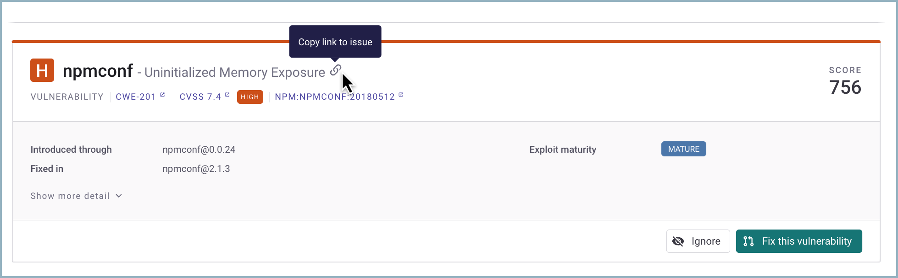
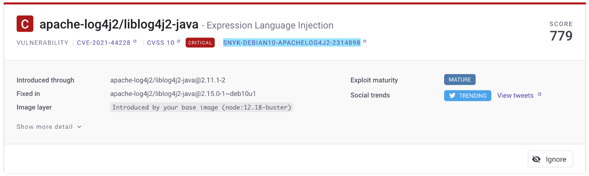
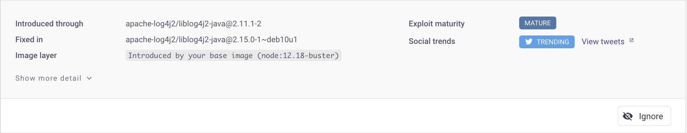
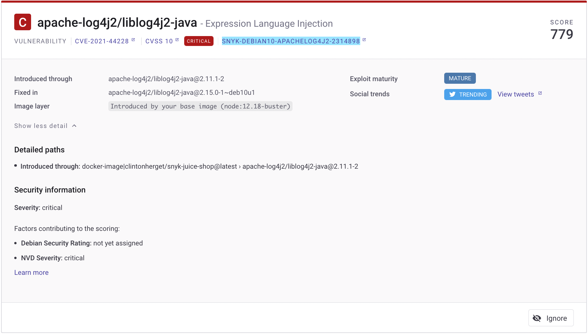

# Issue card information

Issue cards appear on the details page for a Project. See [View Project information](https://docs.snyk.io/getting-started/introduction-to-snyk-projects/view-project-information).

Issue cards show details for a specific vulnerability or license issue and actions you can take for it.

<figure><figcaption>
Issue card for the npmconf vulnerability
</figcaption></figure>

<figure><figcaption>
Issue card for the apache log 4j vulnerability
</figcaption></figure>

## Header section information

<figure><figcaption>
npmconf issue card header
</figcaption></figure>

* [Severity level](https://docs.snyk.io/introducing-snyk/snyks-core-concepts/severity-levels): for example, **H** (High) or **C** (Critical)
* **Issue name**: for example, **Uninitialized Memory Exposure**, with a link that can be copied
* **Score**: [Priority score](https://docs.snyk.io/fixing-and-prioritizing-issues/starting-to-fix-vulnerabilities/snyk-priority-score): 0 - 1,000
* **Type**: VULNERABILITY or LICENSE ISSUE
* Links to [CWE](https://cwe.mitre.org/index.html) (Common Weakness Evaluation), [CVSS](https://www.first.org/cvss/calculator/3.1) (Common Vulnerability Scoring System), and Snyk [Intel Vulnerability DB](https://snyk.io/vuln) information for the issue

## Body section information

<figure><figcaption>
npmconf issue care with with option to Fix this vulnerability
</figcaption></figure>

<figure><figcaption>
apache-log4j2 issue card showing Social trends
</figcaption></figure>

* **Introduced through**: The path through which the vulnerability or license was introduced
* **Fixed in:** The file the vulnerability is fixed in
* [Exploit maturity](https://docs.snyk.io/fixing-and-prioritizing-issues/issue-management/evaluating-and-prioritizing-vulnerabilities): for example, **Mature** or **Proof Of Concept**
* Reachability: for example, **Reachable**. For information and an example, see [Reachable vulnerabilities](../issue-management/reachable-vulnerabilities.md)
* **Social Trends**: Snyk shows a [Trending](../issue-management/prioritize-by-social-trends.md) banner for issues that are being actively discussed on Twitter.

## Detailed information in the issue card

When you expand the issue card for more information, you can see details for the vulnerability, including:

* Detailed path information
* Fix advice
* Overview of the vulnerability
* Any vulnerable functions within the vulnerability

<figure><figcaption>
Details for the npmconf vulnerability
</figcaption></figure>

<figure><figcaption>
Details for the apache log4j vulnerability
</figcaption></figure>

## Filtering and sorting issue cards

You can apply multiple filters to a Project to show a set of issues:

* Whether a vulnerability or a license issue
* With a specific severity
* Within a range of the priority score
* Based on whether it has an exploit, and how mature the exploit is
* That are open or have been patched or ignored

The issue cards in a Project can be sorted based on their priority score or severity.

## Card actions

You can perform the following actions on the issue card:

* [**Ignore the issue**](../issue-management/ignore-issues.md): if you do not need to take action on an issue, or it does not need to appear on your reports, you can ignore it.
* [**Create a Jira ticket**](https://docs.snyk.io/integrations/untitled-3/jira): if you have the [Jira integration](https://docs.snyk.io/integrations/untitled-3/jira), you can link your issue boards to Snyk and create Jira tickets directly from the project details page to fix vulnerabilities.
* [**Fix the vulnerability**](https://docs.snyk.io/snyk-open-source/open-source-basics/fixing-vulnerabilities): if a fix is available, you can fix individual vulnerabilities.
* **View more information about the CWE, CVE, and CVSS scores**: navigate from the issue card to further information about these scores.
* **View the Snyk vulnerability database:** navigate to the Snyk vulnerability database information for a specific vulnerability from its issue card.
