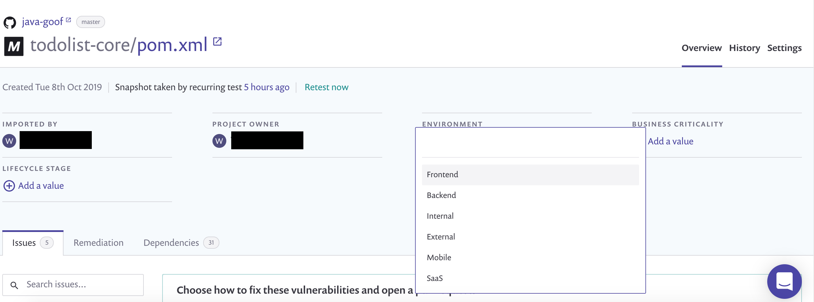
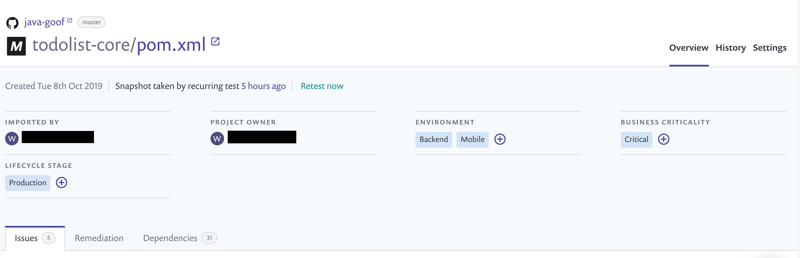
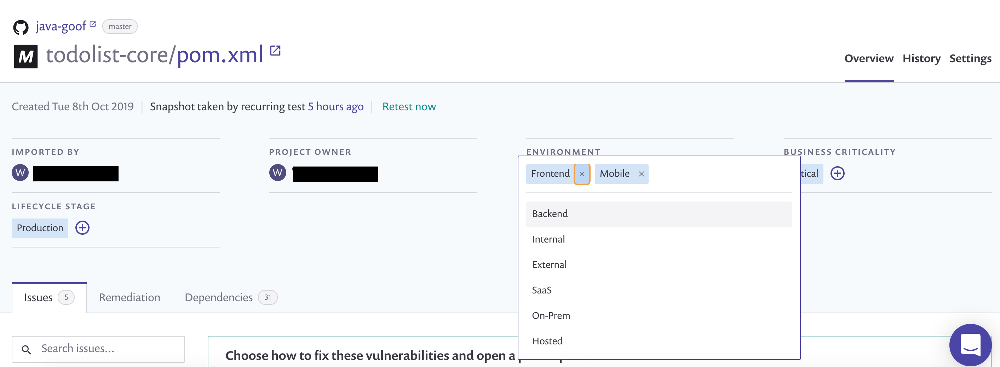
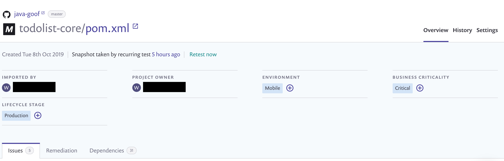

# Project attributes

Project attributes are static and non-configurable fields that allow you to add attribute values to a Project. Attributes have a predefined list of values you can select from. Attribute values can be applied to and removed from Projects and can be used to group, prioritize, and filter Projects.

## **Available attributes and their values**

On the **Projects** listing, use **Group by none** (ungrouped) for optimal Project visibility and to apply [tags](project-tags.md) and filtering attributes at the Project level.

<figure><figcaption>
Project level filtering attributes
</figcaption></figure>

The available Project attributes are summarized in the following table.

| Attribute              | Attribute options                                                                                                                                           |
| ---------------------- | ----------------------------------------------------------------------------------------------------------------------------------------------------------- |
| Business criticality\* | <ul><li>Critical</li><li>High</li><li>Medium</li><li>Low</li></ul>                                                                                          |
| Environment            | <ul><li>Frontend</li><li>Backend</li><li>Internal</li><li>External</li><li>Mobile</li><li>SaaS</li><li>On-Prem</li><li>Hosted</li><li>Distributed</li></ul> |
| Lifecycle stage        | <ul><li>Production</li><li>Development</li><li>Sandbox</li></ul>                                                                                            |


You can apply attributes to Projects and remove attributes using the Snyk API v1 endpoint [Applying attributes](https://snyk.docs.apiary.io/#reference/projects/project-attributes/applying-attributes).

You can also apply and remove attributes using Snyk CLI options, `--project-business-criticality`, `--project-environment`, and -`-project-lifecycle`. Refer to the [CLI commands and options summary](../../snyk-cli/cli-reference.md) for the commands that support these options.



\*When Risk Score is enabled, the Bussiness Criticality attribute will automatically affect the score according to the highest attribute level. Learn more in the [Risk Score](../issue-management/risk-score.md#business-criticality) docs. &#x20;



Organization admins can add an attribute to a Project. However, only Group admins can modify Project attributes in cases where attributes match a policy, because policies can only be managed by Group admins.


## **Apply attribute value to Project**

1. On the Project detail page, click the **+** icon below the attribute for which you want to apply a value to the Project.
2. Select a value from the list.

<figure><figcaption>
Select an attribute value to apply to the Project
</figcaption></figure>

After you have selected a value for the attribute, it appears on the Project detail page. You can apply multiple values for an attribute and multiple attributes to a Project.

<figure><figcaption>
Project detail page showing attribute values applied
</figcaption></figure>

## **Remove attribute value**

1. Select the attribute with an applied value that you want to remove from the Project.
2. Click the **x** icon for the value you want to remove.

<figure><figcaption>
Removing Frontend attribute value
</figcaption></figure>

The attribute value is removed from the Project.

<figure><figcaption>
Project detail showing only Mobile attribute value
</figcaption></figure>

## **Filter by attribute values on the Projects listing page**

On the left of the **Projects** listing page, when Projects are grouped by none (ungrouped), select the values for the attributes that you want to filter Projects by.

When you filter by multiple values on a single attribute, Snyk returns a list of Projects to which one or more of the values in the filter have been applied.

When you filter by multiple attributes, Snyk returns a list of Projects to which values of both attributes have been applied.
