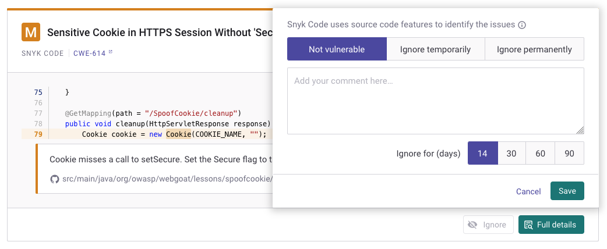

# Ignore issues

You can set ignores individually or as actions - see [Setting ignores](ignore-issues.md#setting-ignores) for details.

If you do not want to fix a vulnerability or license issue, and you do not want to see that issue in scan results, Snyk allows you to ignore the issue, either temporarily or permanently.

## Deciding to ignore issues

The best practice is to fix or patch vulnerabilities or to remove the vulnerable dependency.

However, you may want to suppress an issue for any of the following reasons:

* There is no fix.
* The issue is not relevant to the Project. for example, a distributed denial-of-service (DDoS) attack for an internal service.

If an issue has a path that makes it non-exploitable, it is still best to fix the issue. A vulnerability that is not exploitable today may become exploitable in future.

## Setting ignores

Issues can be ignored and viewed through the following means:

* [Snyk Web UI](ignore-issues.md#ignoring-issues-in-the-web-ui)
* [Snyk CLI](ignore-issues.md#ignoring-issues-in-the-cli)
* [Scanning from the CLI or CI/CD, ignoring in the Web UI](ignore-issues.md#scanning-from-the-cli-or-ci-cd-ignoring-in-the-web-ui)
* [The .snyk file](ignore-issues.md#ignoring-issues-with-the-.snyk-file)
* [Policy actions](ignore-issues.md#ignoring-issues-with-policy-actions)

### Ignoring issues in the Web UI

Each issue card has an **Ignore** button that opens a dialog where you can select how or why you want to ignore the issue and how long to ignore it.

<figure><figcaption><p>Ignore dialog from issue card</p></figcaption></figure>

You can select **Not vulnerable** for any issue that is not exploitable at the time you create the ignore.

If you select **Ignore temporarily,** then you can check the **Until fix is available** checkbox:

<figure><figcaption><p>Ignore temporarily</p></figcaption></figure>

This is checked by default if there is currently no fix available for this issue. The vulnerability resurfaces as soon as Snyk has a fix for it, and optionally you can give additional details on why you are ignoring the issue.


An issue is ignored until either of the conditions occurs: the ignore period expires, or the vulnerability becomes fixable.

An issue ignored within an Open Source or Code Project in the Snyk web UI will be reflected and not flagged in any consecutive [PR check](https://docs.snyk.io/scan-application-code/run-pr-checks) across all branches of that Project.


When you ignore an issue in the Snyk Web UI, the issue shows who ignored it and allow you to edit or unignore it.

<figure><figcaption><p>Ignore set in the Snyk Web UI</p></figcaption></figure>

For more information, see the training: [Ignoring issues](https://training.snyk.io/courses/ignore-strategies).

### Ignoring issues in the CLI

You can suppress issues through the CLI by using the `snyk ignore` command, for example:

`snyk ignore --id='npm:braces:20180219' --expiry='2018-04-01' --reason='testing'`

For more information, see the [`ignore`](../../snyk-cli/commands/ignore.md) command help and [Ignore vulnerabilities using Snyk CLI](../../snyk-cli/test-for-vulnerabilities/ignore-vulnerabilities-using-snyk-cli.md).

When you use `snyk ignore`**,** the `.snyk` policy file is updated with the path and reason given if one was provided. For example:

```
'npm:moment:20170905':
- moment:
reason: The reason given
expires: '2017-12-29T16:10:16.946Z'
```

### Scanning from the CLI or CI/CD, ignoring in the Web UI

Ignores between a CLI or CI/CD run and the Snyk UI are synchronized as follows:

1. A Project is scanned and pushed to the UI using `snyk monitor`.
2. You see the results of the scan and choose to ignore an issue.
3. The issue is ignored when running `snyk test` or `snyk monitor` in the CI/CD or CLI.

Refer to the following example. Issues are identified as CI/CLI, meaning the Project was imported from `snyk monitor`. The issue is `npmconf`. It is **Not vulnerable,** and the user can select **Ignore**.

<figure><figcaption><p>Project imported from snyk monitor, ignore set in the Web UI</p></figcaption></figure>

The following shows `snyk test` results before ignoring in the Web UI:

<figure><figcaption><p>Snyk test results before ignoring in the Web UI</p></figcaption></figure>

The following shows `snyk test` results after ignoring in the Web UI:

<figure><figcaption><p>Snyk test results after ignoring in the Web UI</p></figcaption></figure>

This example shows what happens if you ignore the Project imported by `snyk monitor` from the CLI or CI/CD.

The same repository imported from the SCM is considered to be a different Project, and any ignore on an SCM Project does not impact the results of `snyk test` from the CLI or a CI/CD. SCM and CI Projects behave as two standalone Projects.

### Ignoring issues with the .snyk file

For all Projects, you can ignore the vulnerability by creating a `.snyk` YAML file.


For example, if you want to ignore the vulnerability with SNYK ID [SNYK-RUBY-FASTREADER-20085](https://snyk.io/vuln/SNYK-RUBY-FASTREADER-20085) in `fastreader`, with the reason “No fix available” until 01 Jan 2024, you would write the following:

```
version: v1.5.0
ignore:
    'SNYK-RUBY-FASTREADER-20085':
     - '* > fastreader':
        reason: 'No fix available'
        expires: '2024-01-01T00:00:00.000Z'
```


For more information, see [The .snyk file](../../snyk-cli/test-for-vulnerabilities/the-.snyk-file.md) including the section about [.snyk files in monorepos](../../snyk-cli/test-for-vulnerabilities/the-.snyk-file.md#monorepos-and-complex-project-considerations) and .[snyk files in different directories from manifest files](../../snyk-cli/test-for-vulnerabilities/using-a-.snyk-file-in-a-separate-directory-than-the-manifest-file.md).


### Ignoring issues with policy actions

You can set [Security policies](../policies/security-policies/) actions to ignore all vulnerabilities that match the conditions specified in a policy rule.

For more information, see [Security policies: Actions](https://docs.snyk.io/fixing-and-prioritizing-issues/security-policies/security-policies-actions).

## Snyk Code: ignoring issues

For [Snyk Code](https://docs.snyk.io/snyk-code), the ignore functionality may capture a wider range of issues than other products.

Snyk Code's static code analysis transforms the input code into an **intermediate representation**, which captures the flow of code but abstracts away some details. Snyk Code uses this representation to recognize the same issue even when you refactor your code or rename a variable.

Thus when you ignore an issue, Snyk Code can also ignore that issue if it occurs in multiple places in your code, even with minor code changes. This avoids generating multiple duplicate reports for pieces of code with the same ignored issue.

As an example, the following two code snippets (despite textual differences) denounce the same issue, as the developer only renamed the variables:

```
var fs = require('fs');
var logFileName = req.query.file || 'standard_log.log';
var logfile = fs.readFile(logFileName, "utf8", function(err, data) {...
```

```
var filesystem = require('fs');
var generalLogFileName = req.query.file || 'standard_log.log'; 
var handleLogFile = filesystem.readFile(generalLogFileName, "utf8", function(err, data) {...
```

For more information, see [Exploring the vulnerability issues discovered by Snyk Code](../../scan-application-code/snyk-code/exploring-and-working-with-the-snyk-code-results/exploring-the-vulnerability-issues-discovered-by-snyk-code/).

## Snyk IaC: ignoring issues

When scanning your IaC configuration files using `snyk iac test` you can ignore issues that are not relevant to you by using [The .snyk file](../../snyk-cli/test-for-vulnerabilities/the-.snyk-file.md).

Snyk recommends storing and versioning the `.snyk` file in the root of your working directory, where you store your IaC configuration files.

For more information, see [IaC ignores using the .snyk policy file](../../scan-cloud-configurations/snyk-infrastructure-as-code/snyk-cli-for-infrastructure-as-code/iac-ignores-using-the-.snyk-policy-file.md).

## Configure ignore settings

Suppressing vulnerabilities carries a level of risk, so you can make this function available to admins only as follows

1. Go to your Organization settings > **General**, then navigate in the **Ignores** section
2. Under **Ability to ignore an issue or edit the ignore settings on an issue**, select **Admin users only**. Note that this also disables ignores from being added via the CLI.
3. Under **Require reason for each ignore**, you can also choose to set the **more details** field to be a required field when an issue is being ignored, ensuring the user enters a reason for each ignore.
4. Select **Update** to make the changes.

<figure><figcaption><p>Update ignore settings</p></figcaption></figure>

## Using ignores in reports

If you have access to the Snyk Reports feature, you can also see an overview of how many issues in your Organization’s Projects are ignored, along with an option to filter these so you can drill down into each one. If the issue was ignored in the Snyk Web UI, Snyk includes a credit so you can see who initiated it.

For more information, see [Reports](../reporting/legacy-reports/).
