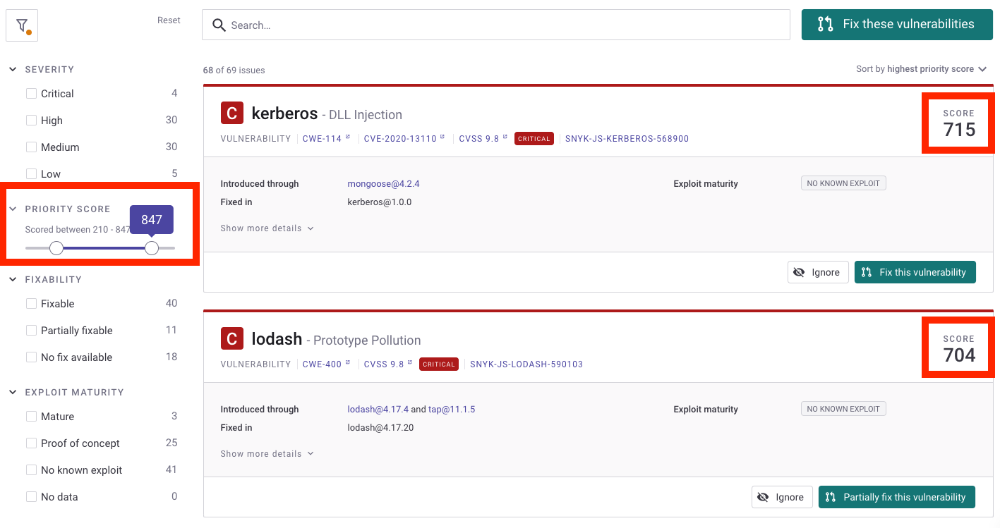

# Priority Score

The Snyk Priority Score is a single value assigned to an issue, to help you quickly and easily decide which issues are most important to fix. Scores range from 0 - 1,000; the higher the score, the most important it is to fix that issue.

You can view Priority Scores:

* [In Projects views](priority-score.md#view-in-projects)
* [In Reports](priority-score.md#view-in-reports)
* [In the API](priority-score.md#view-in-the-snyk-api)


There are no settings related to the Priority Score; they are read-only, and cannot be hidden.


### Overview

Snyk's security group calculates scores based on a number of factors, including CVSS score, trending vulnerabilities, reachability, availability of exploits and other factors. These factors gives scores with a high degree of granularity. This granularity avoids having many issues with the same score, allowing you to determine issue importance quickly and accurately.


Snyk does not use the CVSS score alone to determine priority: other factors are also incorporated.


See [How it works - calculation details](priority-score.md#how-it-works-calculation-details) for detailed information on how scores are determined.

## View in Projects

Scores can be seen on each issue in the Projects view, with all issues now sorted by score, to show you the most pressing issues first.

Issues can be filtered on the left.

<figure><figcaption>
Filter issues
</figcaption></figure>

## View in Reports

The **Issues** tab in the reports includes the Priority Score as its own sortable column. By default the table is already sorted by the score, to show you the most pressing issues first.

Issues can also be filtered by the score.

<figure><figcaption>
Filter issues by score
</figcaption></figure>

## View in the Snyk API

Various issue-related API calls now include the scores in the response, and support filtering by the score.

Read more about the relevant API calls:

* [https://snyk.docs.apiary.io/#reference/reporting-api/latest-issues/get-list-of-latest-issues](https://snyk.docs.apiary.io/#reference/reporting-api/latest-issues/get-list-of-latest-issues)
* [https://snyk.docs.apiary.io/#reference/reporting-api/get-list-of-issues](https://snyk.docs.apiary.io/#reference/reporting-api/get-list-of-issues)
* [https://snyk.docs.apiary.io/#reference/projects/all-projects/list-all-issues](https://snyk.docs.apiary.io/#reference/projects/all-projects/list-all-issues)

## How it works - calculation details

For each issue, Snyk processes and weighs several factors in a proprietary algorithm, to produce the score for that issue. These factors include:

* [**Severity levels**](severity-levels.md): calculated using CVSS framework v3.1 scores for that issue.
* [**Exploit Maturity**](https://snyk.io/blog/whats-so-wild-about-exploits-in-the-wild-and-how-can-we-prioritize-accordingly/): determined by Snyk’s industry-leading security team using manual and automated methods to track which vulnerabilities are exploitable, and to what extent.
* [**Reachability**](reachable-vulnerabilities.md): by looking at the code paths called within a Project, Snyk identifies which vulnerabilities are reachable from the code.
* [**Fixability**](../../scan-application-code/snyk-open-source/starting-to-fix-vulnerabilities/vulnerability-fix-types.md) (availability of a fix): without a safer version to upgrade to, or a Snyk patch available, developers must either fix the code themselves or use an alternative package. So vulnerabilities with fixes are given higher priorities.
* **Time**: new vulnerabilities are likely to be an increased risk, so increasing the priority score.
* [**Social Trends**](prioritize-by-social-trends.md): Snyk monitors mentions of known vulnerabilities in Twitter, calculating the trend of tweets and reactions.
* **Malicious Packages**: Snyk will prioritize vulnerabilities originating from malicious packages.


Snyk continually refines our prioritization algorithm to include new factors, and updates the weighting of factors, to always provide the most accurate and up-to-date representation of priority given the latest information.


### Priority calculation for Kubernetes

Kubernetes container images imported from the Kubernetes integration have a number of additional contributing factors for priority score calculation.

See [Snyk Priority Score and Kubernetes](../../scan-containers/kubernetes-workload-and-image-scanning/kubernetes-integration-ui-explained/snyk-priority-score-and-kubernetes.md) for more details.

### Priority calculation for Snyk Code

A number of specific factors contribute to priority calculation for Snyk Code, including:

* **Severity levels**
* **Number of vulnerability occurrences**
* **Rule tags**: decrease if **beta** tags are found
* **Open community projects**: if this vulnerability is fixed widely
* **Hot files**: if the vuln is in the source file, or inside a code flow
* **Fixability**: If we have fix examples available for this issue

See [Understanding the Priority Score of the Snyk Code issues](../../scan-application-code/snyk-code/exploring-and-working-with-snyk-code-results-in-the-web-ui/understanding-the-priority-score-of-the-snyk-code-issues.md) for more details.
