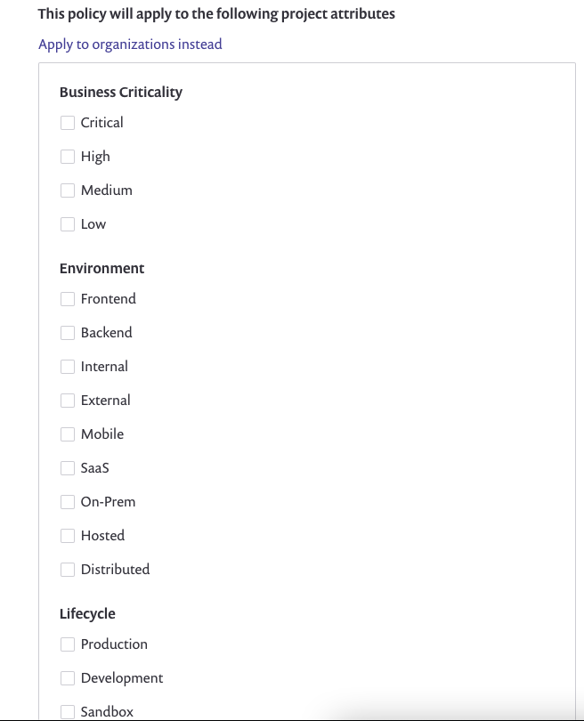
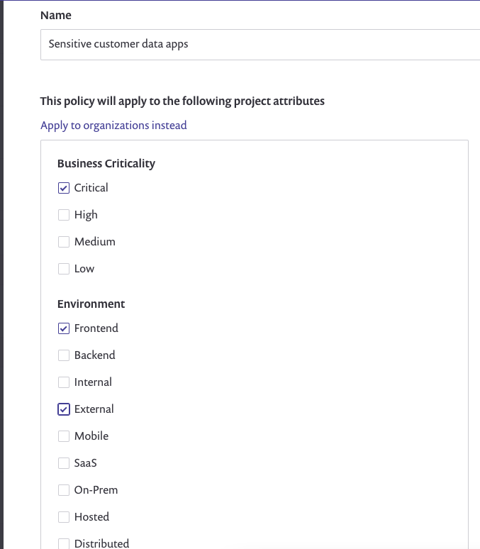
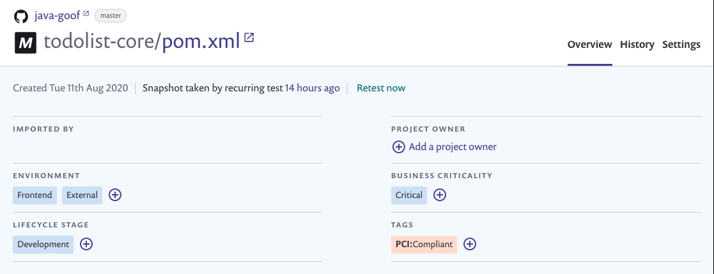
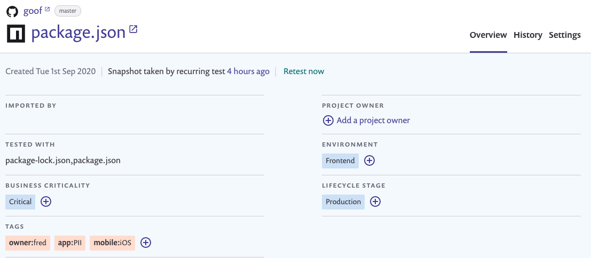
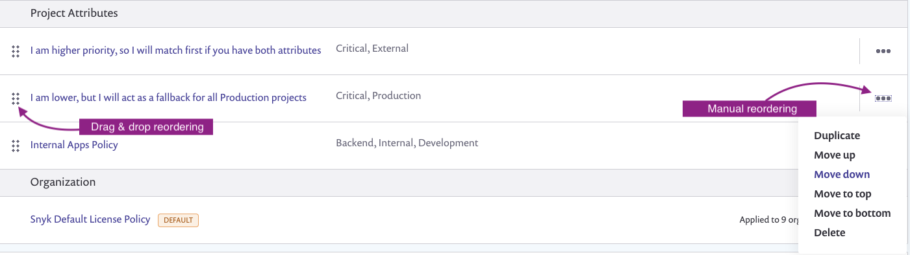

# Apply a policy to Projects

After you apply [Project attributes](../introduction-to-snyk-projects/project-attributes.md) to your Projects, you can create policies that apply to those attributes. Projects and policies are linked based on the attributes assigned to the policy.


Policies assigned to Project attributes always take precedence over policies assigned to Organizations.


A policy can be applied to one or multiple Project attributes, but a set of attributes can only be assigned to one policy. For example, if there is already a policy applied to `Critical`**,** `Production`,`Frontend`, you cannot create another policy that matches _only_ these exact attributes.


Policies assigned to Project attributes apply when you run `snyk monito`**r** in the CLI, assuming it runs on a CLI Project with Project attributes applied. Project attribute policies do not apply to `snyk test`.


## Apply a policy to Project attributes and remove attributes

To apply a policy to an attribute, in the attribute selector panel, check the box for the attribute you want to add to the policy,

To remove an attribute from a policy, uncheck the box next to the attribute you want to remove.

<figure><figcaption>
Add attributes to policies
</figcaption></figure>


You can create and save a policy where no attributes are selected, for example, if you have not yet decided which attributes should be associated with a policy. This policy does not apply to Projects where all attributes are left blank.


## Associating Projects with policies

To be associated with a policy, a Project must have all the attributes listed on the policy. The Project could also have more attributes that are not listed on the policy.

For example, if you have a policy applied to `Critical`, `External`, and `Frontend`, this policy applies to Projects which include those same attributes, but not to a Project with the attributes `Critical` and `External` only.

An example policy follows. It is applied to `Critical` **Business Criticality** and to `Frontend` and `External` **Environment**.

<figure><figcaption>
Example policy
</figcaption></figure>

The following Project will inherit the policy. The Project has the attributes `Frontend`, `External`, and `Critical`.

<figure><figcaption>
Project inheriting a policy
</figcaption></figure>

The following Project will not inherit the policy, because the Project lacks the `Frontend` environment attribute.

<figure><figcaption>
Project not inheriting a policy
</figcaption></figure>

## Applying multiple policies to a Project

Multiple policies can apply to a Project. For example, you may have a policy applied to the attributes `Critical` and `External` and another policy applied to the attributes `Critical` and `Production`. If you have a Project with the attributes `Critical`, `External` and `Production`, either of these policies apply.

When multiple policies are applied to a Project, the order of the policies on the policy manager page determines precedence. The policy closest to the top of the list takes precedence over other applicable policies below it. To change the order of policies, either drag and drop the policies into the correct order or use the three dots on the right-hand side to move the policy up or down in the list.

<figure><figcaption>
Change policy order
</figcaption></figure>

