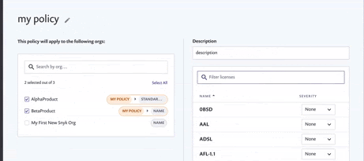

# Create and edit policies

## **Create a policy**

1. Click **Add new policy** from the Policy Manager screen, and a enter details when prompted.
2. Set a policy name and a description to help you quickly identify a policy\
   **Note**: Policies in the same category cannot have the same name. Policies **cannot** be saved without a policy name applied.
3. Select whether you’d like to apply your policy to organizations or to Project attributes.
4. Select the desired [Organizations](apply-a-policy-to-organizations.md) or [attributes](apply-a-policy-to-projects.md)
5. Add rules to the policy. [Click here for information on adding license rules](license-policies/create-a-license-policy-and-rules.md) or [click here for information on adding security rules](security-policies/how-to-create-a-security-policy-and-set-rules.md)
6. Click **Submit** to create and save that policy.

<figure><figcaption>
Submit a policy
</figcaption></figure>

## Edit a policy

1. Click the name of an existing policy in the Policy Manager tab to make any changes.
2. Adjust [Organizations](apply-a-policy-to-organizations.md), [attributes](apply-a-policy-to-projects.md), and rules as desired.
3. Click **Submit** to save your changes.

## **Duplicate or delete a policy**&#x20;

Click the **...** on the right-hand side to duplicate or delete a policy:

<figure><figcaption>
Other policy actions
</figcaption></figure>

#### Delete a policy


Deleting a policy cannot be undone. If you delete a policy that has Organizations assigned to it, those organizations will return to the default policy.


#### Duplicate a policy

Duplicating a policy will copy over the rules of a policy, but not the assigned Organizations or attributes. The new policy will automatically be called ‘Copy of (Policy Name)…” and can be edited as normal.
