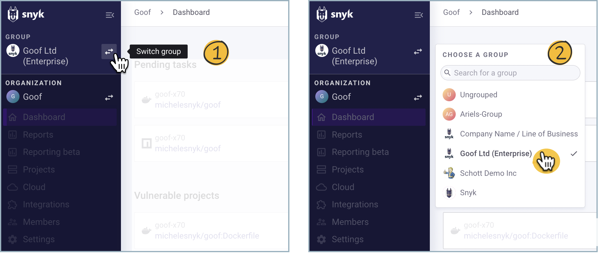
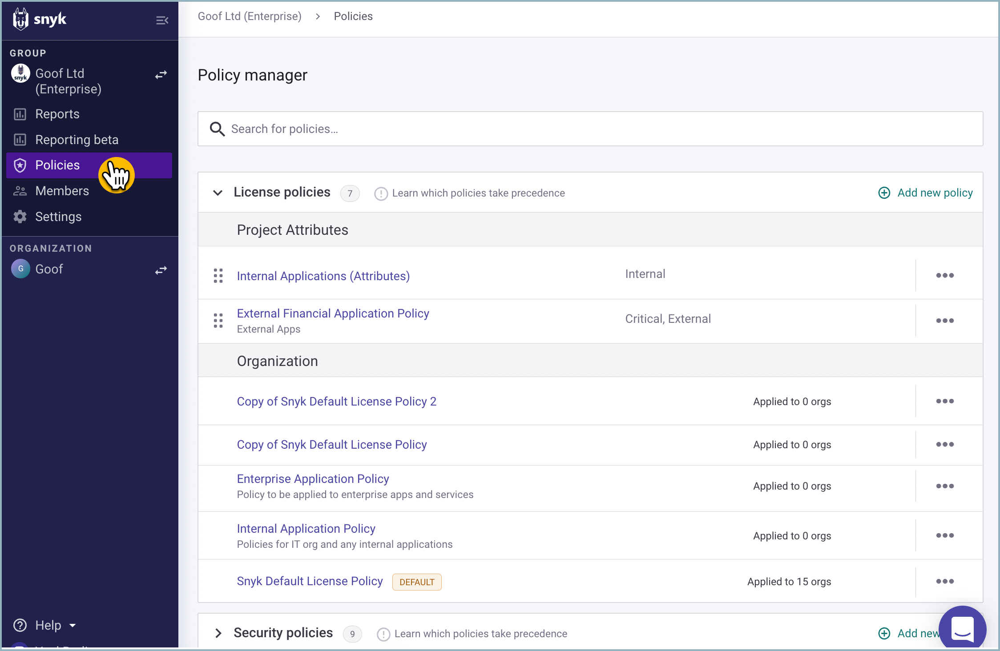
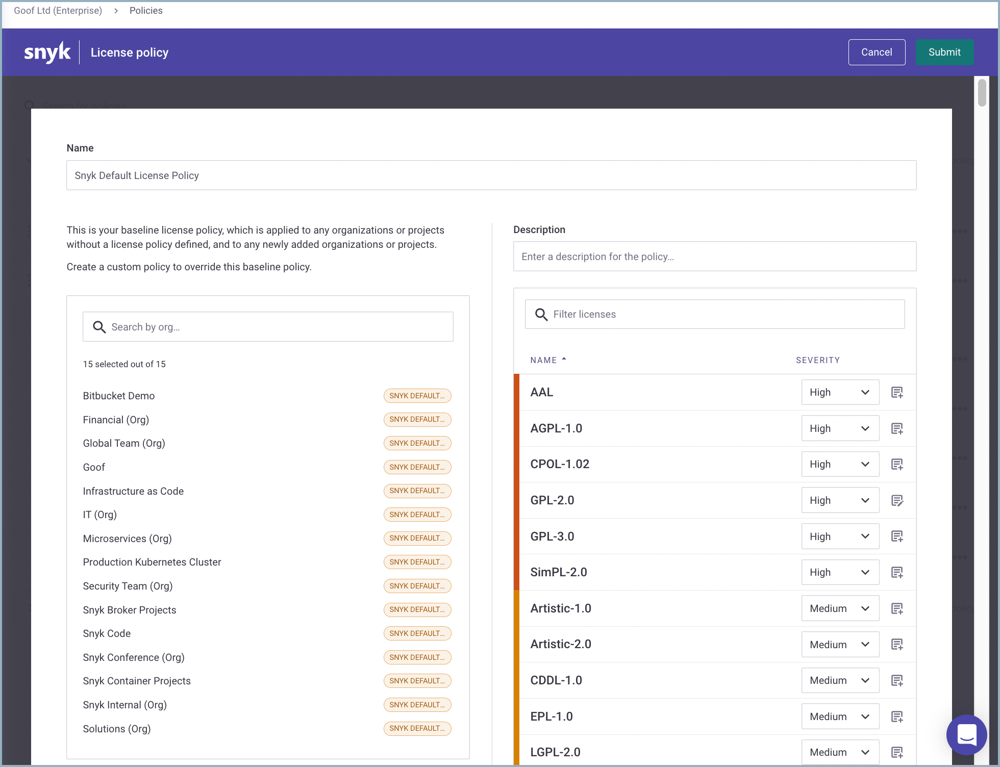
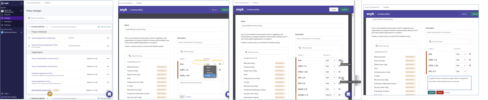
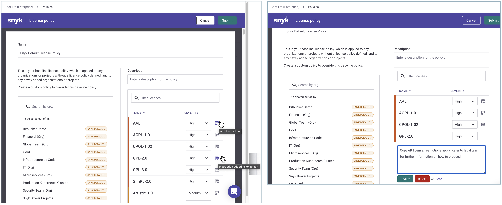

# Create a license policy and rules

Administrators can configure the following settings for each license:

* The level of severity— values include **None**, **Low**, **Medium**, and **High**.
  * When **None** is selected, instructions cannot be inserted since licenses marked with **None** do not appear in any Snyk test results.
  * New licenses added by Snyk inherit the **Unknown** license type severity. In cases where this severity is not set to **None**, newly added licenses appear in Snyk test results.
* **Legal instructions for developers**—enter free text to provide any necessary instructions for developers.
  * We recommend describing your company’s specific policy, explaining the need for collaboration from your developers as well as providing them with step-by-step instructions if any are needed
  * Legal instructions will appear in the CLI results and on issue cards within the Project view


**Feature availability**\
For customers with an Enterprise plan, group administrators can create or modify a policy. See [pricing plans](https://snyk.io/plans/) for more details.


## Access license policies

If your company's account has one or more groups, to access the License policy settings:

1.  Use the **Switch group** selector and choose a Group to open its overview.\\

    <figure><figcaption>
Defining policy
</figcaption></figure>
2.  Go to **Policies > Policy manager > License policies > Organization** and choose the policy you want to update.

    <figure><figcaption></figcaption></figure>

The **License policy** screen displays the list of Organizations that the policy applies to, a policy description, and the licenses included in the policy.

You can edit the license severities and instructions.

<figure><figcaption>
License policy overview
</figcaption></figure>

## Assign rules and severities for a license policy

1. In **Policy manager > License policies > Organization**, choose a policy link to open the **License policy** screen.
2. To set the severity for specific licenses, click the **Severity** selector in the **License policy** screen.
3. To enter an explanation and recommendations for fixes, click the **Instructions** icon (to the right of the **Severity** selector) and enter your text.
4.  Click **Add** to save your changes to the instructions

    Once added, the **Add instructions** link changes to **Edit instructions.**
5. Click **Submit** to save your policy.

<figure><figcaption>
Updating policy instructions
</figcaption></figure>

<figure><figcaption>
Submitting policy instructions
</figcaption></figure>

The updated severities or instructions (or both) are automatically updated on Snyk servers. When the next scheduled test runs, or when a user re-tests a Project, updated results are delivered according to these changes.
