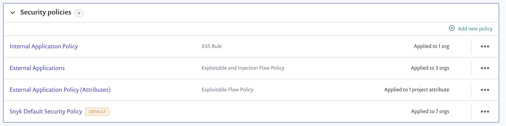
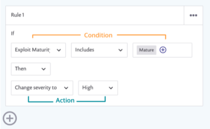

# Create a security policy and rules

To create a new security policy, navigate to **Policies** in your Group menu, expand the **Security policies** category, and click **Add new policy** (see [View policies](../view-policies.md) for more details).

<figure><figcaption>
Security policies screen
</figcaption></figure>


Select **Snyk Default Security Policy** to change the conditions or actions for a security policy that applies to all projects in all Organizations in the Group.


## Rules, conditions, and actions

Security policy rules follow an “if, then” framework, with one or more conditions, and an action. For example:

<figure><figcaption>
Security policy rules
</figcaption></figure>


If you create a new security policy, the first blank rule is automatically created.


Select the conditions and actions to complete a rule. See [Security policy conditions](security-policies-conditions.md) and [Security policy actions](security-policy-actions.md) for more details.

* To add a new blank rule, click on **+** below the previous rule, as seen in the screenshot above.
* To delete or duplicate a rule, click the **…** on the right hand side of each rule box, as seen in the screenshot above.


The order of your rules sets the precedence; if there is a conflict, the rule closest to the top supersedes any subsequent rules.

