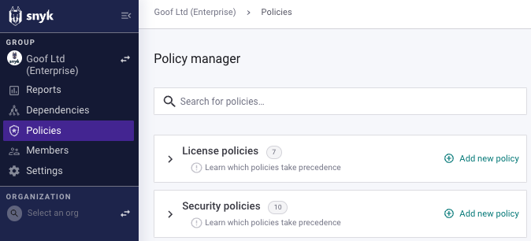
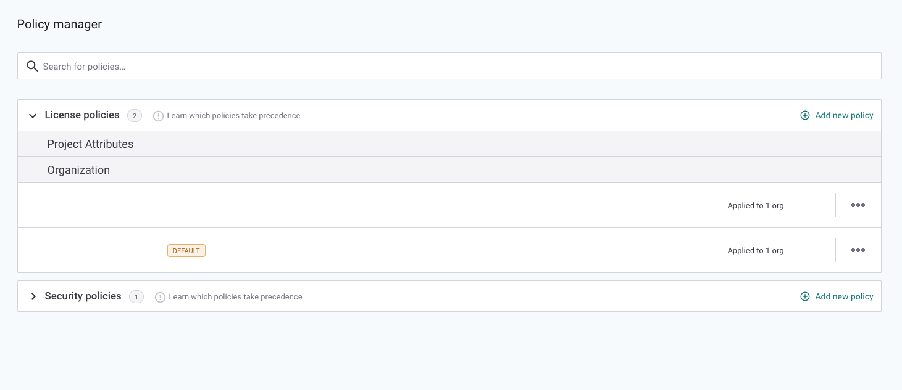
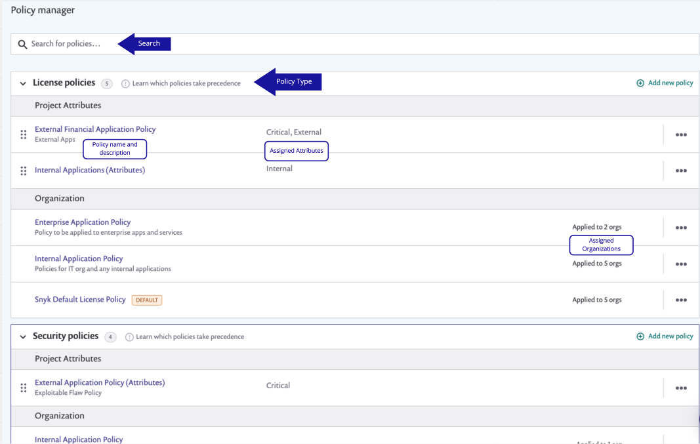

# View policies


You must be a Group administrator to view, create, and modify policies for that Group.


Select the **Policies** menu option to see the policies in your Group, arranged by category, [License policies](license-policies/), and [Security policies](security-policies/).

<figure><figcaption>
View policies
</figcaption></figure>

Expand a category to see a list of the policies in that category:

<figure><figcaption>
License policies list expanded
</figcaption></figure>


This list includes the [default policy](view-policies.md#default-policies), which is automatically created for new Groups for each policy category and cannot be removed.


## Policy details

When you expand a category, the screen shows the policies applied to **Project attributes** and applied to **Organizations**. You can click to **Learn which policies take precedence** in each category. You can also **search** for a particular policy.

<figure><figcaption>
Policy manager screen including attributes and Organizations to which each policy is applied
</figcaption></figure>

## Default policies

Each policy category has a default policy. Default policies can be applied only to Organizations, not Project attributes.

When you create a new Organization, it will automatically be added to the default policy unless you have copied the settings of an existing Organization. You can assign an Organization to a different policy if desired.

The default policy cannot be deleted; however, the default policy name, description, and rules can be edited to match your preferences. A default policy can also contain no rules if you'd prefer.

See [Assign a policy to an Organization](apply-a-policy-to-organizations.md) for details.
