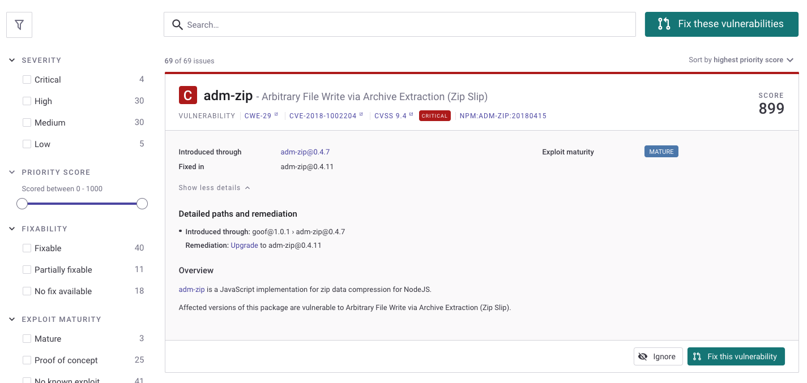

# Priority Score

The Snyk Priority Score is a single value assigned to an issue, to help you quickly and easily decide which issues are most important to fix. Scores range from 0 to 1,000; the higher the score, the more important it is to fix that issue.

The Snyk Priority Score is determined based on a number of industry-standard criteria including CVSS score, trending vulnerabilities, reachability, availability of exploits, and other factors. These factors yield scores with a high degree of granularity. This granularity avoids having many issues with the same score, allowing you to determine the importance of an issue quickly and accurately.


Snyk does not use the CVSS score alone to determine priority: other factors are also considered.


See [Calculation of Priority Score](priority-score.md#calculation-of-priority-score) for detailed information on how scores are determined.

You can view Priority Scores in [Projects views](priority-score.md#view-priority-score-in-projects), [Reports](priority-score.md#view-priority-score-in-reports), and the [API.](priority-score.md#view-priority-score-in-the-snyk-api)

There are no settings related to the Priority Score; they are read-only and cannot be hidden. An example follows of Priority Scores displayed in a Project view.

<figure><figcaption>
Snyk Priority Score in a Project view
</figcaption></figure>

## View Priority Score in Projects

Priority Scores are visible for each Issue card, with all issues sorted by score, to show you the most pressing issues first.

You can filter issues by Priority Score range in the left sidebar.

<figure><figcaption>
Filter issues 
</figcaption></figure>

## View Priority Score in Reports

The **Issues** tab in the reports includes the Priority Score as its own sortable column. By default, the table is sorted by the score to show you the most pressing issues first.

Issues can also be filtered by the score.

<figure><figcaption>
Filter issues by score
</figcaption></figure>

## View Priority Score in the Snyk API

The Snyk API v1 endpoint [Get list of latest issues](https://snyk.docs.apiary.io/#reference/reporting-api/latest-issues/get-list-of-latest-issues) includes the Priority Score in the response and supports filtering by the score.

## Calculation of Priority Score

For each issue, Snyk processes and weighs several factors in a proprietary algorithm, to produce the score for that issue. These factors include the following:

* [Severity levels](../prioritizing-issues/severity-levels.md): calculated using CVSS framework v3.1 scores for an issue.
* [Exploit maturity](https://snyk.io/blog/whats-so-wild-about-exploits-in-the-wild-and-how-can-we-prioritize-accordingly/): determined by the industry-leading Snyk security team using manual and automated methods to track which vulnerabilities are exploitable and to what extent.
* [Reachability](reachable-vulnerabilities.md) (extent to which vulnerabilities are reachable from the code): determined by looking at the code paths called within a Project.
* [Fixability](../../scan-application-code/snyk-open-source/starting-to-fix-vulnerabilities/vulnerability-fix-types.md) (availability of a fix): defined as having a safer version to upgrade to or a Snyk patch available. For vulnerabilities with neither, developers must either fix the code themselves or use an alternative package. Thus vulnerabilities with fixes are given a higher Priority Score.
* Time: considered based on how new the vulnerability is. New vulnerabilities are likely to be an increased risk, and so they increase the Priority Score.
* [Social Trends](vulnerabilities-with-social-trends.md): calculated by Snyk based on mentions of known vulnerabilities in Twitter to express the trend of tweets and reactions.
* Malicious packages: assessed to determine if a vulnerability originated from a malicious package. Vulnerabilities originating from malicious packages have higher Priority Scores.


Snyk continually refines its prioritization algorithm to include new factors, and updates the weighting of factors, to provide the most accurate and up-to-date representation of priority possible, given the latest information.


### Priority calculation for Kubernetes

Kubernetes container images imported from the Kubernetes integration have a number of additional contributing factors for priority score calculation.

See [Snyk Priority Score and Kubernetes](../../scan-applications/snyk-container/integrate-with-kubernetes/navigate-the-kubernetes-integration-ui/kubernetes-and-the-snyk-priority-score.md) for more details.

### Priority calculation for Snyk Code

A number of specific factors contribute to priority calculation for Snyk Code, including:

* Severity levels
* Fixability: If Snyk has fix examples available for this issue
* Number of vulnerability occurrences
* Open community projects: if this vulnerability is fixed widely
* Rule tags: decrease priority if beta tags are found
* Hot files: if the vulnerability is in the source file, or inside a code flow

See [Understanding the Priority Score of the Snyk Code issues](../../scan-applications/snyk-code/exploring-and-working-with-snyk-code-results-in-the-web-ui/exploring-the-code-analysis-page/understanding-the-priority-score-of-snyk-code-issues.md) for details.
