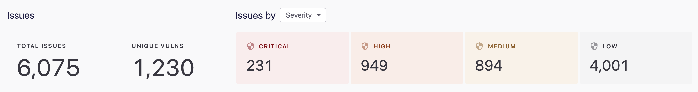
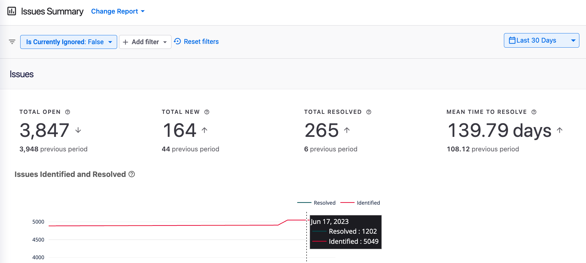
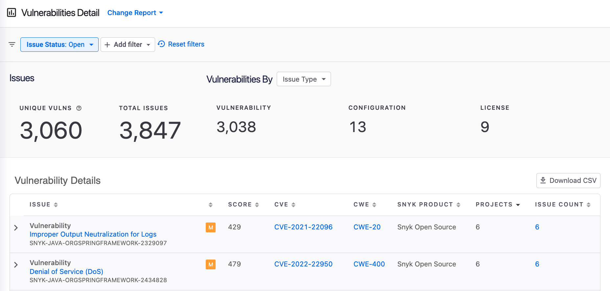
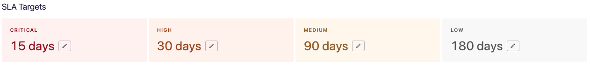
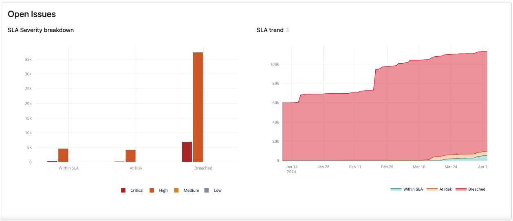
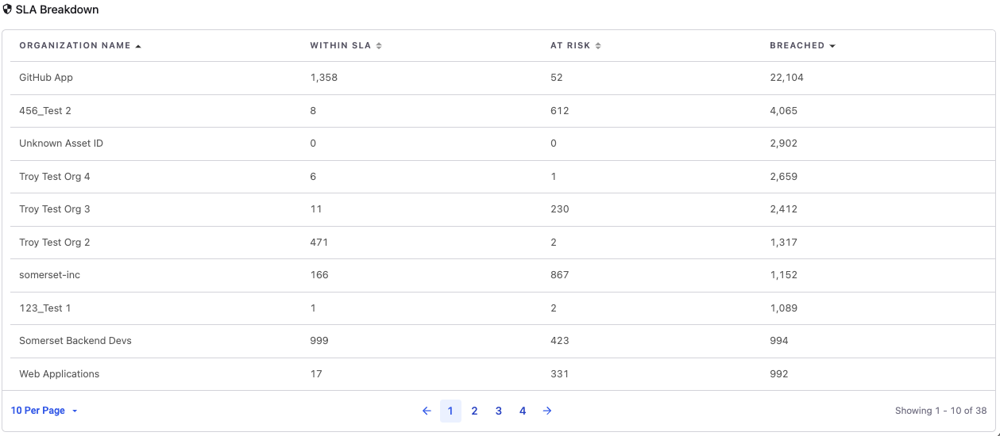
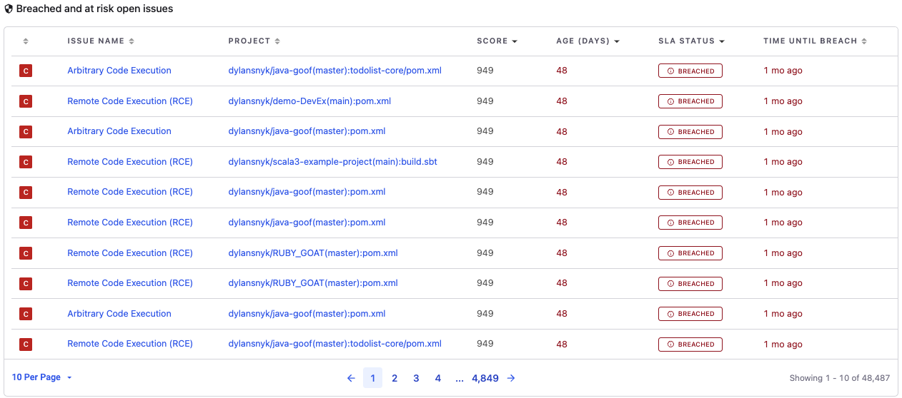
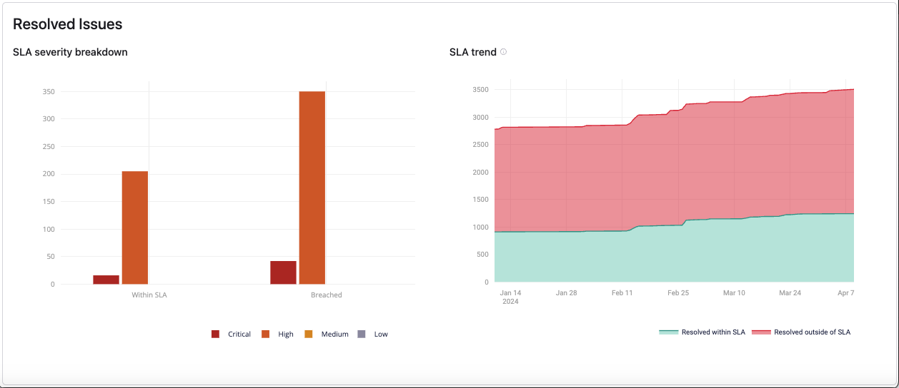
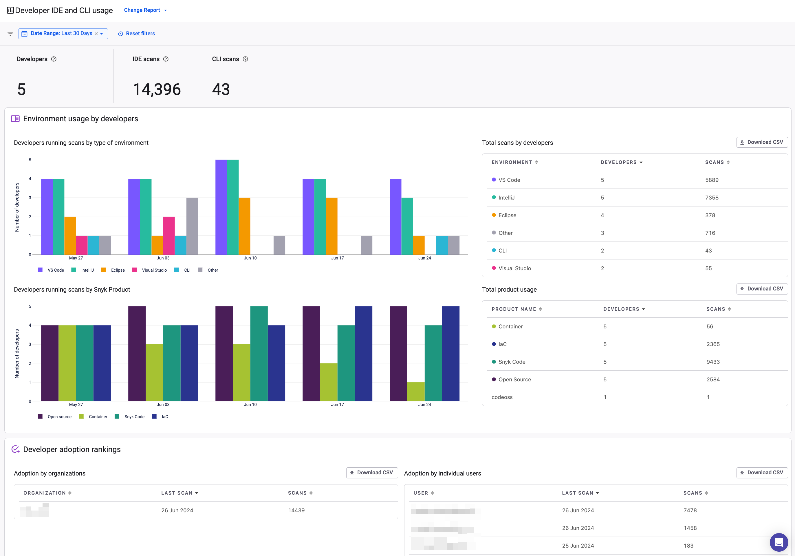

# Available Snyk Reports

The following reports are available:

* [Issues Detail report](available-snyk-reports.md#issues-detail-report)
* [Issues Summary report](available-snyk-reports.md#issues-summary-report)
* [Vulnerabilities Detail report](available-snyk-reports.md#vulnerabilities-detail-report)
* [Featured Zero-Day report](available-snyk-reports.md#featured-zero-day-report)
* [SLA Management report](available-snyk-reports.md#sla-management-report)
* [OWASP TOP 10 report](available-snyk-reports.md#owasp-top-10-report)
* [CWE TOP 25 report](available-snyk-reports.md#cwe-top-25-report)
* [CWE TOP 10 KEV report](available-snyk-reports.md#cwe-top-10-kev-report)
* [Cloud Compliance Issues report](available-snyk-reports.md#cloud-compliance-issues-report)
* [Developer IDE and CLI usage report](available-snyk-reports.md#developer-ide-and-cli-usage)

Select **Change Report** to change the report displayed:

<figure><figcaption>
Select Change Report to display different reports
</figcaption></figure>

## Issues Detail report

The Issues Detail report displays all known issues in all of your Projects that are being monitored by Snyk. The report gives details about each issue and which of your Projects are affected and provides links to fix information.

The Issues Detail report displays the number of issues as well as the number of unique vulnerabilities that make up the issues.

Quick aggregations are available by categories including **Severity**, **Product Name**, and **Issue Type**:

<figure><figcaption>
Quick aggregation for Issues Detail Report
</figcaption></figure>

Individual issues are displayed in a table according to the selected category. You can modify columns as needed.

For a table of only the unique vulnerabilities, use Change Report to switch to the Vulnerabilities Detail report.

## Issues Summary report

The Issues Summary report highlights the value that Snyk is providing by enabling both the identification and resolution of issues.&#x20;

<figure><figcaption>
Issues Summary report
</figcaption></figure>

The report provides a glimpse into how well teams are optimizing the use of the Snyk platform for their workflow and provides a means to measure and improve security.

This report enables you to easily understand the current state and trends of the highest security risk items. This report also provides a quick view into where risk is coming from and where remediation efforts are most and least effective.

Use the date filter in the upper right corner of the Issues Summary report to see key metrics and charts for a specified interval.

This report shows a number of key metrics associated with issues in that interval with a comparison to the same metrics in the previous period so you can get a quick understanding of trends. See tooltips in the app for definitions of the metrics.

Scroll down for additional charts that show trend information in greater detail.

Key metrics are then broken down to point out information at the Organization or Project level. You can drill down to see what new and resolved issues were introduced during the date range selected.

## Vulnerabilities Detail report

The Vulnerabilities Detail report is similar to the Issues Detail report but shows issues grouped by Snyk Problem ID ([see Snyk Vulnerability DB](https://security.snyk.io/vuln)).&#x20;

<figure><figcaption>
Vulnerability Details report
</figcaption></figure>

You can easily see how many instances of a vulnerability exist and how many Projects are affected. Use this report to understand which vulnerabilities are most prevalent for both resolution and prevention use cases.

For a table of Total Issues, use Change Reports to switch to the Issues Detail report.


#### Dependencies and license information

To view Dependencies and license information, select the **Dependencies** menu option. See [Dependencies and licenses](../../manage-risk/reporting/dependencies-and-licenses/) for details.


## Featured Zero-Day report

This report addresses primary scenarios for managing and resolving emerging zero-day vulnerabilities, which carry significant consequences and attract substantial attention in the global AppSec community.

Use this report to discover your exposure to issues highlighted in a zero-day publication across various Targets and Projects. The report helps you prioritize zero-day issues and monitor the progress of remediation efforts against any remaining occurrences.

<figure><figcaption>
Featured Zero-Day Report
</figcaption></figure>

The [Security team at Snyk](https://snyk.io/platform/security-intelligence/) continuously updates the [Vulnerability Database](https://security.snyk.io/) with new vulnerabilities several times a day. When the team discovers a major new zero-day vulnerability—typically in a widely used package with high severity that affects many customers—it will be announced and addressed as a zero-day event.

Upon the announcement of a new zero-day event, begin by examining the **Impacted Targets** table to gain a deeper understanding of the exposure. Use filters such as Project Lifecycle, Environment, or Project Criticality to focus solely on Targets associated with Projects in production that are externally exposed or of high criticality. Gaining such insights depends on the [availability of Project attributes](../../snyk-admin/snyk-projects/project-attributes.md#available-attributes-and-their-values).

<figure><figcaption>
Impacted Targets table
</figcaption></figure>

Next, proceed to the **All** **Issues** table and compile a prioritized list of issues requiring remediation. Typically, prioritization is determined by either the Snyk [Risk Score](../../manage-risk/prioritize-issues-for-fixing/risk-score.md) or NVD CVSS Score, with emphasis placed on addressing vulnerabilities within sensitive targets. Apply filters based on Project Lifecycle, Environment, or Project Criticality to identify and address these targets promptly.

<figure><figcaption>
All Issues table
</figcaption></figure>

For continuous monitoring of remediation progress and efficacy, refer to the trend diagrams.\
The **Accumulative Issues Backlog Trend** diagram shows the weekly changes in the zero-day backlog by accumulating the weekly delta between identified and resolved issues. Use this diagram to ensure that your R\&D teams are reducing the zero-day backlog consistently, which will be indicated by a negative trend line.

In parallel, review the **Issues Identified versus Resolved over Time** diagram to conclude whether additional emphasis should be placed on preventing the introduction of new issues or on accelerating the remediation efforts.

## SLA Management report&#x20;

The SLA (Service Level Agreement) Management report provides new levels of visibility into your SLA governance and compliance across Snyk Groups, Organizations, and Targets. It provides the means to assess the remediation time against SLA targets and prioritize the next steps to achieve the desired results.

<figure><figcaption>
SLA Management report
</figcaption></figure>

The report presents the SLA targets with default values based on common security standards, for example, FedRAMP.  Within the report, users can modify each SLA target according to their security requirements.

<figure><figcaption>
Editable SLA targets
</figcaption></figure>

Users can share the report with predefined SLA targets by sharing the URL of the report. Users can also return to a predefined SLA report by bookmarking the web page in their browser.

In the open issues section, the SLA severity breakdown shows a distribution of severity levels by the SLA compliance status of the viewed Group or Organization. The SLA trend indicates whether the viewed Group or Organization meets the expected progress toward SLA compliance.

<figure><figcaption>
Open issues section
</figcaption></figure>

The SLA breakdown table allows you to compare the SLA compliance results of Organizations in the Group view, or Targets in the Organization view. The table is sorted by default according to the quantity of breached issues. Use the filters to view counters for specific severities only.

<figure><figcaption>
SLA breakdown table
</figcaption></figure>

The breached and at-risk open issues table helps you prioritize issues based on their aging and SLA compliance status.

<figure><figcaption>
Breached issues table
</figcaption></figure>

You can also review the SLA results for resolved issues and perform a retrospective analysis.

<figure><figcaption>
Resolved Issues section
</figcaption></figure>

## OWASP Top 10 report

The [OWASP Top 10](https://owasp.org/www-project-top-ten/) is a standard awareness document for developers and web application security. It represents a broad consensus about the most critical security risks for web applications and is globally recognized by developers as the first step towards more secure coding.&#x20;

Each control in the list (A1, A2, and so on) is based on a list of Common Weakness Enumerations (CWEs). For example, [A01:2021 – Broken Access Control](https://owasp.org/Top10/A01\_2021-Broken\_Access\_Control/) is based on a list of 34 CWEs.&#x20;

The CWEs are mapped to Snyk-IDs (), which are mapped to issues.&#x20;

For example, the critical vulnerability [SNYK-JAVA-ORGAPACHELOGGINGLOG4J-2314720](https://security.snyk.io/vuln/SNYK-JAVA-ORGAPACHELOGGINGLOG4J-2314720) is classified as [CWE-94](https://cwe.mitre.org/data/definitions/94.html), which is part of the OWASP TOP 10 [A03:2021 - Injection](https://owasp.org/Top10/A03\_2021-Injection/). All the issues related to this vulnerability will be under the A03 category.

Learn more by using the [OWASP TOP 10 Learning path](https://learn.snyk.io/learning-paths/owasp-top-10/) on Snyk Learn.

<figure><figcaption>
OWASP Top 10 Distribution of Control and Issues by Severity dashboards 
</figcaption></figure>

<figure><figcaption>
A list of of the OWASP controls, and a breadkdown of the issues by severity 
</figcaption></figure>

The report is based on the latest mapping released in 2021. The supported products are Snyk Open Source, Snyk Container, and Snyk Code.

## CWE Top 25 report

The [CWE Top 25](https://cwe.mitre.org/top25/) Most Dangerous Software Weaknesses is a list that demonstrates the current most common and impactful software weaknesses based on Common Vulnerabilities and Exposures (CVEs) severity and their exploitation potential.&#x20;

<figure><figcaption>
CWE Top 10 report
</figcaption></figure>

The report is based on the latest version released in 2023 by Mitre. The supported products are Snyk Open Source, Snyk Container, and Snyk Code.

## CWE Top 10 KEV report&#x20;

The [CWE Top 10 KEV Weaknesses](https://cwe.mitre.org/top25/archive/2023/2023\_kev\_list.html) list identifies the top ten CWEs in the Cybersecurity and Infrastructure Security Agency’s (CISA) [Known Exploited Vulnerabilities](https://www.cisa.gov/known-exploited-vulnerabilities-catalog) (KEV) Catalog, a database of security flaws in software applications and weaknesses that have been exposed and leveraged by attackers.&#x20;

<figure><figcaption>
CWE TOP 10 KEV
</figcaption></figure>

The report is based on the version released in 2023 by Mitre. The supported products are Snyk Open Source, Snyk Container, and Snyk Code.

## Cloud Compliance Issues report


This report is available only if you have [Snyk IaC+](../../scan-with-snyk/snyk-iac/iac+-code-to-cloud-capabilities/) or the legacy Snyk Cloud enabled.


The Cloud Compliance Issues report shows cloud and IaC+ issues for an entire Organization, organized by [compliance standard](../../scan-with-snyk/snyk-iac/getting-started-with-iac+-and-cloud-scans/key-concepts-for-iac+-and-cloud.md#docs-internal-guid-e2e38027-7fff-9271-f2c0-e23677542f6e).

You can view a report for a single version of a compliance standard at a time, for example, CIS AWS Foundations Benchmark v1.4.0, by selecting the desired standard from the drop-down menu. Each report includes a list of compliance controls organized by control category, with corresponding issue counts.

Selecting an issue count lets you view the list of issues associated with that control in the [Cloud Issues UI](../../scan-with-snyk/snyk-iac/getting-started-with-iac+-and-cloud-scans/manage-iac+-and-cloud-issues/view-iac+-and-cloud-issues-in-the-snyk-web-ui.md), where you can view each issue in detail.

Use the information in the Cloud Compliance Issues report to investigate, triage, and fix cloud compliance issues.

## Developer IDE and CLI usage

To use this report, you must ensure you have installed the following prerequisites:&#x20;

* Snyk CLI version 1.1292.1 or newer
* VS Code 1.86.0 or newer and Snyk Security plugin 2.3.3 or newer
* IntelliJ IDEs 2023.3 or newer and Snyk Security plugin 2.7.3 or newer
* Visual Studio 2019, 2022 and Snyk Security Plugin 1.1.47 or newer
* Eclipse 2023.12 or newer and Snyk Security plugin 2.1.0 or newer

This report shows the adoption of Snyk testing in local development through the IDE plugins and using the CLI locally. The report is available under the Change Report dropdown at the Group and Organization levels.


This report focuses on the local developer experience and thus does not include the use of CI/CD. In addition, the report does not show organizations or developers that have never used the CLI or IDE.


Security teams can use this report to demonstrate strong shift left behavior as model behavior to bring to other teams. This report also shows where teams or individual developers are not adopting Snyk locally. Companies can use this report to encourage more shift left behavior.

<figure><figcaption>
Developer IDE and CLI usage
</figcaption></figure>

This report shows the test usage in the IDE and CLI by developers:

* Total number of developers running scans and the number of scans in IDE and CLI
* Charts and summary tables breaking down this data by different dimensions, including IDE plugin
* List of organizations and developers adopting Snyk locally

Teams can filter by date and Organization.\
