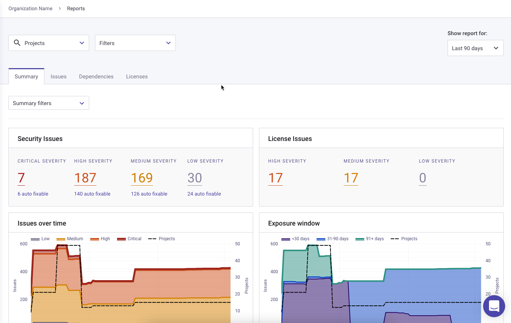

# Legacy reports


**Feature availability**\
This feature is available with Enterprise plans. See [pricing plans](https://snyk.io/plans/) for more details. See [Reporting](../) for information about Snyk's updated reporting feature.


Snyk reports show the status of all of your Projects, issues, dependencies, and licenses, for your Organization or Group.

Snyk reports help security and development teams work together. As your coding work progresses, Snyk's reporting dashboard lets security professionals monitor activity and maintain security insight without looking over development’s shoulder.

See the [Reports Overview](legacy-reports-overview.md) page for more information on organizing and customizing legacy reports.


Reports do not support Snyk Code Projects.


## Accessing reports

Select the **Reports** menu option to view reports:

