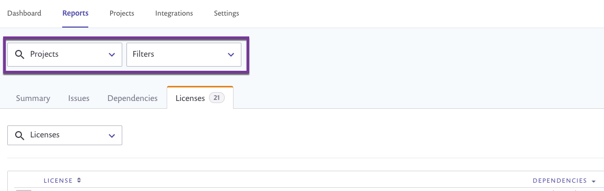
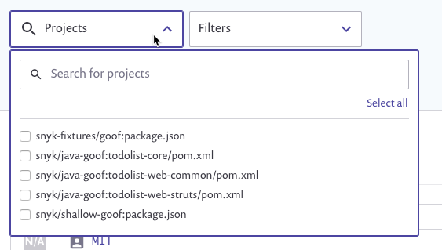
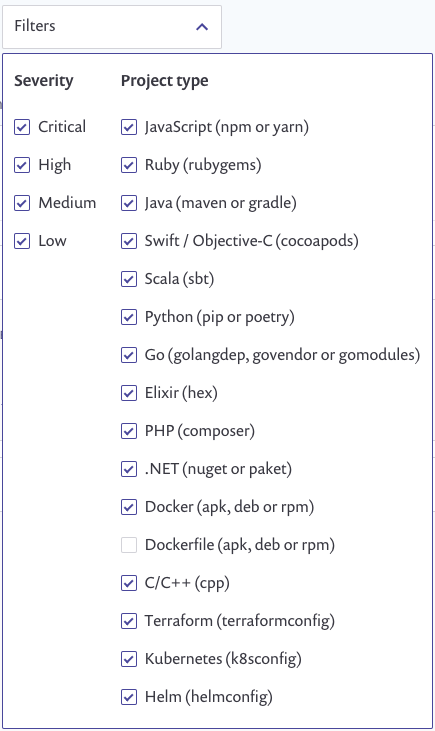

# Legacy reports general actions

This section describes the actions you can perform on all Reports tabs.

## Apply filters

At the Organization level, from the top of the Reports area, you can search for and filter specific Snyk Projects, and you can filter Projects by severity and type. After you've filtered, the settings are retained as you navigate between tabs.


The maximum support for filtering is 1,000 Projects.


<figure><figcaption>
Report filters
</figcaption></figure>

To search for and filter specific Projects, open the dropdown from the **Projects** search field; additionally or alternatively, start typing any part of the project names:

<figure><figcaption>
Report filters - Projects
</figcaption></figure>

To filter by vulnerability severities and by Project types, open the **Filters** dropdown:

<figure><figcaption>
Report filters - by vulnerabilities and Project type
</figcaption></figure>

## Navigate to and view data for Groups and Organizations

To view data for a single Organization, you must be an administrator for that Organization. Follow these steps:

1. Select the Organization from the dropdown list in the top panel.
2. Navigate to **Reports**.

Data appears only for the Organization you selected.

## View data for multiple Organizations

Group administrators can view report data for multiple Organizations in a single Group. Follow these steps:

1. Select the Group from the dropdown list in the top panel.
2. Navigate to **Reports**.\
   Data appears for all Organizations in the Group, and a dynamic dropdown of Organizations is available.
3. Check or uncheck the Organizations you wish to view.
4. To save the selected Organizations as a quick filter, assign a unique name and then click **Save**.

## Sort columns

Columns that allow the data to be sorted have arrows next to their headings. Click the arrows to sort the data in descending order by the relevant category. Click again to switch the order to ascending.
