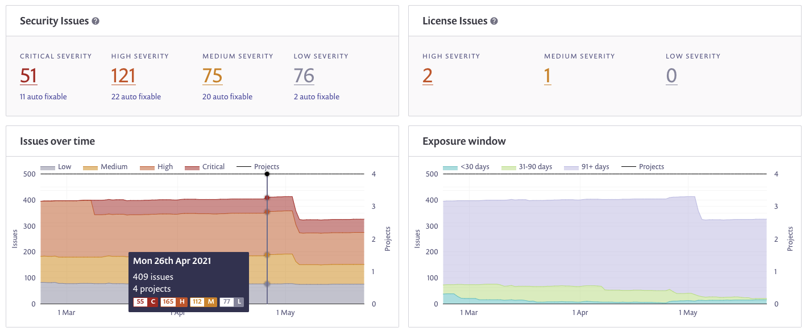

# Legacy reports overview

The legacy **Reports** area in the Web UI offers data and analytics about Projects, issues, dependencies, and licenses. You can also generate and retrieve report data using the [API](../../../snyk-api/reference/reporting-api-v1.md).

Report information appears in the Web UI based on the Organization in which you are working, and you can filter this data with different parameters.

In addition, if your account is managed with Groups, you can display aggregated data for all of your Organizations when you navigate to **Reports** from the **Group** level.

From the **Group** level, you can filter to view data for multiple Organizations, as shown in this example:

<figure><figcaption>
Group-level reporting
</figcaption></figure>

You can also use the **Organization Filters** to save and store pre-filtered reports for selected groups of Organizations.

At the Organization level, you can also use [General actions](legacy-reports-general-actions.md) to filter for:

* Project names
* Project types
* vulnerability severity
* a specific period of time

The legacy **Reports tabs** are as follows:

* [Summary](legacy-reports-summary-tab.md): the main dashboard displays a summary view of all of your issues (vulnerabilities and licenses), across all of your Projects.
* [Issues](legacy-reports-issues-tab.md): all issues (vulnerabilities and licenses) across all of your Projects, including their severity, any available fixes, and more.
* [Dependencies](../../../manage-risk/reporting/legacy-reports/legacy-reports-dependencies-tab.md): the package dependencies in your Project and their health status.
* [Licenses](legacy-reports-licenses-tab.md): the licenses in all of your Projects and their status.

There may be a delay from the time a Project is tested to the time when that data appears in the Reports area. If you find that there is more than a nine hour delay, [contact Snyk Support](https://support.snyk.io).

Read-only and deactivated Projects and results do not appear in the Reports area.
