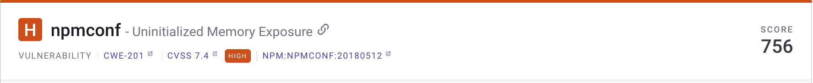
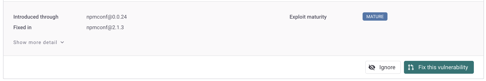
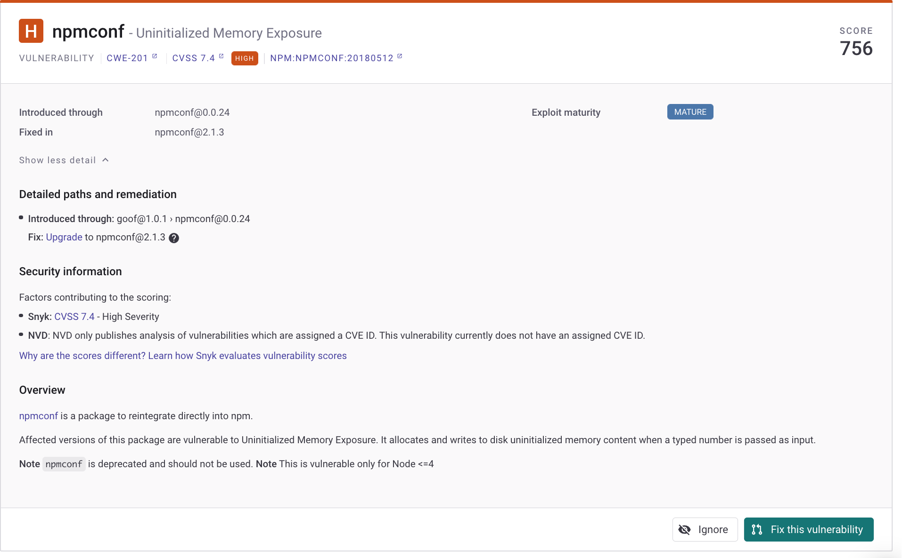

# Issue card information

## Introduction to issue cards

Issue cards appear on the details page for a Project.

You can:

* [View issue card information](issue-card-information.md#view-issue-card-information)
* Expand a card to [show more details](issue-card-information.md#detailed-information-in-the-issue-card)
* [Filter and sort issue cards](issue-card-information.md#filtering-and-sorting-issue-cards)
* [Take other actions](issue-card-information.md#card-actions).

### View Issue card information

Issue cards show details for a specific vulnerability or license issue, and actions you can take for:

<figure><figcaption>
Issue card for the npmconf vulnerability
</figcaption></figure>

Card details include [Header section](issue-card-information.md#header-section) and [Body section](issue-card-information.md#body-section) information.

#### Header section

<figure><figcaption>
npmconf issue card header
</figcaption></figure>

* [Severity level](../prioritizing-and-managing-issues/severity-levels.md): for example, **H** (High) or **C** (Critical)
* **Issue name**: for example, **Uninitialized Memory Exposure**, with a link that can be copied
* **Score**: [Priority score](../prioritizing-and-managing-issues/priority-score.md): 0 - 1,000
* **Type**: VULNERABILITY or LICENSE ISSUE
* Links to [CWE](https://cwe.mitre.org/index.html) (Common Weakness Evaluation), [CVSS](https://www.first.org/cvss/calculator/3.1) (Common Vulnerability Scoring System), and Snyk [Intel Vulnerability DB](https://snyk.io/vuln) information for the issue. You can use these links to view more information about the CWE, CVE, and CVSS scores: or navigate to the Snyk vulnerability database information for a specific vulnerability from its issue card.

#### Body section

<figure><figcaption>
npmconf issue card body details
</figcaption></figure>

* **Introduced through**: The path through which the vulnerability or license was introduced
* **Fixed in:** The file the vulnerability is fixed in
* [Exploit maturity](../prioritizing-and-managing-issues/view-exploits.md): for example, **Mature** or **Proof Of Concept**
* Reachability: for example, **Reachable**. For information and an example, see [Reachable vulnerabilities](../prioritizing-and-managing-issues/reachable-vulnerabilities.md)
* **Social Trends**: Snyk shows a [Trending](../prioritizing-and-managing-issues/vulnerabilities-with-social-trends.md) banner for issues that are being actively discussed on Twitter.

### Detailed information in the issue card

When you expand the issue card for more information, you can see details for the vulnerability, including:

* Detailed path information
* Fix advice
* Overview of the vulnerability
* Any vulnerable functions within the vulnerability

<figure><figcaption>
Details for the npmconf vulnerability
</figcaption></figure>

## Filtering and sorting issue cards

You can apply multiple filters to a Project to show a set of issues:

* Whether a vulnerability or a license issue
* With a specific severity
* Within a range of the priority score
* Based on whether it has an exploit, and how mature the exploit is
* That are open or have been patched or ignored

The issue cards in a Project can be sorted based on their priority score or severity.

## Card actions

You can perform the following actions on the issue card:

* [**Ignore the issue**](../prioritizing-and-managing-issues/ignore-issues.md): if you do not need to take action on an issue, or it does not need to appear on your reports, you can ignore it.
* \*\*\*\*[**Create a Jira ticket**](../../integrations/notifications-ticketing-system-integrations/jira.md): if you have the Jira integration, you can link your issue boards to Snyk and create Jira tickets directly from the project details page to fix vulnerabilities.
* [**Fix the vulnerability**](https://docs.snyk.io/snyk-open-source/open-source-basics/fixing-vulnerabilities): if a fix is available, you can fix individual vulnerabilities.
