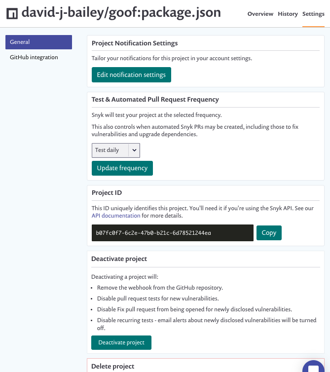

# View Project settings

## Edit settings

Select the **Settings** tab on the Project details page to view and edit Project settings:

<figure><figcaption>
Project details page Settings tab
</figcaption></figure>

Click the **GitHub integration** section to edit SCM-specific settings (applicable also to other SCMs).

You can edit the **Project Notification Settings** and **Test & Automated Pull Request Frequency**. You can also retrieve the **Project ID** for use in Snyk API calls.


The default test frequency and available test frequencies vary depending on the type of Project: Open Source, Code analysis, Container, or IaC. For more information see [Usage page details](../../snyk-admin/manage-settings/usage-settings.md) (Set test frequency). You can also set test frequency by using the Snyk REST API: [Updates project by project ID](https://apidocs.snyk.io/?version=2023-02-15#patch-/orgs/-org\_id-/projects/-project\_id-).


You can also deactivate or delete a Project.

### Deactivate a Project

Deactivating a Project will:

* Remove the webhook from the SCM repository.
* Disable pull request tests for new vulnerabilities.
* Disable a Fix pull request from being opened for newly disclosed vulnerabilities.
* Disable recurring tests; email alerts about newly disclosed vulnerabilities will be turned off.
* Remove any vulnerabilities in the project from reporting and dashboard views

### Delete a Project

Deleting a Project will:

* Delete the Project and all historical snapshot data from Snyk.
* Remove the webhook from the GitHub repository.
