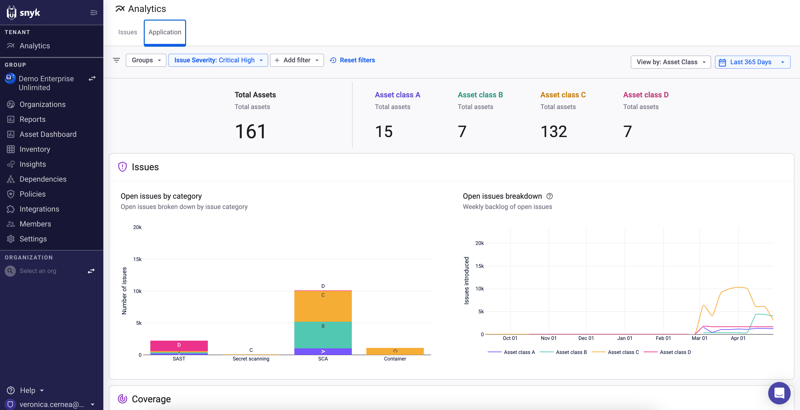
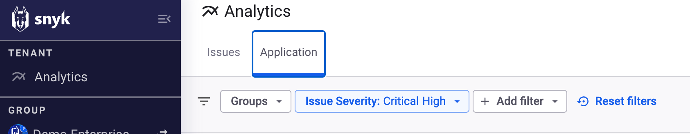
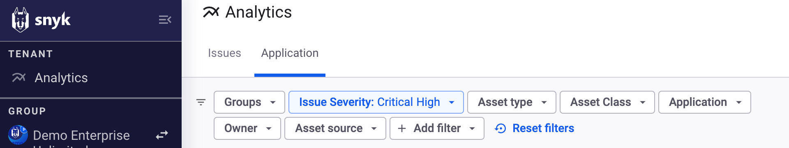
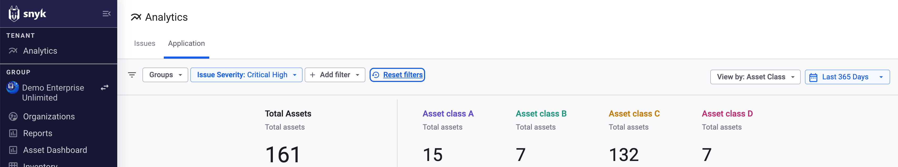
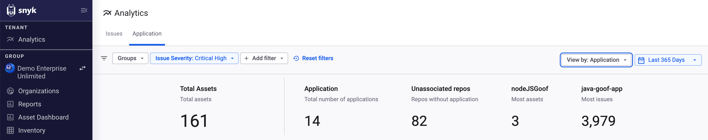
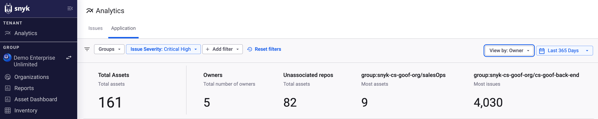
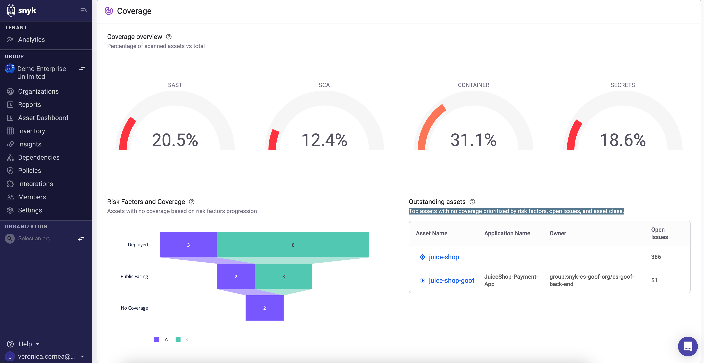
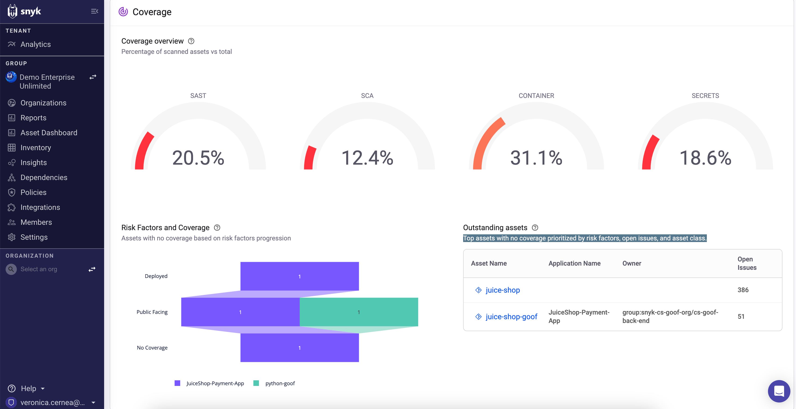
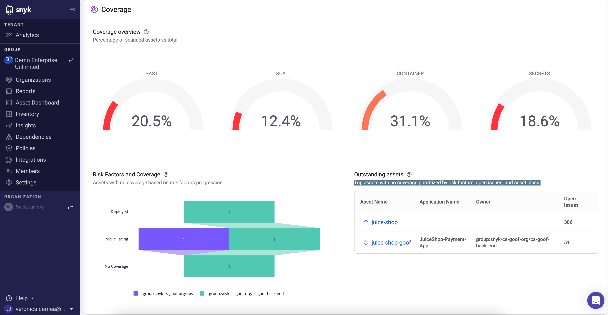

# Application - Analytics


**Release status** \
Analytics is currently in Closed Beta and available only for Snyk AppRisk Pro plans.&#x20;

Contact your account manager if you are interested in Snyk AppRisk Pro.


## Overview


Application Analytics is available only for Snyk AppRisk Pro users.&#x20;

If you are using Snyk AppRisk Essentials, navigate to the [Dashboard for Snyk AppRisk ](../../snyk-apprisk/dashboard-for-snyk-apprisk.md)page.


Application Analytics enables you to review and explore your AppSec program status and results from a top-down approach. You can start the exploration from a high, general level over applications, teams (owners), or asset classes and then narrow it down to the asset level.\
You can enhance the security of your application by identifying areas for improvement, recognizing developing risks, and addressing blind spots. The Application Analitycs retrieves the data from all the Groups available for the tenant.

The following video presents the main functionalities of the Application Analytics:


Liked the video? Checkout the rest of the course on [Snyk Learn](https://learn.snyk.io/lesson/snyk-apprisk-essentials/)!


Harnessing Application Analytics provides answers to questions such as:

* Which sensitive assets are being publicly exposed and not tested according to the coverage policy?
* Which applications and code owners bear the most risk in terms of accumulated critical and high issues, and how do they compare to others?
* How many repositories exist without a clear association to an application or a code owner? And are new assets being associated as expected?

<figure><figcaption>
Application Analytics Overview
</figcaption></figure>

## Filters and views 

You can customize your data by using the available filters, dimension views, and specific timeframes.&#x20;

Filters are applied at the tenant level, and after being customized, they have an impact on all the reports and statistics presented on the Application Analytics page.

You can refine the data even more by using the View by options. This focuses the data on specific dimensions: Asset Class, Application, or Owner.

### Filters

The filters are located at the top left of your Application Analytics page, and you can customize them based on your needs.

Here are the available filters:

| Filter                                                                                                                                   | Description                                                                                                                                                                                                                                                                                                                                                                                                                                                                                    |
| ---------------------------------------------------------------------------------------------------------------------------------------- | ---------------------------------------------------------------------------------------------------------------------------------------------------------------------------------------------------------------------------------------------------------------------------------------------------------------------------------------------------------------------------------------------------------------------------------------------------------------------------------------------- |
| Groups                                                                                                                                   | 
Provides a list of all the available Groups that exist for the selected tenant. You can customize the selection and focus only on specific Groups. The default setting is providing information for all available groups.
                                                                                                                                                                                                                                                            |
| Issue severity                                                                                                                           | Provides a list with all available types of severity for an issue. The default setting provides information about issues with Critical and High severity.                                                                                                                                                                                                                                                                                                                                      |
| 
Add filter
<ul><li>Asset type</li><li>Asset classes</li><li>Assets application</li><li>Assets owner</li><li>Asset source</li></ul> | 
You can add filters for a more customized data analysis. 
<ul><li>Asset type - specify the asset type (Container image, Repository)</li><li>Asset classes - specify the asset class (A, B, C, D)</li><li>Assets application - specify the application for which you want to see the assets</li><li>Assets owner - specify the Group owner of the analyzed assets</li><li>Asset source - specify the source of the assets (Snyk, SCM integrations, or third-party integrations)</li></ul> |
| Reset filters                                                                                                                            | Resets the filters to the default state                                                                                                                                                                                                                                                                                                                                                                                                                                                        |

Every newly added filter is displayed next to the default ones, the Asset group and Issue Severity filter.

<table data-card-size="large" data-view="cards"><thead><tr><th></th><th></th><th></th></tr></thead><tbody><tr><td><strong>Default filters</strong></td><td></td><td></td></tr><tr><td><strong>Customized filters</strong></td><td></td><td></td></tr></tbody></table>

### Views

Managing an AppSec program can be challenging, especially ensuring complete visibility of assets and issues. Identifying assets that require protection and monitoring them with all applicable ASTs can be difficult. This task becomes more complex with new assets and misconfigurations in ASTs, leading to incomplete coverage and critical visibility.\
\
AppSec teams must maintain a comprehensive understanding of risks and vulnerabilities linked to applications and their respective owners.

Viewing metrics for an application or owner is much more meaningful and helps to:

* Clearly communicate the status and developing trends to all levels and groups across the enterprise.
* Identify who should be aware of the situation and who should take action.
* Make comparisons and conclude where more attention is needed.

Application analytics provides you with new levels of visibility over your important assets, applications, and code owners (teams) and helps you to identify and take action on risk and coverage.

Collaboration across Research and Development teams is necessary for achieving optimal visibility and requires attention from the AppSec team.

You can display the analytics view by:

* Asset Class
* Application&#x20;
* Owner

By selecting a View by dimension, all exposed widgets will be affected, enabling you to compare data points based on the selected dimension.


The widgets display the top five applications or code owners based on the context. For instance, in the "open issues by control" widget, the top five applications or owners are chosen based on the total number of issues after applying the display views.\
You can also compare specific applications or owners by adding the application or owner display views.


<table data-card-size="large" data-view="cards"><thead><tr><th></th><th></th><th></th></tr></thead><tbody><tr><td><strong>View by: Asset Class</strong></td><td></td><td></td></tr><tr><td><strong>View by: Application</strong></td><td></td><td></td></tr><tr><td><strong>View by: Owner</strong> </td><td></td><td></td></tr></tbody></table>

Assets and applications vary in importance and sensitivity. Some repositories are internal and used for testing only, while others are public-facing and used in key services.

The dashboard default view compares assets and issues metrics by asset class. Display the view by dimension to see a comparison between applications or code owners throughout the dashboard.

#### Asset Class view 

[Asset class](https://docs.snyk.io/manage-risk/snyk-apprisk/inventory-for-snyk-apprisk/inventory-capabilities#class) reflects the business criticality of the asset from A (most critical) to D (least critical).\
By having this level of visibility, you can prioritize the most crucial assets in your inventory, applications, or code owners.\
To associate assets with asset class, you can either change the asset class manually in the inventory screen or preferably define a [classification policy](https://docs.snyk.io/manage-risk/snyk-apprisk/policies-for-snyk-apprisk/use-cases-for-policies/classification-policy-use-case) that will automatically assign an asset class to your assets.

#### Applications and Owner view 

You can filter the data from your Application Analytics dashboard based on application or code owner. To proceed, it is necessary to have the appropriate metadata available for the repositories. The metadata can be pulled directly from the Snyk SCM integration. You can find details of how to set this up on the [Backstage catalog in Asset Inventory](../../snyk-apprisk/integrations-for-snyk-apprisk/backstage-file-for-scm-integrations.md#backstage-catalog-in-asset-inventory) page. \
To determine if this metadata is available in your repositories, check the completeness widget for repository metadata. Snyk recommends verifying that all class A assets are properly configured by using the asset class filter from the dashboard.&#x20;

### Analytics timeframe

You can select a specific timeframe for the assets analyzed data. The default setting is Last 365 days. Here are all the available options:

* Last 7 days
* Last month
* Last 30 days
* Last 90 days
* Last 365 days
* Month to Date
* Year to Date

## Data categories 

The Application Analytics dashboard focuses on three main data categories:

* **Issues** - provides the status of the open issues
* **Coverage** - provides the coverage status and the trends for the analyzed assets
* **Assets** - provides the coverage status of the repository metadata and the status and trends for the imported assets.

### Issues

In the Issues section, you have information about the analyzed open issues.

* **Open issues by category** - This graphic provides a clear overview of the number of issues distributed by the integration category (SAST, SCA, Container, Secrets, and so on).&#x20;
* **Open issues breakdown** - This graphic provides information about the backlog of your open issues. The desired trend is a negative one, especially for higher asset classes or important applications.

You can choose to view the issues based on Asset Class, Application, or Owner. The focus of the presented information is changed based on your View by selection.

<table data-card-size="large" data-view="cards"><thead><tr><th></th><th></th><th></th></tr></thead><tbody><tr><td><strong>Issues section - View by: Asset Class</strong></td><td></td><td></td></tr><tr><td><strong>Issues section - View by: Application</strong></td><td></td><td></td></tr><tr><td><strong>Issues section - View by: Owner</strong></td><td></td><td></td></tr></tbody></table>

You can see more details about each graphic by hovering over the presented data. Extra controls are available on the right side of each graphic, allowing you to control the zoom, select a specific area, or download it as an image. You can also use the scroll option for graphics that present data for an extensive time period.

### Coverage

AppSec teams struggle with maintaining an accurate asset inventory view. To achieve this view, you must establish a [coverage policy](../../snyk-apprisk/policies-for-snyk-apprisk/use-cases-for-policies/coverage-and-coverage-gap-policies.md) and ensure that security tests are configured based on the policy criteria. Then you need to examine your scanned assets, starting with critical assets (by asset class) that are deployed and public-facing.

In the Coverage section, you have information about the assets coverage.&#x20;

* **Coverage overview** - provides information, in percentages, about the scanned assets, distributed by the integration category (SAST, SCA, Container, Secrets, and so on).&#x20;
* **Risk factors and coverage** - provides information about assets with no coverage based on the progression of the risk factors.&#x20;
* **Outstanding assets** - provides information about the top five assets with no coverage prioritized by risk factors, open issues, and asset class. &#x20;

You can choose to view the Coverage section based on Asset Class, Application, or Owner. The focus of the presented information is changed based on your View by selection.

<table data-card-size="large" data-view="cards"><thead><tr><th></th><th></th><th></th></tr></thead><tbody><tr><td>
<strong>Coverage section - View by: Asset Class</strong>

</td><td></td><td></td></tr><tr><td><strong>Coverage section - View by: Application</strong></td><td></td><td></td></tr><tr><td><strong>Coverage section - View by: Owner</strong></td><td></td><td></td></tr></tbody></table>

You can see more details about the **Risk factors and coverage** graphic by hovering over the presented data. Extra controls are available on the right side of each graphic, allowing you to control the zoom, select a specific area, or download it as an image. You can also use the scroll option for graphics that present data for an extensive time period.

### Assets

In the Assets section, you have information about the analyzed assets.

* **Repo metadata completeness** - Percentage information is provided about the availability of backstage catalog attributes, including application and owner, for the available repositories.
* **New assets introduced** - provides information about when new assets were introduced over time.
* **Repository source distribution** - provides information about the repositories distributed by the type of integration (SCM integrations, third-party integrations).

You can choose to view the Assets section based on Asset Class, Application, or Owner. The focus of the presented information is changed based on your View by selection.

<table data-card-size="large" data-view="cards"><thead><tr><th></th><th></th><th></th></tr></thead><tbody><tr><td><strong>Assets section - View by: Asset Class</strong></td><td></td><td></td></tr><tr><td><strong>Assets section - View by: Application</strong></td><td></td><td></td></tr><tr><td><strong>Assets section - View by: Owner</strong></td><td></td><td></td></tr></tbody></table>

You can see more details about each graphic by hovering over the presented data. Extra controls are available on the right side of each graphic, allowing you to control the zoom, select a specific area, or download it as an image. You can also use the scroll option for graphics that present data for an extensive time period.

