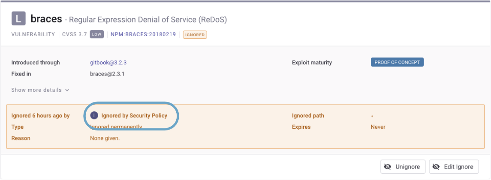
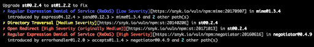
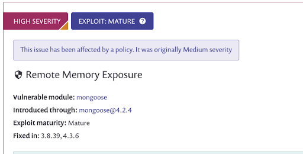
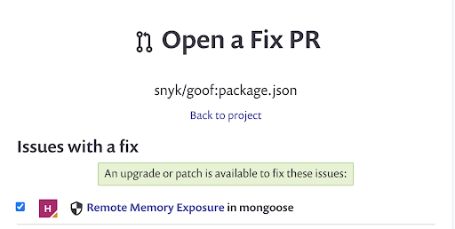
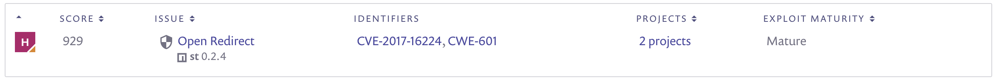

# Security policy results

A newly-assigned policy, or changes to a policy, apply when the Project is re-scanned. This is what Project collaborators see when an action is applied to a vulnerability:

<table data-header-hidden><thead><tr><th width="246">Action</th><th>What Project collaborators see</th></tr></thead><tbody><tr><td>Change severity to…</td><td>The new severity, as well as the originally assigned severity</td></tr><tr><td>Ignore current and future instances</td><td>An ignored issue looking like a manual ignore but labeled <strong>ignored by Security Policy</strong>.</td></tr></tbody></table>

Examples follow for an issue on a Project page that has been ignored by a security policy:

<figure><figcaption>
Issue ignored by security policy
</figcaption></figure>

## **Custom and original severity in the CLI**

<figure><figcaption>
Custom and original severity in the CLI
</figcaption></figure>

## **Custom and original severity in Project page UI**

<figure><figcaption>
Custom and original severity in the Project Page UI
</figcaption></figure>

## **Custom and original severity in Open Fix PR UI**

<figure><figcaption>
Custom and original severity in Open Fix PR UI
</figcaption></figure>

## **Custom and original severity in reports**

<figure><figcaption>
Custom and original severity in reports
</figcaption></figure>

