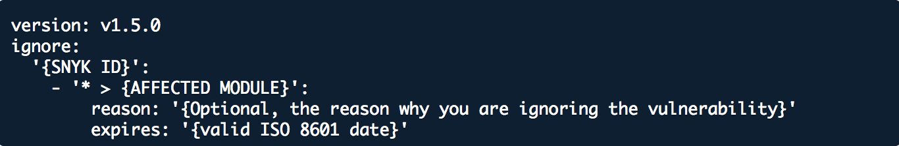
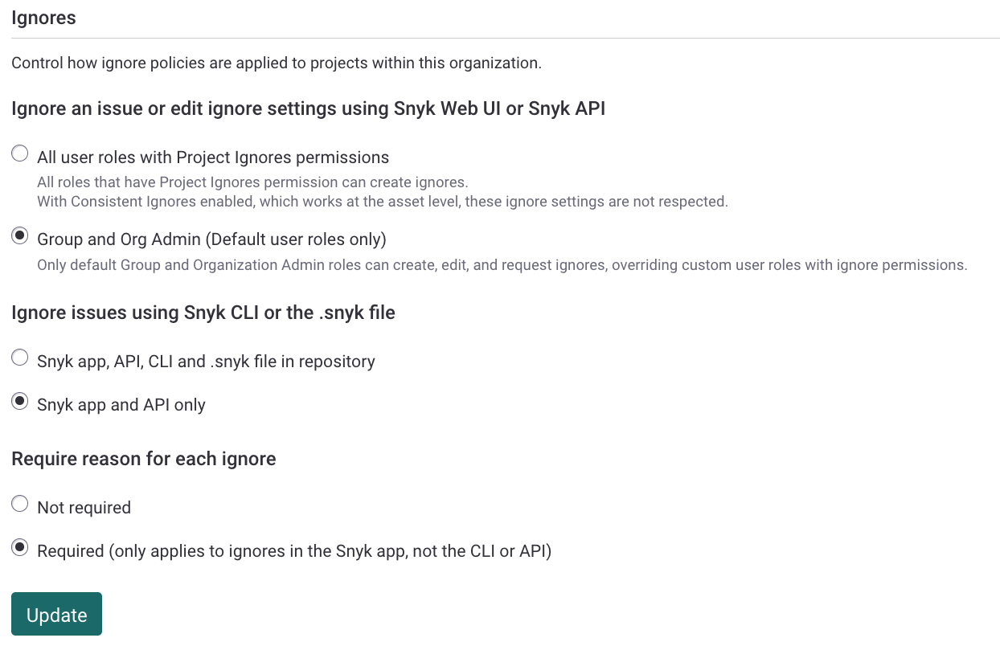

# Ignore issues

You can ignore a vulnerability or open-source license issue if you do not need to fix it and want to avoid seeing the issue in scan results. You can ignore issues temporarily or permanently and set ignores individually or as actions. By using Snyk ignores you can display results only for issues you need to fix

&#x20;For Open Source details, see [How to set ignores](./#how-to-set-ignores). This information provides a useful background for using ignores with other Snyk scanning methods. For more information, see the following sections on this page:

* [Ignore issues in Snyk Code](./#ignore-issues-in-snyk-code)
* [Ignore issues in Snyk Container](./#ignore-issues-in-snyk-container)
* [Ignore issues in Snyk IaC](./#ignore-issues-in-snyk-iac)

## Decisions to ignore issues

Optimally, it allows you to fix or patch vulnerabilities or remove vulnerable dependencies. However, you may want to suppress an issue for any of the following reasons:

* There is no fix.
* The issue is not relevant to the Project. One example is a distributed denial-of-service (DDoS) attack for an internal service.

It is optimal to fix an issue even if it has a path that makes it non-exploitable. A vulnerability that is not exploitable now may become exploitable in the future.

## How to set ignores

You can view and ignore issues in several ways:

* [Ignore issues in the Snyk Web UI](./#ignore-issues-in-the-snyk-web-ui)
* [Ignore issues in the CLI](./#ignore-issues-in-the-cli)
* [Scan from the CLI or CI/CD, ignore in the Web UI](./#scan-from-the-cli-or-ci-cd-ignore-in-the-web-ui)
* [Use the .snyk file to ignore issues](./#use-the-.snyk-file-to-ignore-issues)
* [Use policy actions to ignore issues](./#use-policy-actions-to-ignore-issues)

### Ignore issues in the Snyk Web UI

Each issue card has an **Ignore** button that opens a dialog where you can select how or why you want to ignore the issue and how long to ignore it.

<figure><figcaption><p>Ignore dialog from issue card</p></figcaption></figure>

You can select **Not vulnerable** for any issue that is not exploitable at the time you create the ignore.

If you select **Ignore temporarily,** then you can check the **Until fix is available** checkbox:

<figure><figcaption><p>Ignore temporarily</p></figcaption></figure>

This is checked by default if no fix is available for the issue. The vulnerability resurfaces as soon as Snyk has a fix for it, and optionally you can provide additional details on why you are ignoring the issue.


An issue is ignored until either of these conditions occurs: the ignore period expires, or the vulnerability becomes fixable.

An issue ignored in an Open Source or Code Project in the Snyk web UI will be reflected and not flagged in any subsequent [PR checks](../../../scan-with-snyk/pull-requests/pull-request-checks/) across all branches of the Project.


When you ignore an issue in the Snyk Web UI, the issue shows who ignored it and allows you to edit the ignore or unignore the issue.

<figure><figcaption><p>Ignore set in the Snyk Web UI</p></figcaption></figure>

For more information, see the training: [Ignoring issues](https://learn.snyk.io/lesson/ignoring-issues/).

### Ignore issues in the CLI

You can suppress issues through the CLI by using the `snyk ignore` command, for example:

`snyk ignore --id='npm:braces:20180219' --expiry='2018-04-01' --reason='testing'`

For more information, see the [`ignore`](../../../developer-tools/snyk-cli/commands/ignore.md) command help and [Ignore vulnerabilities using Snyk CLI](../../../developer-tools/snyk-cli/scan-and-maintain-projects-using-the-cli/ignore-vulnerabilities-using-the-snyk-cli.md).

When you use `snyk ignore` for Open Source, the `.snyk` policy file is updated with the path and reason given if one was provided. An example follows:

```
'npm:moment:20170905':
- moment:
reason: The reason given
expires: '2017-12-29T16:10:16.946Z'
```

For more information, see [Use the .snyk file to ignore issues](./#use-the-.snyk-file-to-ignore-issues).

### Scan from the CLI or CI/CD, ignore in the Web UI

Ignores for Open Source issues found in a CLI or CI/CD run are synchronized with the Web UI as follows:

1. You scan a Project and push the results to the Web UI using `snyk monitor`.
2. You see the results of the scan in the Web UI and choose to ignore an issue.
3. The issue is ignored when you run `snyk test` or `snyk monitor` in the CI/CD or CLI.

Refer to the following example. Issues are identified as **CI/CLI**, meaning the Project was imported from `snyk monitor`. The issue is `npmconf`. It is **Not vulnerable,** and the user can select **Ignore**.

<figure><figcaption><p>Project imported by <code>snyk monitor</code>, ignore set in the Web UI</p></figcaption></figure>

The following shows `snyk test` results before an ignore is set in the Web UI:

<figure><figcaption><p>Snyk test results before ignoring in the Web UI</p></figcaption></figure>

The following shows `snyk test` results after an ignore is set in the Web UI:

<figure><figcaption><p>Snyk test results after ignoring in the Web UI</p></figcaption></figure>

The same repository imported from the SCM is considered to be a different Project, and any ignore set for an SCM Project does not impact the results of `snyk test` from the CLI or a CI/CD. SCM and CI Projects behave as two standalone Projects.

### Use the .snyk file to ignore issues


The `expires` field is optional. If you need a permanent ignore, omit the field.

To ensure that expiration dates are enforced for ignores that are created through the `.snyk` file, you must specify a valid expiration date. The date must be in the Date Time String Javascript format like YYYY-MM-DDThh:mm:ss.fffZ. If the specified expiration date does not adhere to this format, the ignore will be respected and persist indefinitely. For details, see the [--expiry option in the snyk ignore command help](../../../developer-tools/snyk-cli/commands/ignore.md#expiry-less-than-expiry-greater-than).


For Open Source Projects, you can ignore the vulnerability by creating a `.snyk` YAML file or  modifying the existing `.snyk` file.

<figure><figcaption><p>A .snyk file</p></figcaption></figure>

For example, if you want to ignore the vulnerability with SNYK ID [SNYK-RUBY-FASTREADER-20085](https://snyk.io/vuln/SNYK-RUBY-FASTREADER-20085) in `fastreader`, with the reason “No fix available” until 01 Jan 2024, you would write the following:

```
version: v1.5.0
ignore:
    'SNYK-RUBY-FASTREADER-20085':
     - '* > fastreader':
        reason: 'No fix available'
        expires: '2024-01-01T00:00:00.000Z'
```


For more information, see [The .snyk file](../../policies/the-.snyk-file.md), including the section about [.snyk files in monorepos](../../policies/the-.snyk-file.md#use-the-.snyk-file-with-monorepos-and-complex-projects) and .[snyk files in different directories from manifest files](../../../developer-tools/snyk-cli/scan-and-maintain-projects-using-the-cli/a-.snyk-policy-file-in-a-different-directory-from-the-manifest-file.md).


### Use policy actions to ignore issues

You can set [Security policy actions](../../policies/security-policies/security-policy-actions.md) to ignore all vulnerabilities that match the conditions specified in a policy rule.

For more information, see [Security policies](../../policies/security-policies/).

## Ignore issues in Snyk Code

For [Snyk Code](../../../scan-with-snyk/snyk-code/), the ignore functionality may capture a wider range of issues than other products.

Snyk Code transforms the input code into an intermediate representation, which captures the flow of code but abstracts away some details.

Snyk Code uses this intermediate representation to recognize the same issue even when you refactor your code or rename a variable.

Thus when you ignore an issue, Snyk Code can also ignore that issue if it occurs in multiple places in your code, even with minor code changes. This avoids generating multiple duplicate reports for pieces of code with the same ignored issue.

As an example, the following two code snippets, denote the same issue, as the developer only renamed the variables:

```
var fs = require('fs');
var logFileName = req.query.file || 'standard_log.log';
var logfile = fs.readFile(logFileName, "utf8", function(err, data) {...
```

```
var filesystem = require('fs');
var generalLogFileName = req.query.file || 'standard_log.log'; 
var handleLogFile = filesystem.readFile(generalLogFileName, "utf8", function(err, data) {...
```

## Ignore issues in Snyk Container

When you scan container images using `snyk container test`, you can ignore issues that are not relevant to you by setting an ignore in [The .snyk file](../../policies/the-.snyk-file.md).

Snyk recommends storing and versioning the `.snyk` file in the root of your working directory.

After you set an ignore, when you use the `snyk container test` or `snyk container monitor` command, you must use the `--policy-path=` option. An example follows:

`snyk container test node --policy-path=.snyk.`

## Ignore issues in Snyk IaC

When scanning your IaC configuration files using `snyk iac test`, you can ignore issues that are not relevant to you by using [The .snyk file](../../policies/the-.snyk-file.md).

Snyk recommends storing and versioning the `.snyk` file in the root of your working directory, where you store your IaC configuration files.

For more information, see [IaC ignores using the .snyk policy file](../../../developer-tools/snyk-cli/scan-and-maintain-projects-using-the-cli/snyk-cli-for-iac/iac-ignores-using-the-.snyk-policy-file.md).

## Configure ignore settings

Suppressing vulnerabilities carries a level of risk, so you can make this function available to admins only as follows:

1. Navigate to your Organization **Settings** > **General** > **Ignores**.
2. Under **Ignore an issue or edit ignore settings using Snyk Web UI or Snyk API**, select **Group and Org Admin users (Default user roles only)**.\
   This also prevents ignores from being added through the CLI.
3. Under **Require reason for each ignore**, you can set to **Required** to enter a reason for each ignore.
4. Select **Update** to make the changes.

<figure><figcaption><p>Update ignore settings</p></figcaption></figure>


When Consistent Ignores is enabled, the **Group and Org Admin (Default user roles only)** configuration is disregarded.


If you have access to the Snyk Reporting feature, and use the new [Snyk Reports](../../reporting/available-snyk-reports.md), you can display an Issue Status report showing only the open, ignored issues.

If you use the [Legacy reports](../../reporting/legacy-reports/), you can see an overview of how many issues in the Projects in your Organization are ignored, with an option to filter the issues so you can drill down into each one. If the issue was ignored in the Snyk Web UI, Snyk includes a credit so you can see who initiated it.
