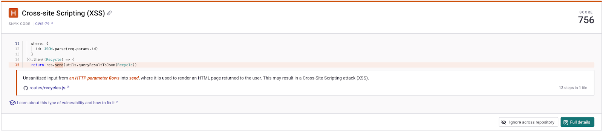

# Consistent Ignores for Snyk Code


**Release status**

Snyk Code Consistent Ignores is in Early Access and available only with Enterprise plans. For more information, see [plans and pricing](https://snyk.io/plans/).

To make sure Snyk Code Consistent Ignores Early Access meets your needs and requirements, review [Known limitations](known-limitations.md) and [FAQ](consistent-ignores-for-snyk-code-faqs.md) sections.


Snyk Code Consistent Ignores helps your teams focus on important tasks by filtering out distractions.&#x20;

It makes sure that once an ignore is created, it is consistently respected regardless of how and where the test is run and what branch is being tested.&#x20;

By filtering out false positives, inapplicable threats, and accepted risks, your security teams can prioritize fixing real problems, and developers can code without interruptions.&#x20;

## From Project to asset-scoped ignores&#x20;

Snyk is transitioning from ignores tied to specific issues within a Project to ignores tied to a finding within a repository. This change enables consistency across Projects and where Projects aren't present while reducing ignore management complexity.

## Enable Snyk Code Consistent Ignores

Enable Snyk Code Consistent Ignores for your Group or Organization in the Snyk Web UI by navigating to **Group/Organization** > **Settings** > **Ignores across the repository for Snyk Code**. See [Snyk Preview](../../../../snyk-admin/snyk-preview.md).

Review the [Known limitations](known-limitations.md) before enabling this feature in your environment.

## Disable Snyk Code Consistent Ignores

Any ignores created or converted with the feature enabled will not be automatically converted back to Project-based ignores. You can recreate them manually after disabling the feature.

## User roles

To create, edit and remove ignores, you need to have a user role assigned with Ignore management permissions. Only Group Admins can set these permissions (see [User role management](../../../../snyk-admin/user-roles/user-role-management.md)).&#x20;

1. Log in to the Snyk Web UI and navigate to your Group and Organization.
2. Navigate to **Members** > **Manage Roles** and select one or more permissions.

<table><thead><tr><th width="203">Ignore management </th><th>Description</th></tr></thead><tbody><tr><td>View Ignores</td><td>View Ignore information.</td></tr><tr><td>Create Ignores</td><td>Create new Ignores.</td></tr><tr><td>Edit Ignores</td><td>Configure Ignores.</td></tr><tr><td>Remove Ignores</td><td>Permanently remove Ignores.</td></tr></tbody></table>

## Convert Project-scoped ignores to asset-scoped ignores


**Before you begin**

If you're new to Snyk or with Snyk Code Projects, you can skip this step as there are no existing ignores to be converted.


Conversion is necessary to give you control over which ignores are converted. For example, if you monitor multiple branches for a given repository, you can decide what ignore metadata should be converted and used as the single source of truth going forward.

The following scenario assumes that you have ignored issues within your Snyk Code Project prior to enabling Snyk Code Consistent Ignores.

If a rescan has not occurred since enabling Snyk Code Consistent Ignores, you may need to [retest the Project](../../../../scan-with-snyk/snyk-code/manage-code-vulnerabilities/#retesting-code-repository) for the `Ignore across repository` button to be active. In most cases, the `Ignore across repository` button will be activated, and this step will not be necessary.

[Navigate to a Snyk Project](../../../../snyk-admin/snyk-projects/) and open an issue card with an issue that was ignored before enabling this feature.

<figure><figcaption>
Ignored issue using the legacy system
</figcaption></figure>

The warning states that the ignore was created through the legacy system and is not consistent across the repository. Issues ignored before enabling the feature will appear with this warning so you can determine what ignore metadata should be converted and used as the source of truth going forward.&#x20;

To convert the issue from a Project-scoped to an asset-scoped ignore, select **Ignore across repository**.

## Manage ignores at the Group level through security policies

You can manage ignores proactively using group-level Snyk Code security policies. As a general rule, you can apply ignore policies when you identify a recurring need to apply similar individual ignores.&#x20;

To manage the ignores through security policies, Snyk Code Consistent Ignores need to be enabled at the Group level by your Snyk team. You will not require [conversion](./#convert-project-scoped-ignores-to-asset-scoped-ignores) for any previously applied Group level policy ignores.

Policies configured to ignore based Project attributes will not result in ignores being applied in Snyk CLI and IDE settings where a Snyk Project is not available.

| Criteria | Description                                                                                                                                                                                                                                                      |
| -------- | ---------------------------------------------------------------------------------------------------------------------------------------------------------------------------------------------------------------------------------------------------------------- |
| CWE      | You can provide any CWE value. Snyk Code will ignore any subsequent tests that find associated findings or issues. You can find valid CWEs on [MITRE’s website](https://cwe.mitre.org/data/published/cwe_latest.pdf) or anywhere you can view Snyk Code results. |
| Rule IDs | You can provide any Snyk Code rule ID. You can find Snyk Code rule IDs as part of the SARIF output that you exported using [Snyk CLI](../../../../snyk-cli/).                                                                                                    |

## Manage ignores in Snyk Projects

You can take action from Project issues, but Snyk will apply any ignores to the underlying asset-scoped findings that can span across Snyk Projects, integrations, and branches.


**Before you begin**

When you create, modify, or delete an ignore, you must [retest the Project](../../../../scan-with-snyk/snyk-code/manage-code-vulnerabilities/#retesting-code-repository) to update the issue status.&#x20;

An indicator at the top of the Project page will notify you if a retest is needed to capture policy or ignore updates.&#x20;

Project retests typically occur on a nightly or weekly basis, but you can also retest manually.


### Create ignore

1. Log in to the Snyk Web UI and navigate to your Group and Organization.
2.  Open a Project and find an issue card.

    <figure><figcaption>
Issue card overview
</figcaption></figure>
3. Select **Ignore across repository** on an issue card to create an ignore.
4. Fill in the ignore information and confirm its creation. The issue will be updated and moved from **Open** to **Ignored**.\
   \
   If anyone loads the page before a retest, an indicator will appear and encourage retesting to capture policy or ignore changes.

### Modify ignore

#### Delete ignore

1. Log in to the Snyk Web UI and navigate to your Group and Organization.
2. Open a Project and find an issue card.
3. Select **Unignore** to set all future tests to show the associated finding or issue as open.

#### Edit ignore details

1. Log in to the Snyk Web UI and navigate to your Group and Organization.
2. Open a Project and find an issue card.
3. Select **Edit Ignore**, change the values, and then **Confirm**.
