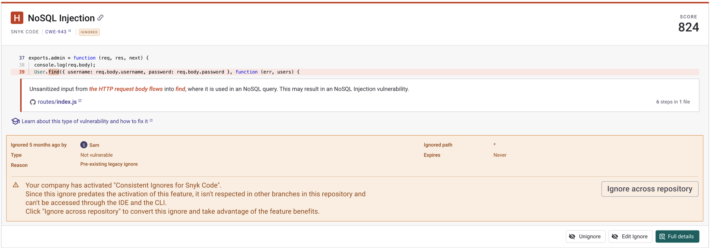

# Known limitations


**Release status**

Snyk Code Consistent Ignores is in Early Access and available only with Enterprise plans. For more information, see [plans and pricing](https://snyk.io/plans/).

To ensure Snyk Code Consistent Ignores Early Access meets your needs and requirements, review the [FAQ](consistent-ignores-for-snyk-code-faqs.md) sections.


The following items are planned to be delivered in the months following the Early Access program.

## Snyk Code CLI Upload (beta)

Snyk Code Consistent Ignores does not support ignores for Projects associated with CLI Upload.&#x20;

If you activate a Snyk Organization with Snyk Code CLI Upload Projects, ignores for any subsequent scans using `snyk code test --report` will not be taken into account. All resulting Projects and associated issues will show as open. Additionally, any pre-existing [Project-scoped ignores will not be converted to asset-scoped ignores](./#convert-project-scoped-ignores-to-asset-scoped-ignores).&#x20;

<figure><figcaption>
Snyk Code Consistent Ignores limitation in CLI upload
</figcaption></figure>

Support for CLI upload ignores will be introduced in the months following the Early Access launch.&#x20;

### Recommendation

If you're using Snyk Code CLI Upload Projects consider postponing Consistent Ignores enablement until these workflows are supported.

If you want to try out Snyk Code Consistent Ignores you can enable it for Organizations that do not have Snyk Code CLI Upload Projects.

## Finding identifier added to Issues API and Reporting&#x20;

There are no changes to the [Group](https://apidocs.snyk.io/?version=2024-10-15#get-/orgs/-org_id-/issues) and [Organization](https://apidocs.snyk.io/?version=2024-10-15#get-/orgs/-org_id-/issues) level Issues API endpoints or Reporting (issue reporting).

An additional attribute containing the finding identifier will be added to these API endpoints and issue reports in the coming months. You can use this to assist you in converting from Project-scoped to asset-scoped ignores, especially at scale or if you have competing ignores across different Projects.

## Bulk ignore conversion

You need to migrate pre-existing Project-scoped ignores to asset-scoped ignores manually on the Projects page.

You may be able to script some of the migration using the CLI, as the CLI output returns both the `issueId` value used in the v1 ignores API, and the `snyk/assets/finding/v1` ID used to manage asset-scoped ignores. However, this would need to be done at the repository level.&#x20;

### Recommendation

If you need support with the migration, reach out to your Snyk account teams or request time with Snyk product management to share feedback on what will make this process easier for you.

### Support for Bitbucket Data Center/Server 

When testing a Bitbucket Server repository, the ignores created are not respected across Projects imported through an SCM integration, Snyk CLI, and IDE.

#### Recommendation 

Postpone activating Snyk Code Consistent Ignores until Bitbucket Data Center/Server is fully supported.
