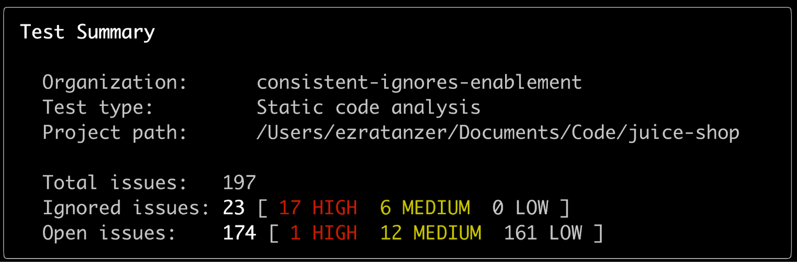
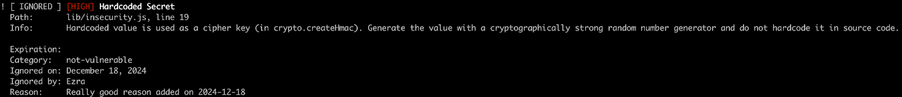
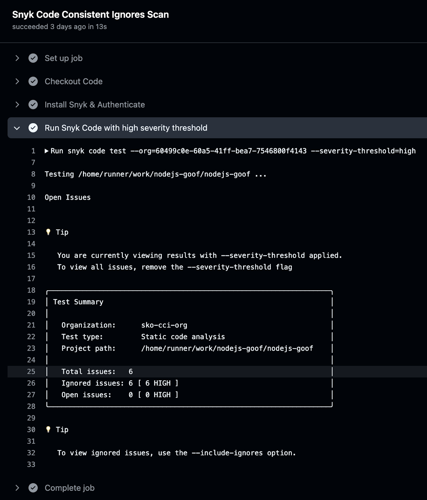

# Consistent Ignores for Snyk Code CLI

Ignores are taken into account in the Snyk CLI when `snyk code test` is run.

## Minimum version required

You must have at least Snyk CLI v1.1297.1 installed for Snyk Code Consistent Ignores. See [Install or update the Snyk CLI](../../../../developer-tools/snyk-cli/install-or-update-the-snyk-cli/).

## Setup

To take ignores into account, specify the Organization where the ignores reside.

[Group-level policies also cascade down to all Organizations](./#manage-ignores-at-the-group-level-through-snyk-code-security-policies). See [How to select the Organization to use in the CLI](../../../../developer-tools/snyk-cli/scan-and-maintain-projects-using-the-cli/how-to-select-the-organization-to-use-in-the-cli.md).

Repository context is required for asset-scoped ignores to take effect. Policy-based ignores such as those based on CWE or Snyk Code Rule ID are still being applied regardless of repository context.

`snyk code test` automatically detects the repository context if a .git directory is present. If not, you can explicitly specify it using the `--remote-repo-url` option. To verify the Git URL, run `git remote -v`.

## Snyk CLI default ignore behavior

The CLI display output hides ignored results by default when you run `snyk code test`. It displays only unignored results and a summary table with the total number of issues (open and ignored).

<figure><figcaption>
Snyk CLI default ignore behavior
</figcaption></figure>

## View ignores in Snyk CLI

After running `snyk code test`, the CLI displays a hint about using the `--include-ignores` parameter to show ignored results.

Running `snyk code test --include-ignores` shows ignored results with their metadata below the open results.

<figure><figcaption>
Ignores in Snyk CLI
</figcaption></figure>

## View JSON output

You can find the ignore metadata in the suppressions module of the SARIF output. Run `snyk code test --json` or `snyk code test --sarif` to view this output.

## Access the finding identifier in JSON and SARIF output

The finding identifier is included in the JSON and SARIF output of Snyk CLI. To view it, run `snyk code test --json` and navigate to `runs.results[n].fingerprints.snyk/assets/finding/v1` in the JSON output. See How Snyk Code identifies and tracks issues.

You can use this identifier to [create new ignores using API calls](api.md).

## Ignores in CI/CD pipelines

As ignores are taken into account in Snyk CLI, the same applies when Snyk CLI is integrated into CI/CD pipelines. For example, if a pipeline uses the command `snyk code test –severity-threshold=high` and there are no unignored high-severity results, Snyk CLI will exit with a `0` (success) status code and the build will succeed.

The following example shows how Snyk Code detected high-severity hardcoded secrets, causing a GitHub Action workflow to fail with the exit code `1`.

<figure><figcaption>
High severity hardcoded secreted detected causing GitHub Action workflow to fail with exit code 1
</figcaption></figure>

In a scenario with ignores applied through Group Policies, Snyk Code has successfully completed the scan, resulting in zero open issues, with the exit code `0`.

<figure><figcaption>
High severity issues ignored causing GitHub Action workflow to succeed with exit code 0
</figcaption></figure>
