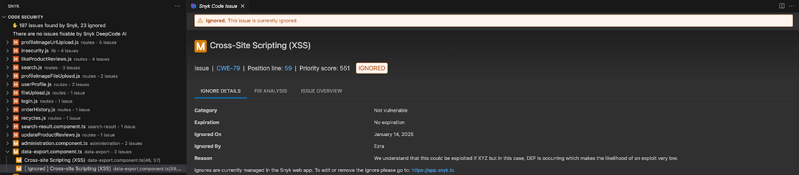

# Consistent Ignores for Snyk Code IDE

When you run tests in any of the [four supported Snyk IDE plugins](../../../../developer-tools/snyk-ide-plugins-and-extensions/), the plugins will take into account your ignores.

## **Minimum version required**

Snyk Code Consistent Ignores works best with the latest IDE plugin versions.

| IDE           | Minimum version required |
| ------------- | ------------------------ |
| VS Code       | 2.22.0                   |
| IntelliJ      | 2.13.1                   |
| Visual Studio | 2.2.1                    |
| Eclipse       | v20250516.122216         |

## **Set up the Organization**

To take ignores into account, specify the Organization where the ignores reside. [Group-level policies also cascade down to all Organizations](./#manage-ignores-at-the-group-level-through-security-policies). See [How to select the Organization to use in IDE plugins (Visual Studio Code example)](../../../../developer-tools/snyk-cli/scan-and-maintain-projects-using-the-cli/how-to-select-the-organization-to-use-in-the-cli.md).

## Snyk IDE default ignore behavior

The IDE display output hides ignored results by default to maintain developer focus.&#x20;

## View ignores in Snyk IDE

You can apply filters in the plugin settings to show ignored results alongside open results or in isolation. When you set ignored issues to display, the issues and their details appear in the plugin.

<figure><figcaption>
View ignores in Snyk IDE
</figcaption></figure>
