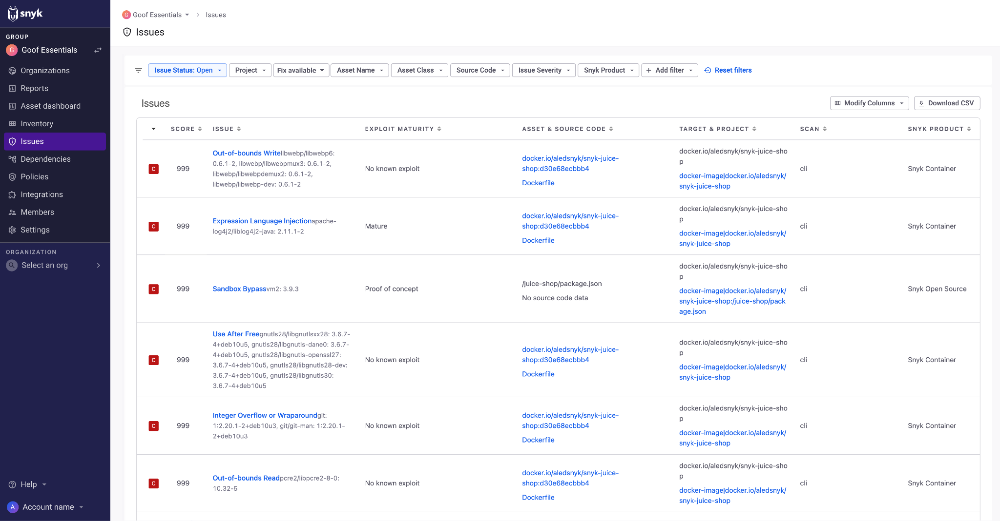

# Prioritization for Snyk Essentials

Snyk uses holistic application intelligence to help you better identify and prioritize your Container, Code, and Open Source issues based on the risk they pose to your application. You can also prioritize your issues based on asset classification as defined in asset-related policies.&#x20;

You can access the **Issues** page from the Snyk Web UI. The **Issues** page provides a centralized view of all the issues identified by Snyk with additional asset context. This will empower AppSec teams to better triage and remediate issues in Snyk. **Issues** is available at the Group level or at the Organization level.&#x20;

## Prioritizing issues using Snyk Essentials

The following video explains how to prioritize issues using Snyk Essentials:


Prioritizing issues with Snyk Essentials


## Issues page for Snyk Essentials

**Issues** is nested in the main left menu and provides information about the identified issues. Use the available filters to customize and prioritize the issues list.

<figure><figcaption>
Issues menu - Snyk Essentials
</figcaption></figure>
