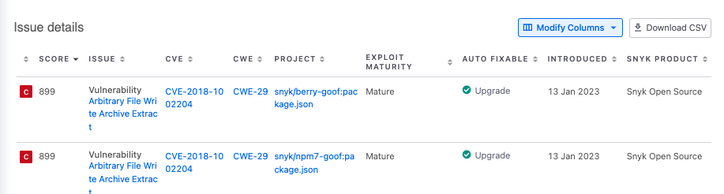

# View exploits

An exploit is a demonstration of how a vulnerability can be taken advantage of. When an exploit is widely published, it is commonly referred to as an exploit "in the wild."

## View exploits in Projects

In the Snyk web UI, navigate to the Project detail page for any of your Projects. Exploit information is shown for each issue found in that Project.

Use the legacy Snyk exploit maturity to filter issues and determine if vulnerabilities have real-world exploits and their level of maturity. This helps prioritize the most risky vulnerabilities.

The filter has the following options:

* **Mature:** Snyk has published a code exploit for this vulnerability.
* **Proof of concept:** Snyk has a proof-of-concept or detailed explanation of how to exploit this vulnerability.\
  Proof of concept vulnerability patches cannot be disabled and are visible in the fix PRs where they are found.
* **No known exploit:** Snyk did not find a proof-of-concept or a published exploit for this vulnerability.
* **No data**: The issue is not a vulnerability, but a license issue or a vulnerability advisory.

You can also filter detected issues in your Projects by CVSS v4.0 exploit maturity to see whether a specific vulnerability has been exploited or a proof-of-concept has been written. This helps you prioritize and attend to the most important and risky vulnerabilities first.

The filter has the following options:

* **Attacked**: Snyk has evidence of active exploitation for this vulnerability.
* **Proof of Concept**: Snyk is aware of a proof-of-concept or detailed explanation of how to exploit this vulnerability. Proof of concept vulnerability patches cannot be disabled and are visible in the fix PRs where they are found.
* **Not Defined**: Snyk has not evaluated the exploit maturity for this vulnerability.

## View exploits availability in Reports

You can check the availability of exploit information in the Reports section.

<figure><figcaption>
View exploits in Reports
</figcaption></figure>

## How exploits are determined

Information about the existence and status of an exploit is collected from various sources.

The security analysts at Snyk curate information on new exploits and an automated process explores structured and unstructured data from multiple exploit sources.

Examples of structured data are the [Known Exploited Vulnerabilities Catalog](https://www.cisa.gov/known-exploited-vulnerabilities-catalog) by CISA (Cybersecurity and Infrastructure Security Agency) [Exploit DB](https://www.exploit-db.com/). Examples of unstructured data include blogs, forums, and social media sites like X (formerly known as Twitter).
