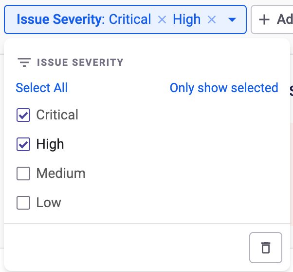

# Reporting

## Overview


**Feature availability**\
Snyk Reporting is available only with Enterprise plans. For more information, see [plans and pricing](https://snyk.io/plans/).


Snyk reports provide the visibility and analytics needed to drive data-based conversations between development and security.

Security professionals can easily access, analyze, and share Snyk security data to track developer adoption and success, identify where the greatest amount of risk lies to prioritize remediation effectively, and understand the overall risk posture across the Organization's application portfolio.

Snyk Reports offer analytics across all of your Projects, displaying detailed and aggregated data about Projects and issues. Data displayed in each report is scoped to the Snyk Organization or Group in which you are working.

Snyk Reports are highly flexible, enabling you to display specifically selected data in the appropriate view to answer key security questions.


Deactivated Projects and their respective results will not appear in the Reports area.


You can view dependencies and license information for all Projects in your Group or Organization. For more details, navigate to the [Dependencies and licenses](dependencies-and-licenses/) page.

Reports are available on the **Reports** tab in the Snyk navigation.

You can navigate to different reports from the dropdown in the upper left. The report currently selected is displayed.

## Snyk reporting filters

All reports are filterable by a number of attributes, enabling users to create the appropriate horizontal or vertical slice of the business for their use case. You can see the available filters on the dropdown furthest right at the top.

If you do not select or enter any values for a particular key, the filter is not applied.

### Snyk reporting filter logic

Within a given filter, all values selected are separated by an OR operator. For example, if you select the values `Critical` and `High` for the `Issue Severity` filter, Snyk displays issues that have a severity of either `critical` or `high`.

<figure><figcaption>
Issue severity selected
</figcaption></figure>

Filters are separated by an AND operator. For example, if you select the `Critical` value for the `Issue Severity` filter and the `Resolved` value for the `Issue Status` filter, Snyk displays issues that are both `critical` severity and `resolved`.

### Stateful URLs for filtered views

Every time a filter value is applied, the app.snyk.io URL is updated to persist the state of the page. You can bookmark and copy the URL, and share it with anyone who has the appropriate Snyk Organization or Group access. For easy sharing, use the copy URL button in the upper right corner of the list of reports.

## Exporting Snyk reports

You can export reports to PDF and download tabular data within a report to CSV.

### Export Snyk reports to PDF

Use the **Export to PDF** button at the top right to download a PDF of not only the content of a report, but also its context, including who ran the report, when it was exported, the scope being viewed (Snyk Organization or Group), and any filters applied.

Exporting a PDF allows sharing a report with a user who will not or should not authenticate into the Snyk app, such as an executive or external auditor. **Export to PDF** offers point-in-time attestation with the necessary context.

In tabular data on reports, only the first 50 results are shown in the PDF export. Links are provided in the PDF export to view the report in the browser.

### Download Snyk report to a CSV file

You can use the **Download CSV** button at the right in the report to download data presented in tables to CSV. This information can be used, for example, for prioritization purposes or a one-time analysis of data in Excel or a similar tool.

All columns displayed in the UI are included in the CSV output. In addition, any columns that contain hyperlinks in the UI are split into two columns: one containing the text and the other containing the linked URL.

There is no row limit, but there is a 5GB file size limit.

The **Download CSV** button is disabled if there are no vulnerabilities in the report, either because the Organization has no vulnerable projects or the filters applied remove all vulnerabilities. In this case, the report can still be exported to PDF if proof of zero vulns is required.&#x20;

## Column sorting

Sort columns within tables by clicking the arrows next to the column header. Click once to sort in ascending order, twice to sort in descending order and a third time to remove sort from that column. Multi-column sorting is supported.

When columns are sorted, the app.snyk.io URL is updated to persist the state of the page, allowing for bookmarking, copying, and sharing.

## Modifying Snyk report columns

In some reports, tables may include an option to modify columns. When this option is available, you can use it to select the columns to display in the UI. The export features (PDF and CSV) respect the selected columns.

When columns are modified, the app.snyk.io URL is updated to persist the state of the page, allowing for bookmarking, copying, and sharing.

## Saved views

The Saved Views feature enables collaboration based on shared, consistent, and customizable reports. This feature is available at Organization and Group level, in the **Reports** menu. It allows you to customize and save filter settings for your reports, which you can then reuse.

To make it easier to share the view outside of the Snyk platform, the URL of a saved view remains the same after it's created, regardless of any changes you make to it.

### Prerequisites

To create, edit, and remove a saved view, you must have **Edit reports** permission. Saved views are not private. After being created, Saved Views are visible to all users with **View reports** permission. Only Organization and Group Admins can assign these permissions. For more information, see [User role management](../../snyk-platform-administration/user-roles/user-role-management.md).

To assign report permissions:

1. In the Snyk Web UI, navigate to your Group and Organization.
2. At the Group level, navigate to **Members** > **Manage Roles** > **Group Admin** and enable the following permissions:
   * **View reports:** to view Snyk Reports and to view the saved views that were created by others
   * **Edit reports:** to create saved views.
3. At the Organization level, enable the **View Organization reports** and **Edit Organization reports** permissions.

### Create a view

To create a new view:

1. In the Snyk Web UI, navigate to your Group or Organization.
2. Navigate to the **Reports** menu and select a report from the **Change Report** dropdown.
3. Select the **Standard view** filter and click **Create new view**.

<figure><figcaption>
Create new view button in the Standard view filter
</figcaption></figure>

4. Fill in the name of the view and click **Create view**.


The name of a saved view can contain a maximum of 60 characters and must be unique from other saved views for the same report.


### Update a view

To update a saved view:

1. In the Snyk Web UI, navigate to your Group and Organization.
2. Navigate to the **Reports** menu and select the report that contains the saved view you want to update.
3. From the **Standard view** filter, select and load the view you want to update.
4. Make any necessary changes to the report view.
5. Save the changes by clicking **Save** next to the Saved Views dropdown. This overwrites the existing view.

### Rename, delete, or copy the URL of a view

If you hover over the name of a saved view and click the three dots that appear, the following options are available:CommentShare feedback on the editor

* **Copy URL**: to copy the URL of the saved view
* **Set as Group default view:** to set a view as default for your Group. You can then remove it as the default by clicking **Remove as Group default view**.
* **Rename:** to rename the saved view
* **Delete**: to delete the saved view.

<figure><figcaption>
Options available for saved views
</figcaption></figure>

### Example

Snyk offers built-in reports that you can customize based on associated report filters. A wide range of filters are available, some with multiple values. In such cases, you can save the state of the report using a saved view.

For example, your **Issues Detail** report shows a large number of issues and thus is difficult to manage.

<figure><figcaption>
An Issues Detail report
</figcaption></figure>

You can add a **Computed Fixability** filter to your report to show only issues that are computed as **Fixable.**

Finally, you can add an **Exploit Maturity** filter to show only issues with a specific risk score.

<figure><figcaption>
Filtered Issues Detail report
</figcaption></figure>

You can then save this filtered view by clicking **Save**, adding a name to your view, and then clicking **Create view**.&#x20;

<figure><figcaption>
Create view window
</figcaption></figure>

You can then share the report with your development team by copying and sending the view URL.
