# Available Snyk reports

The following reports are available:

* [Issues Detail report](available-snyk-reports.md#issues-detail-report)
* [Issues Summary report](available-snyk-reports.md#issues-summary-report)
* [Vulnerabilities Detail report](available-snyk-reports.md#vulnerabilities-detail-report)
* [Featured Zero-Day report](available-snyk-reports.md#featured-zero-day-report)
* [SLA Management report](available-snyk-reports.md#sla-management-report)
* [OWASP TOP 10 report](available-snyk-reports.md#owasp-top-10-report)
* [CWE TOP 25 report](available-snyk-reports.md#cwe-top-25-report)
* [CWE TOP 10 KEV report](available-snyk-reports.md#cwe-top-10-kev-report)
* [PCI-DSS v4.0.1 report](available-snyk-reports.md#pci-dss-v4.0.1-report)
* [Developer IDE and CLI usage report](available-snyk-reports.md#developer-ide-and-cli-usage)
* [Repositories Tested in CI/CD report](available-snyk-reports.md#repositories-tested-in-ci-cd-report)
* [Cloud Compliance Issues report](available-snyk-reports.md#cloud-compliance-issues-report)
* [Snyk Generated Pull Requests](available-snyk-reports.md#snyk-generated-pull-requests)
* [Asset Dashboard](available-snyk-reports.md#asset-dashboard)
* [Risk exposure report](available-snyk-reports.md#risk-exposure-report)
* [Saved Views](available-snyk-reports.md#saved-views)
* [Learn Engagement](available-snyk-reports.md#learn-engagement)

Select **Change Report** to change the report displayed:

<figure>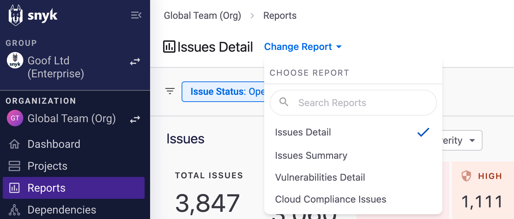<figcaption>
Select Change Report to display different reports
</figcaption></figure>

## Issues Detail report

The Issues Detail report displays all known issues in all of your Projects that are being monitored by Snyk. The report gives details about each issue and which of your Projects are affected and provides links to fix information.

The Issues Detail report displays the number of issues as well as the number of unique vulnerabilities that make up the issues.

Quick aggregations are available by categories including **Severity**, **Product Name**, and **Issue Type.**

Individual issues are displayed in a table according to the selected category. You can modify columns as needed.

For a table of only the unique vulnerabilities, use Change Report to switch to the Vulnerabilities Detail report.

## Issues Summary report

The Issues Summary report highlights the value that Snyk is providing by enabling both the identification and resolution of issues.&#x20;

The report provides a glimpse into how well teams are optimizing the use of the Snyk platform for their workflow and provides a means to measure and improve security.

This report enables you to easily understand the current state and trends of the highest security risk items. This report also provides a quick view into where risk is coming from and where remediation efforts are most and least effective.


Use the date filter in the upper right corner of the Issues Summary report to see key metrics and charts for a specified interval. The selected date range also impacts the compared period, which allows you to measure ‌progress across various key metrics.


At the top of the report, you can follow key metrics associated with security issues in the selected date range with a comparison to the previous sequential period's results. This allows you to get insights on trends. See the tooltips in Snyk Web UI for definitions of the metrics.

<figure><figcaption></figcaption></figure>

The **Issues Identified and Resolved** trend captures the accumulated security issues that were identified and resolved during the selected date range. The gap between the two lines indicates the open issues backlog.

This visual trend allows you to identify if too many issues are being introduced, meaning that prevention should become a higher priority. Conversely, if not enough issues are being resolved, it means that you need to further analyze metrics such as MTTR and SLA.&#x20;


The Total Open issues metric at the top completes the picture for this trend, by showing the total open issues at the end of the selected period compared with the total open issues at the beginning of the selected date range.


<figure><figcaption></figcaption></figure>

Reviewing the **Exposure Window** trend allows you to identify the capacity of security issues that are open within predefined periods. This is a relevant metric to follow when filtering by attributes such as severity, exploit maturity, or asset class. and ensuring that the most critical issues for sensitive assets are being remediated on time.

<figure><figcaption></figcaption></figure>

The **Time to Resolve by Week** trend provides visibility on the number of issues remediated within predefined periods, allowing you to measure remediation performance over time.

<figure><figcaption></figcaption></figure>

The **Risk breakdown** table helps you make data-driven decisions about where you need to focus. The tables allow you to review ‌performance metrics from several angles.&#x20;

Use the dimension picker to browse:

* **Projects** - Available at the Organization level. Allows you to pinpoint Projects that require your attention.
* **Organizations** - Available at the Group level. Surface Snyk Organizations based on their performance.  &#x20;
* **Asset Classes** - Ensure that efforts are prioritized to secure the most sensitive assets first.
* **Introduction Categories** - Allows to determine if preventable issues are handled properly by looking at the percentage change of new preventable issues, as well as assessing the impact of new monitored assets over your AppSec Program. You can view this under the **Baseline Issue** category.

<figure><figcaption></figcaption></figure>

## Vulnerabilities Detail report

The Vulnerabilities Detail report is similar to the Issues Detail report but shows issues grouped by Snyk Problem ID ([see Snyk Vulnerability DB](https://security.snyk.io/vuln)).&#x20;

You can easily see how many instances of a vulnerability exist and how many Projects are affected. Use this report to understand which vulnerabilities are most prevalent for both resolution and prevention use cases.

For a table of Total Issues, use Change Reports to switch to the Issues Detail report.


#### Dependencies and license information

To view Dependencies and license information, select the **Dependencies** menu option. See [Dependencies and licenses](dependencies-and-licenses/) for details.


## Featured Zero-Day report

This report addresses primary scenarios for managing and resolving emerging zero-day vulnerabilities, which carry significant consequences and attract substantial attention in the global AppSec community.

Use this report to discover your exposure to issues highlighted in a zero-day publication across various Targets and Projects. The report helps you prioritize zero-day issues and monitor the progress of remediation efforts against any remaining occurrences.

The [Security team at Snyk](https://snyk.io/platform/security-intelligence/) continuously updates the [Vulnerability Database](https://security.snyk.io/) with new vulnerabilities several times a day. When the team discovers a major new zero-day vulnerability—typically in a widely used package with high severity that affects many customers—it will be announced and addressed as a zero-day event.

Upon the announcement of a new zero-day event, begin by examining the **Impacted Targets** table to gain a deeper understanding of the exposure. Use filters such as Project Lifecycle, Environment, or Project Criticality to focus solely on Targets associated with Projects in production that are externally exposed or of high criticality. Gaining such insights depends on the [availability of Project attributes](../../snyk-platform-administration/snyk-projects/project-attributes.md#available-attributes-and-their-values).

Next, proceed to the **All** **Issues** table and compile a prioritized list of issues requiring remediation. Typically, prioritization is determined by either the Snyk [Risk Score](../prioritize-issues-for-fixing/risk-score.md) or NVD CVSS Score, with emphasis placed on addressing vulnerabilities within sensitive targets. Apply filters based on Project Lifecycle, Environment, or Project Criticality to identify and address these targets promptly.

For continuous monitoring of remediation progress and efficacy, refer to the trend diagrams.\
The **Accumulative Issues Backlog Trend** diagram shows the weekly changes in the zero-day backlog by accumulating the weekly delta between identified and resolved issues. Use this diagram to ensure that your R\&D teams are reducing the zero-day backlog consistently, which will be indicated by a negative trend line.

In parallel, review the **Issues Identified versus Resolved over Time** diagram to conclude whether additional emphasis should be placed on preventing the introduction of new issues or on accelerating the remediation efforts.

## SLA Management report&#x20;

The report presents a set of default SLA targets per severity based on common security standards, such as FedRAMP. These SLA targets can be modified to meet your own security requirements.

The SLA status of an issue can be:

* **Within SLA** - the age of the issue has not exceeded the SLA target, and it is expected to have sufficient lead time before breaching.
* **At Risk** - the issue is considered to be approaching an SLA breach and is flagged as “At Risk”.
* **Breached** - the age of the issue has exceeded the SLA target.

You can control the SLA targets and the transition of issues to the “At Risk” status by editing the **SLA target** and setting the **At risk duration before breach (days)** field.

<figure><figcaption>
SLA Management Report - Edit SLA targets
</figcaption></figure>

The SLA report includes additional filters under the SLA category, allowing for better identification of the age of issues in relation to the SLA target:

* **SLA status** - allows the filtering of the report according to a specific SLA status.
* **Issue age** - allows to discover issues within a range of age.
* **Time until breach** - identifies issues that will breach the SLA target within days.


The report is, by default, showing only issues that are with high or critical severity. Update the severity filter if you want to view the SLA status for additional severities.


<figure><figcaption>
SLA Filters within the filters picker 
</figcaption></figure>

You can share the report with predefined SLA targets by sharing the report URL or return to a predefined SLA report by bookmarking the web page in your browser.

In the **Open issues** section, the **SLA severity breakdown** shows a distribution of severity levels by the SLA compliance status of the viewed Group or Organization.&#x20;

The **SLA trend** shows the cumulative SLA status of issues over time.

<figure><figcaption>
SLA Management Report - Open issues section
</figcaption></figure>

The **SLA breakdown table** allows you to compare the SLA compliance results of Organizations in the Group view, or Targets in the Organization view. The table is sorted by default according to the quantity of breached issues.

<figure><figcaption>
SLA Management Report - SLA Breakdown
</figcaption></figure>

The **Breached and at-risk open issues** table helps you prioritize issues based on their aging and SLA compliance status. You can use the **Modify Column** picker to add additional columns and learn more about the specific issues.

<figure><figcaption>
SLA Management Report - Breached and at risk open issues
</figcaption></figure>


You can download the **SLA Breakdown** and the **Breached and at risk open issues data** in a CSV format using the **Download CSV** option.


You can review the SLA results for resolved issues and perform a retrospective analysis by reviewing the **Resolved issues** section.

<figure><figcaption>
Resolved issues section
</figcaption></figure>

## OWASP Top 10 report

The [OWASP Top 10](https://owasp.org/www-project-top-ten/) is a standard awareness document for developers and web application security. It represents a broad consensus about the most critical security risks for web applications and is globally recognized by developers as the first step towards more secure coding.&#x20;

Each control in the list (A1, A2, and so on) is based on a list of Common Weakness Enumerations (CWEs). For example, [A01:2021 – Broken Access Control](https://owasp.org/Top10/A01_2021-Broken_Access_Control/) is based on a list of 34 CWEs.&#x20;

The CWEs are mapped to Snyk-IDs (), which are mapped to issues.&#x20;

For example, the critical vulnerability [SNYK-JAVA-ORGAPACHELOGGINGLOG4J-2314720](https://security.snyk.io/vuln/SNYK-JAVA-ORGAPACHELOGGINGLOG4J-2314720) is classified as [CWE-94](https://cwe.mitre.org/data/definitions/94.html), which is part of the OWASP TOP 10 [A03:2021 - Injection](https://owasp.org/Top10/A03_2021-Injection/). All the issues related to this vulnerability will be under the A03 category.

Learn more by using the [OWASP TOP 10 Learning path](https://learn.snyk.io/learning-paths/owasp-top-10/) on Snyk Learn.

The report is based on the latest mapping released in 2021. The supported products are Snyk Open Source, Snyk Container, and Snyk Code.

## CWE Top 25 report

The [CWE Top 25](https://cwe.mitre.org/top25/) Most Dangerous Software Weaknesses is a list that demonstrates the current most common and impactful software weaknesses based on Common Vulnerabilities and Exposures (CVEs) severity and their exploitation potential.&#x20;

The report is based on the latest version released in 2023 by Mitre. The supported products are Snyk Open Source, Snyk Container, and Snyk Code.

## CWE Top 10 KEV report&#x20;

The [CWE Top 10 KEV Weaknesses](https://cwe.mitre.org/top25/archive/2023/2023_kev_list.html) list identifies the top ten CWEs in the Cybersecurity and Infrastructure Security Agency’s (CISA) [Known Exploited Vulnerabilities](https://www.cisa.gov/known-exploited-vulnerabilities-catalog) (KEV) Catalog, a database of security flaws in software applications and weaknesses that have been exposed and leveraged by attackers.&#x20;

The report is based on the version released in 2023 by Mitre. The supported products are Snyk Open Source, Snyk Container, and Snyk Code.

## PCI-DSS v4.0.1 report


**Release status**&#x20;

The PCI-DSS v4.0.1 report is in Early Access and available only with Enterprise plans.


PCI Security Standards are technical and operational requirements created by the PCI Security Standards Council (PCI SSC) to safeguard cardholder data. These standards apply to all entities that store, process, or transmit this information and include requirements for software developers and manufacturers.\
\
The Council manages these standards, while compliance is enforced by founding members: American Express, Discover Financial Services, JCB, MasterCard, and Visa Inc.

Snyk PCI-DSS v4.0.1 Report is designed to help you:

* Estimate readiness for meeting the PCI-DSS AppSec requirements for SCA and SAST based on the Snyk scan results.
* Provide evidence that the Organization is meeting the PCI-DSS AppSec requirements for SCA and SAST vulnerabilities.
* Prioritize issues to improve PCI-DSS compliance readiness.

<figure><figcaption>
Snyk PCI-DSS v4.0.1 Report
</figcaption></figure>

The report identifies PCI-DSS risks and violations based on the following PCI-DSS v4.0.1 requirements:

1. **Requirement 6.2.4:** Engineers use various techniques to prevent or mitigate common software attacks and related vulnerabilities in bespoke and custom software. This includes but is not limited to the following methods:
   * Injection attacks, including SQL, LDAP, XPath, or other command, parameter, object, fault, or injection-type flaws.
   * Attacks on data and data structures, including attempts to manipulate buffers, pointers, input data, or shared data.
   * Attacks on cryptography usage, including attempts to exploit weak, insecure, or inappropriate cryptographic implementations, algorithms, cipher suites, or modes of operation.
   * Attacks on business logic, including attempts to abuse or bypass application features and functionalities through the manipulation of APIs, communication protocols and channels, client-side functionality, or other system or application functions and resources. This includes cross-site scripting (XSS) and cross-site request forgery (CSRF).
   * Attacks on access control mechanisms, including attempts to bypass or abuse identification, authentication, or authorization mechanisms or attempts to exploit weaknesses in the implementation of such mechanisms.&#x20;
   * Attacks using any “high-risk” vulnerabilities identified in the vulnerability identification process, as defined in Requirement 6.3.1.
2. **Requirement 6.3.3:** All system components are protected from known vulnerabilities by installing applicable security patches and updates as follows:&#x20;
   * Patches and updates for critical vulnerabilities, identified according to the risk ranking process at Requirement 6.3.1 are installed within one month of release.

### Snyk Violation Analysis based on PCI-DSS attack categories

As the standard does not explicitly define specific CWEs or CVEs, Snyk provides an analysis based on leading CWEs associated with the named attack categories. Below are the CWEs categorized by attack type:

#### Injection Attack Violations Summary

The following list provides an association between the identified attack categories and the CWEs associated with each category:

* SQL Injection: CWE-89
* LDAP Injection: CWE-90
* XML Injection (XPath Injection): CWE-91&#x20;
* Command Injection: CWE-77
* Use of Unsafe Reflection: CWE-470

#### Attacks on Data and Data Structures Violations Summary

The following list provides an association between the identified attack categories and the CWEs associated with each category:

* Buffer Overflow: CWE-120
* NULL Pointer Dereference: CWE-476
* Double Free: CWE-415
* Concurrent Execution using Shared Resource with Improper Synchronization (‘Race Condition’): CWE-362

#### Attacks on Cryptography Usage Violations Summary

The following list provides an association between the identified attack categories and the CWEs associated with each category:

* Use of a Broken or Risky Cryptographic Algorithm: CWE-327
* Use of Insufficiently Random Values: CWE-330
* Improper Verification of Cryptographic Signature: CWE-347
* Cleartext Transmission of Sensitive Information: CWE-319
* Use of Hard-coded Cryptographic Key: CWE-321

#### Attacks on Business Logic Violations Summary

The following list provides an association between the identified attack categories and the CWEs associated with each category:

* Server-Side Request Forgery (SSRF): CWE-918
* Cross-Site Request Forgery (CSRF): CWE-352
* Cross-Site Scripting (XSS): CWE-79
* Origin Validation Error: CWE-346
* Improper Authorization: CWE-285
* Exposure of Sensitive Information to an Unauthorized Actor: CWE-200

#### Attacks on Access Control Mechanisms Violations Summary

The following list provides an association between the identified attack categories and the CWEs associated with each category:

* Improper Authentication: CWE-287
* Improper Access Control: CWE-284
* Incorrect Authorization: CWE-863
* Authorization Bypass Through User-Controlled Key: CWE-639
* Missing Authentication for Critical Function: CWE-306
* Incorrect Implementation of Authentication Algorithm: CWE-303

#### Attacks on Access Control Mechanisms Violations Summary

The Missing Authorization attack category is associated with CWE-862.&#x20;

### PCI-DSS v4.0.1 Guidance

The report is filtered by default on open issues of critical severity. Those filters are also applicable when exporting the report to PDF.

#### PCI-DSS Readiness Trend

The PCI-DSS Readiness Trend is designed to help you track your progress toward eliminating PCI-DSS violations. A violation is defined as a critical vulnerability elected by the PCI-DSS attack categories (as explained in Requirement 6.2.4) that is more than 30 days old, as stated in Requirement 6.3.3.

The number on the left indicates the violation status and the progress made in the last seven days.

The trend shows all vulnerabilities per Requirement 6.2.4, categorized by age bucket. This allows for quick identification of potential violations and vulnerabilities that may soon become violations.

<figure><figcaption>
PCI-DSS Readiness Trend
</figcaption></figure>

#### Attack category breakdown

The breakdown table helps identify the number of vulnerabilities by attack category (as per requirement 6.2.4) or by Snyk Organization based on the relevant age bucket.

Use the table to pinpoint major attack categories or Snyk Organizations that lead to PCI-DSS violations. You can click on the figures to explore the specific issues in more detail.


After you investigate and see the actual issues behind the figures, you may proceed by:

* Vulnerability triage and prioritization.
* Conclude the prevalent CWEs and CVEs by sorting on the CWE/CVE column and filtering those CWEs/CVEs in the [Vulnerabilities Detail Report](available-snyk-reports.md#vulnerabilities-detail-report) to surface all the vulnerability occurrences across targets and Projects.&#x20;
* Run a vulnerability eradication campaign or assign Snyk Learn training to relevant engineering teams.


<figure><figcaption>
Attack Category Breakdown
</figcaption></figure>

## Developer IDE and CLI usage

To use this report, you must ensure you have installed the following prerequisites:&#x20;

* Snyk CLI&#x20;
  * version 1.1292.1 or newer (for CLI and IDE plugins usage)
  * version 1.1297.0 or newer for general Agentic scans (MCP)
  * version 1.1298.1 or newer for granular Agentic scans (such as MCP host)
* VS Code 1.86.0 or newer and Snyk Security plugin 2.3.3 or newer
* IntelliJ IDEs 2023.3 or newer and Snyk Security plugin 2.7.3 or newer
* Visual Studio 2019, 2022 and Snyk Security Plugin 1.1.47 or newer
* Eclipse 2023.12 or newer and Snyk Security plugin 2.1.0 or newer

This report shows the adoption of Snyk testing in local development through the IDE plugins, using the CLI locally or incorporating the Snyk MCP into agentic workflows. The report is available under the Change Report dropdown at the Group and Organization levels.


This report focuses on the local developer experience and does not include the use of CI/CD. In addition, it does not show Organizations or developers that have never used the CLI, IDE, or MCP.


Security teams can use this report to demonstrate strong shift-left behavior as a model behavior to bring to other teams. This report also shows where teams or individual developers are not adopting Snyk locally. Companies can use this report to encourage more shift-left behavior.

This report shows the test usage in the IDE, CLI, and MCP by developers. Teams can filter by date and Organization. The report includes visibility into metrics such as:

#### Total number of developers running scans and the number of scans in IDE, CLI, and Agentic integrations (such as MCP)

<figure><figcaption></figcaption></figure>

#### Charts and summary tables breaking down this data by the environment of the scan

<figure><figcaption></figcaption></figure>

#### Charts and summary tables breaking down this data by different dimensions, such as IDE plugins or Agentic integrations

<figure><figcaption></figcaption></figure> <figure><figcaption></figcaption></figure>

#### Charts and summary tables breaking down this data by the Snyk scan type

<figure><figcaption></figcaption></figure>

#### List of organizations and developers adopting Snyk locally

<figure><figcaption></figcaption></figure>

## Repositories tested in CI/CD report

To use this report, consider the following prerequisites:

* Snyk CLI version 1.1292.1 or newer.
* Viewing the last commit data requires SCM Group integration. For more details, navigate to [SCM integrations](../../developer-tools/scm-integrations/organization-level-integrations/).&#x20;
* When testing containers, include the `.git` context as part of the `snyk container test` command.

This report analyzes Snyk tests performed as part of CI/CD pipelines executed using Snyk CLI. It will inform you about the usage of your company and adoption of testing in CI/CD, ensuring repositories are tested as expected and preventing critical vulnerabilities and misconfigurations from being deployed and reaching the production environment.


* The report results are scoped by a date range filter that you can use to review specific periods. The filter is defaulted to the last 30 days.
* This report provides visibility into Snyk tests (`snyk test`, `snyk code test`, `snyk container test`, `snyk iac test`) executed within your CI pipeline (using CLI). Its primary goal is to help you evaluate test results and determine whether to pass or fail the build process based on these security checks.
* Please note that `snyk monitor` commands are **not** included in this report. While `snyk monitor` is crucial for ongoing security posture and identifying new vulnerabilities, this report specifically tracks tests that actively gate your CI/CD pipeline.


The numbers displayed on the main view of the report represent the number of repositories tested in the selected date range per Snyk product.&#x20;

In addition, you can learn about the change in the number of tested repositories compared to the previous sequential period, so you can conclude whether the adoption of CI/CD tests across repositories improved.&#x20;

A green upward arrow indicates that more repositories were tested compared to the previous sequential period, while a red downward arrow indicates the opposite. The absolute change value appears next to the arrow, and the perception of change appears right underneath to measure the degree of change.

<figure><figcaption>
Repositories tested during date range
</figcaption></figure>


A sequential period refers to a date range covering the last seven days. In this case, the period starts seven days ago and ends today. The previous sequential period spans from 14 days ago to seven days ago. As a result, both sequential periods are of the same duration.


#### Repository Test Adoption 

Review the Repository Test Adoption trend to learn more about ‌adoption over time.\
Represented by the green line, you can see the weekly number of repositories that have been tested compared to the repositories that had commits in the last 30 days, represented by the purple line.&#x20;

This comparison helps determine whether Snyk tests in CI/CD are being increasingly adopted over time and highlights the number of repositories that have received commits but have not been tested in CI/CD.


Viewing the last commit data requires SCM Group integration. For more details, navigate to the [SCM integrations](../../developer-tools/scm-integrations/organization-level-integrations/) page.&#x20;


You can filter by specific products or by specific organizations or extend the viewed period using the date range filter.

<figure><figcaption>
Repository Test Adoption
</figcaption></figure>

#### Test Success Rate Trend 

The test success rate serves as an indicator of how well the engineering department or specific Snyk Organizations can adopt a "shift left" approach, which aims to identify and resolve issues before the code reaches the build process. This success rate is calculated by dividing the number of tests that passed by the total number of relevant tests conducted.


An applicable test is a test that did not fail due to technical issues or a non-supported Project.


Having a low success rate can indicate that:

* Snyk tests are failing due to security issues that can be prevented in local development or in the PR Check stages. Snyk recommends testing with the [Snyk IDE](../../developer-tools/snyk-ide-plugins-and-extensions/) plugin, using [Snyk PR Checks](../../scan-with-snyk/pull-requests/pull-request-checks/) and enroll in a [Snyk Learn](../../discover-snyk/snyk-learn/) program.
* The test success criteria are too strict. To explore this option further, Snyk recommends reviewing the test definitions of the organizations with the lowest success rate, as shown by the Adoption by Organizations widget. For more details about defining test success criteria, navigate to the [Failing of builds in Snyk CLI](../../developer-tools/snyk-cli/scan-and-maintain-projects-using-the-cli/failing-of-builds-in-snyk-cli.md) page.&#x20;

<figure><figcaption>
Test Success Rate Trend
</figcaption></figure>

#### Adoption by Organizations 

Launching an Application Security program to boost testing adoption in CI/CD pipelines can be challenging. This initiative requires collaboration between the AppSec and R\&D teams and will be implemented gradually, with regular progress monitoring.

The Adoption by Organization table facilitates tracking and comparing the adoption rates of Snyk Organizations, helping you identify the organizations that are struggling or lagging behind.

In addition, you can examine the success rate column to surface organizations that have lower success rates.

**Columns descriptions:**

* **Tested Repositories:** the number of repositories that were tested in the selected time range, with an indication of the percentage of change compared to the previous sequential period.
* **Committed Repositories:** the number of repositories that had any commits in the last 30 days at any given time within the selected time range, with an indication of the percentage of change compared to the previous sequential period.
* **Success Rate:**  the portion of successful tests in CI/CD against all other tests that were executed.

#### Repository Test Summary 

The repository test summary table shows the performed tests during the selected date range.

The default sorting in the table surfaces repositories according to their last commit, allowing you to identify repositories that were expected to be tested in CI/CD pipelines and verify they were tested. Clicking the column names to sort the table according to the selected column. You can sort the table by multiple columns at a time.&#x20;


Viewing the last commit data requires SCM Group integration. For more details, navigate to the [Group-level integrations](../../developer-tools/scm-integrations/group-level-integrations/) page.&#x20;


You can execute the test on a specific repository branch in the table. The `tested` indicator means that any branch of this repository was tested during the selected date range.


Hovering over the TESTED tag reveals the last test performed during the selected date range


<figure><figcaption>
Repository Test Summary
</figcaption></figure>

## Cloud Compliance Issues report


This report is available only if you have enabled legacy Snyk Cloud.


The Cloud Compliance Issues report shows cloud issues for an entire Organization, organized by [compliance standard](../../scan-with-snyk/snyk-iac/getting-started-with-cloud-scans/key-concepts-for-cloud-scans.md#docs-internal-guid-e2e38027-7fff-9271-f2c0-e23677542f6e).

You can view a report for a single version of a compliance standard at a time, for example, CIS AWS Foundations Benchmark v1.4.0, by selecting the desired standard from the dropdown menu. Each report includes a list of compliance controls organized by control category, with corresponding issue counts.

Selecting an issue count lets you view the list of issues associated with that control in the [Cloud Issues UI](../../scan-with-snyk/snyk-iac/getting-started-with-cloud-scans/manage-cloud-issues/view-cloud-issues-in-the-snyk-web-ui.md), where you can view each issue in detail.

Use the information in the Cloud Compliance Issues report to investigate, triage, and fix cloud compliance issues.

## Learn Engagement


Snyk Learn engagement report is available only in the Learning Management add-on offering. For more information, contact your Snyk account team.


The goal of the engagement report is to provide insights into your security education and training programs overall progress, and give you insights into which parts of your organization are engaging with Snyk Learn content. You can use the data an insights to better optimise your program, find security champions, generate reports for compliance and show progress to your executive sponsors.

### Access the report

The Learn Engagement report can be accessed at the Group level from the **Change Report** drop down in the Reports menu.

### Report features

The report allows you to track:

* Learn engagement snapshot analytics
* Assignment Progress
* Adoption rankings
* Content usage breakdown
* Filtering
  * Custom time periods, users, organizations, organization role, and Lesson titles.

### Learn engagement snapshot and assignment progress

The first section of the report focuses on showing key engagement statistics and progress of any assignments. Tool tips give more detail on the definitions of the metrics.

<figure><figcaption></figcaption></figure>

### Adoption rankings

The adoption ranking section shows your organization and individual user engagement with Snyk Learn. This is ranked by "Lessons complete" and also has the estimated duration the org/user has spent on Snyk Learn lessons. Estimated duration calculated using the estimated duration presented at the start of each lesson, and includes estimated time from any progress on "in-progress" lessons in the selected period.


The user level adoption ranking is a great way to identify potential security champions who are proactively engaging in security education and training.


<figure><figcaption></figcaption></figure>

### Learning breakdown

The breakdown shows the different types of Learn content the users are engaging with, using lesson completions as the measure. You can see if users are engaging with product training or security education, along with the most popular lessons and insights into which CWE categories users are studying the most.

<figure><figcaption></figcaption></figure>

## Snyk Generated Pull Requests


**Feature availability**

Snyk Generated Pull Requests report is available only for Enterprise plan customers, for all SCM integrations. For more information, see [Plans and pricing](https://snyk.io/plans/).


### Access the report

The Generated Pull Requests report can be accessed at both Group and Organization level from the **Change Report** drop down in the Reports menu.

<figure>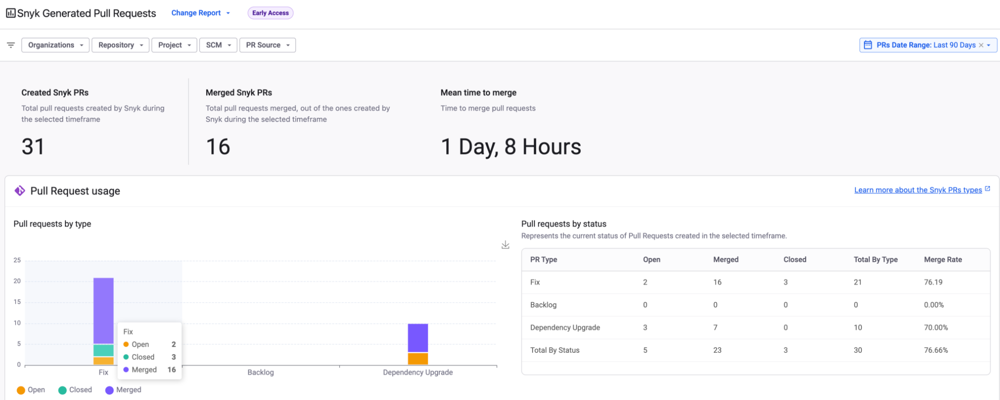<figcaption>
Snyk generated pull requests report
</figcaption></figure>

This report type provides an overview of how [Fix](../../scan-with-snyk/pull-requests/snyk-pull-or-merge-requests/create-automatic-prs-for-new-fixes-fix-prs.md), [Backlog](../../scan-with-snyk/pull-requests/snyk-pull-or-merge-requests/create-automatic-prs-for-backlog-issues-and-known-vulnerabilities-backlog-prs.md), and [Upgrade PRs](../../scan-with-snyk/pull-requests/snyk-pull-or-merge-requests/upgrade-dependencies-with-automatic-prs-upgrade-prs/) are used and highlights the efficiency of PR merges.

The analytics report covers the following:

* Overview of PRs status by type and the PR merge ratio.
* Visibility of issues.
* Breakdown by repository for PR status.

The report summary enables you to check the total number of Snyk PRs created, the total pull requests merged, and the mean time to merge for those pull requests.


This report type does not include PR checks.


### Report features

Use the date filter in the upper right corner of the report to display data based on a specific interval.

Add various filters to narrow down results to specific configurations. The filter options are Organization, SCM, Project, and Repository.

#### Snyk Generated Pull Requests usage

<figure>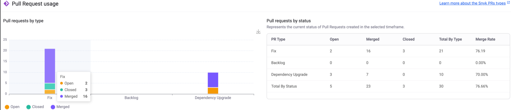<figcaption>
Pull Request usage graph and table
</figcaption></figure>

Pull Request usage is visualized in a **Pull requests by type** graph and a **Pull requests by status** table, displaying the same data in different formats. These distinguish the number of PRs into Fix, Backlog, and Dependency upgrade categories, segmented by Open, Merged, and Closed status types. Merge rate is presented as a percentage for each row.

#### Open vs Fixed issues

<figure>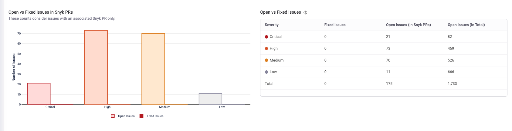<figcaption>
Open vs Fixed issues graph and table 
</figcaption></figure>

The Open vs Fixed issues in Snyk PRs graph and table displays the number of open and fixed issues based on severity.

#### Snyk Generated Pull Requests by repository

<figure>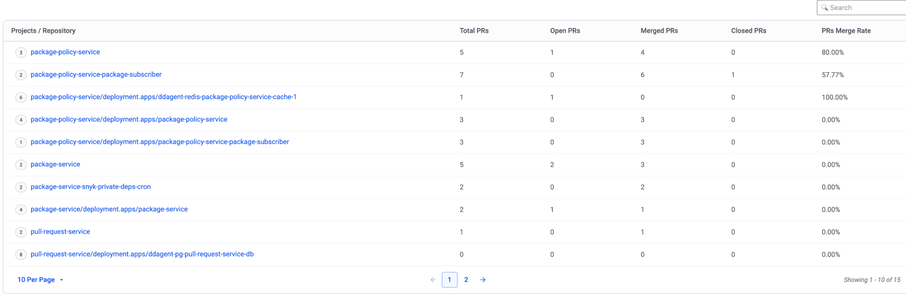<figcaption>
Projects/Orgs/Repository table for PRs of different status
</figcaption></figure>

The **Projects/Org/Repository** table displays the number of Total, Open, Merged, and Closed PRs for each Organization and repository relationship. Merge rate is presented as a percentage for each row.

Select a repository name to open a modal containing additional metrics for that specific repository.

<figure>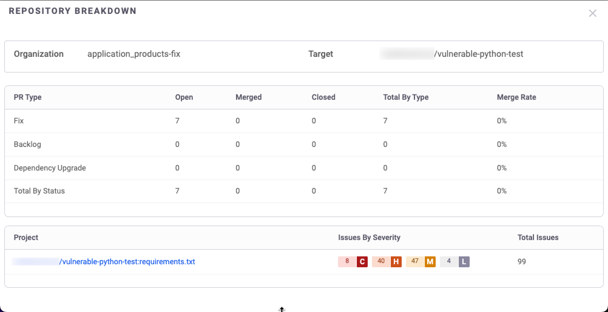<figcaption>
Repository breakdown by PR type and PR status
</figcaption></figure>

The repository breakdown details the number of PRs segmented by PR type and PR status. Merge rate is presented as a percentage for each row. It also lists the Projects within that repository, with the number of issues categorised by severity.

## Asset Dashboard

The Asset Dashboard provides a comprehensive overview of your application and security controls. It displays essential data such as the status and trends of open issues, control coverage, and repository metadata.&#x20;

The Asset Dashboard is a central hub for managing and reviewing assets, making tracking inventory size easier over time and understanding the interaction between different asset types.

While Snyk Inventory enables the discovery and management of your assets that should be secured,  the Snyk Asset Dashboard allows you to go beyond the details and better understand the main building blocks of your inventory. \
\
The Asset Dashboard brings all the asset data that is available in your inventory and helps to answer various questions, such as:

* Does my AppSec program meet the coverage requirements for business-critical assets and strategic applications?
* Are the assets being classified properly according to their criticality?&#x20;
* Do you know which repositories belong to which application or code owners? Are newly introduced repositories being updated with that data?&#x20;
* What are the main programming languages and package managers that are used in repositories that have been worked on recently?&#x20;

### Filters

The filters are located at the top left of the page, with the following filtering options: **Asset Class**, **Asset type,** **Add filter**. The filter selection applies to all available data widgets.

Here are the available filters:

| Filter               | Description                                                                                                                                                                                                                                                                                                                                                            |
| -------------------- | ---------------------------------------------------------------------------------------------------------------------------------------------------------------------------------------------------------------------------------------------------------------------------------------------------------------------------------------------------------------------- |
| Asset Class          | The business criticality of an asset (A - most critical to D - least critical).                                                                                                                                                                                                                                                                                        |
| Asset type           | The type of an asset (Container image, Package, Repository). Most data widgets already present certain asset types by default.                                                                                                                                                                                                                                         |
| \*Application        | The list of the applications for which you have configured the application context catalog in Snyk Essentials.                                                                                                                                                                                                                                                         |
| \*Catalog name       | The name of your application context catalog.                                                                                                                                                                                                                                                                                                                          |
| \*Category           | The category of a repository asset. For example, `service` or `library`.                                                                                                                                                                                                                                                                                               |
| Discovered           | The period when the asset was discovered.                                                                                                                                                                                                                                                                                                                              |
| Last Seen            | The period when the asset was last imported from the integration.                                                                                                                                                                                                                                                                                                      |
| \*Lifecycle          | The lifecycle state of the application context catalog component. For example `production`, `experimental`, `deprecated`.                                                                                                                                                                                                                                              |
| \*Owner              | The team that owns the repository for which the application context catalog was configured.                                                                                                                                                                                                                                                                            |
| Repository Freshness | 
The last commit date in the repository: 
<ul><li><strong>Active</strong>: Had commits in the last 3 months.</li><li><strong>Inactive</strong>: The last commits were made in the last 3 - 6 months.</li><li><strong>Dormant</strong>: No commits in the last 6 months.</li><li><strong>N/A</strong>: There are no commits detected by Snyk Essentials.</li></ul> |
| Source               | The integration that imported the asset.                                                                                                                                                                                                                                                                                                                               |
| Tags                 | The asset tags. For more details about tagging assets using a policy, see the [Tagging policy](../policies/assets-policies/use-cases-for-policies/tagging-policy.md) page.                                                                                                                                                                                             |
| \*Title              | The name of the component for which the application context catalog was configured.                                                                                                                                                                                                                                                                                    |

**\***&#x41;ll filters marked with `*` are visible only if you configured the [application context](../../developer-tools/scm-integrations/application-context-for-scm-integrations/) catalog for your SCM integrations.

### Repository coverage widget

The repository coverage widget provides an overview of the percentage of scanned repositories compared to the total number of available repositories, using integrated Snyk or third-party security products.

Hover over any column to see how the coverage percentage is calculated.&#x20;

<figure><figcaption>
Repository Coverage
</figcaption></figure>

### Asset class breakdown

The asset class breakdown widget surfaces the distribution of repositories and container images by [asset class](../../manage-assets/assets-inventory-components.md#class). Reviewing this widget allows you to determine the percentage of business-critical assets in your inventory and drill down to see the actual assets.


**Tips**

* Having the context of the asset class is crucial for prioritizing assets. It is recommended to categorize your inventory by implementing [classification policies](../policies/assets-policies/use-cases-for-policies/classification-policy.md) to proactively classify existing and newly introduced assets.
* Using the filters enables narrowing down the asset class distribution within specific applications or code owners, as well as focusing on active repositories or a set of assets based on the asset tags.


<figure><figcaption>
Asset Class Breakdown
</figcaption></figure>

### Top 10 technologies breakdown

The top 10 technologies widget identifies the leading programming languages and frameworks used in repositories. Using the available filters enables you to determine the most commonly used technologies in active or business-critical repositories. Moreover, you can investigate specific applications or code owners.


**Tips**

* The technology data is available in the [asset tags](../../manage-assets/assets-inventory-components.md#tags).&#x20;
* Click a presented technology to open the inventory page in a new browser tab. This will allow you to review the related repositories in detail.


### Top 10 package managers breakdown

The top 10 package managers widget allows you to identify the leading package managers in your inventory. The quantities represent assets of package type. A [package asset](../../manage-assets/assets-inventory-layouts.md#packages) is defined as software or library that is managed by package management systems.&#x20;

### Repository freshness

The repository freshness widget displays the distribution of repositories according to the last commit date:

* **Active**: Had commits in the last 3 months.
* **Inactive**: The last commits were made in the last 3 - 6 months.
* **Dormant**: No commits in the last 6 months.
* **N/A**: Commits data is unavailable.

You can use this widget to surface the quantity of repositories that are more or less maintained in various contexts, such as specific applications.&#x20;


**Tips**

You can use the asset class filter to identify business-critical assets that are not being maintained. Click a specific slice to open the inventory page in a new browser tab where you can browse and learn more about those assets.


<figure><figcaption>
Repository freshness
</figcaption></figure>

### Application context availability

The application context availability widget allows you to discover gaps in the context of assets. The available columns include:

* **Application Context** - displays the analyzed context attribute.
* **Unique Values** - shows how many unique instances exist for an attribute. For example, you can check how many unique applications or code owners are available for any of the listed attributes.
* **Availability in Repos** - indicates the completeness of a certain attribute across the repositories.


**Tips**

* Before reviewing this widget, ensure that the results are cleaned up by filtering out the "dummy" attribute values, such as "unknown", "-", and so on.\
  You can clean up the values by selecting only the relevant values.
* Filtering by asset class allows you to identify business-critical repositories without a known code owner or associated application.
* Filtering by the "active" value of the repository freshness filter allows you to discover context gaps in repositories that are actively being developed.
* Reviewing the unique values allows you to spot gaps in context. For example, you may realize that the number of unique code owners does not match the number of teams.


<figure><figcaption>
Application Context Availability
</figcaption></figure>

### Asset source breakdown

The asset source breakdown widget visualizes the quantities of detected assets from various sources. A source can be a platform where the asset is being managed directly (such as an SCM, container registry, and so on) or a platform that enriches the assets (such as security products and ASTs).


**Tips**

* The widget displays the net quantities of detected assets for each source. If an asset is detected in more than one source, it will be counted once for each detected source.
* When asset inventory quantities seem incomplete or exceed expectations, this widget will help you discover which integrations should be examined and potentially configured differently.


<figure><figcaption>
Asset source breakdown
</figcaption></figure>

## Risk exposure report

This report gives you a single, consolidated view of your security risks. It allows you to quickly understand your risk exposure, track your progress in reducing it, and pinpoint high-risk areas.

The Risk Exposure Report helps AppSec teams make quicker, more informed decisions. Rather than reviewing multiple reports, it provides a clear overview of the security landscape, allowing you to:

* Make faster decisions by quickly identifying your biggest security challenges and where to focus your attention.
* Prioritize effectively by using data to guide your mitigation efforts toward the areas that contribute the most risk.
* Show progress by tracking the impact of your team on reducing risk over time with easy-to-understand visualizations.

### Severity source

Choose your preferred severity source and automatically update selected severity throughout the report:

* **Snyk**: utilizing Snyk proprietary CVSS calculations and other factors, including the relative importance of the Linux distributor.
* **NVD CVSS**: leveraging severity scores from the National Vulnerability Database (NVD).
* **Non-SCA Severities:** For non-SCA issues (e.g., Code, IaC), Snyk's severity calculates High, Medium, and Low levels for specific code vulnerabilities and makes use of the Common Configuration Scoring System (CCSS) for IaC severity determinations

The report includes two main sections to provide a comprehensive view of your risk landscape:

### **Risk exposure Trends**

<figure><figcaption></figcaption></figure>

This section provides a visual overview of your issues over time. You can view these trends by:

* **Severity**: See the distribution of issues across different severity levels.
* **Introduction Category**: Understand how issues are being introduced into your Projects.
* **Asset Class**: Group issues by the type of asset they affect.

### **Risk exposure Breakdown**

This detailed table breaks down issues and impacted assets. You can dynamically group the data to fit your needs by selecting from the following dimensions: group, organization, project, introduction category, and asset class.

The table is sorted by default to surface the total number of critical and high-severity issues, helping you focus on the most urgent risks first.

You can also export data to PDF or CSV and drill down into issues for more detail.

## Saved Views

The Saved Views feature enables collaboration based on shared, consistent, and customizable reports. This feature is available at Organization and Group level, in the **Reports** menu. It allows you to customize and save filter settings for your reports, which you can then reuse.

To make it easier to share the view outside of the Snyk platform, the URL of a saved view remains the same after it's created, regardless of any changes you make to it.

### Prerequisites

To create, edit, and remove a saved view, you must have **Edit reports** permission. Saved views are not private. After being created, Saved Views are visible to all users with **View reports** permission. Only Organization and Group Admins can assign these permissions. For more information, see [User role management](../../snyk-platform-administration/user-roles/user-role-management.md).

To assign report permissions:

1. In the Snyk Web UI, navigate to your Group and Organization.
2. At the Group level, navigate to **Members** > **Manage Roles** > **Group Admin** and enable the following permissions:
   * **View reports:** to view Snyk Reports and to view the saved views that were created by others
   * **Edit reports:** to create saved views.
3. At the Organization level, enable the **View Organization reports** and **Edit Organization reports** permissions.

### Create a view

To create a new view:

1. In the Snyk Web UI, navigate to your Group or Organization.
2. Navigate to the **Reports** menu and select a report from the **Change Report** dropdown.
3. Select the **Standard view** filter and click **Create new view**.

<figure>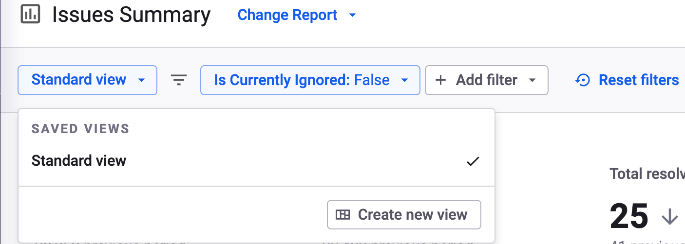<figcaption>
Create new view button in the Standard view filter
</figcaption></figure>

4. Fill in the name of the view and click **Create view**.


The name of a saved view can contain a maximum of 60 characters and must be unique from other saved views for the same report.


### Update a view

To update a saved view:

1. In the Snyk Web UI, navigate to your Group and Organization.
2. Navigate to the **Reports** menu and select the report that contains the saved view you want to update.
3. From the **Standard view** filter, select and load the view you want to update.
4. Make any necessary changes to the report view.
5. Save the changes by clicking **Save** next to the Saved Views dropdown. This overwrites the existing view.

### Rename, delete, or copy the URL of a view

If you hover over the name of a saved view and click the three dots that appear, the following options are available:CommentShare feedback on the editor

* **Copy URL**: to copy the URL of the saved view
* **Set as Group default view:** to set a view as default for your Group. You can then remove it as the default by clicking **Remove as Group default view**.
* **Rename:** to rename the saved view
* **Delete**: to delete the saved view.

<figure>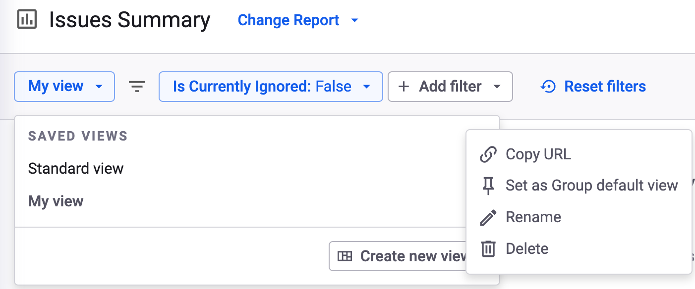<figcaption>
Options available for saved views
</figcaption></figure>

### Example

Snyk offers built-in reports that you can customize based on associated report filters. A wide range of filters are available, some with multiple values. In such cases, you can save the state of the report using a saved view.

For example, your **Issues Detail** report shows a large number of issues and thus is difficult to manage.

<figure>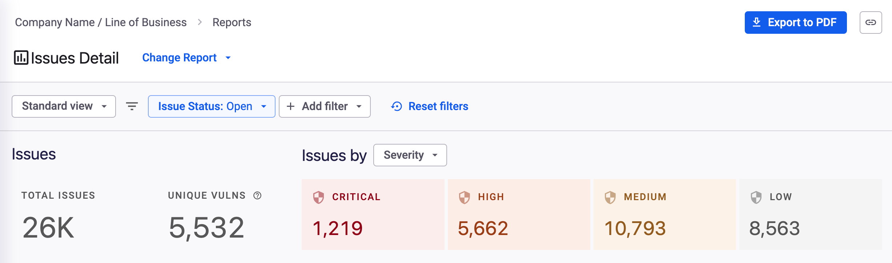<figcaption>
An Issues Detail report
</figcaption></figure>

You can add a **Computed Fixability** filter to your report to show only issues that are computed as **Fixable.**

Finally, you can add an **Exploit Maturity** filter to show only issues with a specific risk score.

<figure>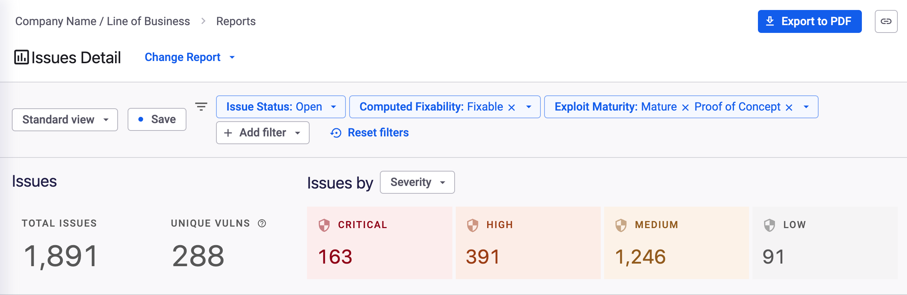<figcaption>
Filtered Issues Detail report
</figcaption></figure>

You can then save this filtered view by clicking **Save**, adding a name to your view, and then clicking **Create view**.&#x20;

<figure>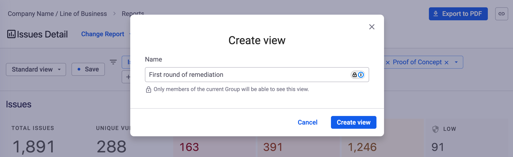<figcaption>
Create view window
</figcaption></figure>

You can then share the report with your development team by copying and sending the view URL.
