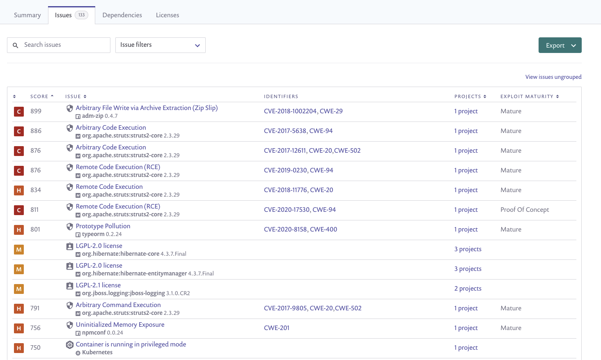
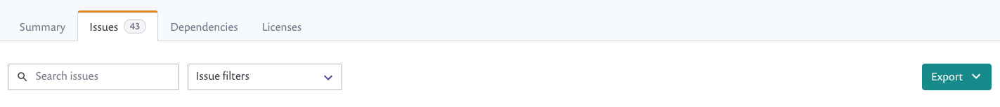
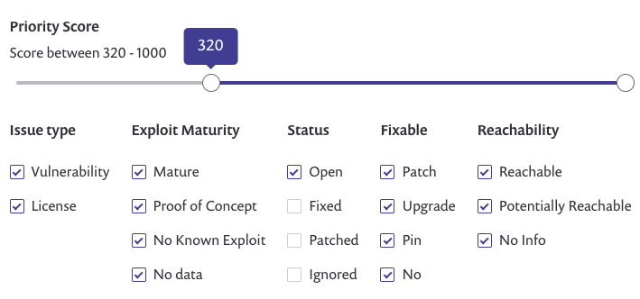

# Legacy reports issues tab

### Overview

The **Issues** tab displays all known vulnerability and license discrepancies across your Organization, indicating details about each issue, which of your Projects are affected, and how you can fix each issue.


Data in each tab appears based on the filters you've applied from the top of the Reports area, as well as the Group or Organization that you're viewing from.


By default, issues are ranked by their [Snyk Priority Score](../../prioritize-issues-for-fixing/priority-score.md); you can also filter based on columns. For example, you may want to look at the highest scores with the most maturity (which are likely to have more exploits). You can also track the list of issues that got fixed.

Click **Export** to export or print these results.

<figure><figcaption>
Issues tab results
</figcaption></figure>


The number of issues that you’re currently viewing, based on the filters and searches you used, appear on the Issues tab label.&#x20;


#### Grouped and ungrouped views

Use the default grouped view to get an overview of the general health of your organization on the whole by inspecting the number of projects affected per issue and the number and kinds of issues affecting your projects.

Alternatively, click **View issues ungrouped** to ungroup data, viewing a separate line for each project in which the issue occurs; meaning the same issue can appear multiple times if it affects multiple projects. This ungrouped view provide more details about each affected project, and the recommended fix.

To toggle between views, click the **View issues ungrouped** or **View issues grouped** link.

### Issues tab elements

#### All views

These fields appear for both views (grouped and ungrouped):

| Severity         | 
The icon of the associated <a href="../../prioritize-issues-for-fixing/severity-levels.md">severity level </a>for this issue:

Critical

High

Medium

Low
                                                                                                                                                                                                                                                                                                                                                                                                      |
| ---------------- | ---------------------------------------------------------------------------------------------------------------------------------------------------------------------------------------------------------------------------------------------------------------------------------------------------------------------------------------------------------------------------------------------------------------------------------------------------------------------------------------------------------------------------------------------------------------------------------------------------------------------------------------------------------------------------------------------------------------------------------------------------------------------------------------------------------------------------------------------------------------------------------------------------------------------------------------------------------------------------------- |
| Score            | The [Snyk Priority Score](../../prioritize-issues-for-fixing/priority-score.md), useful to guide the order in which you fix issues.                                                                                                                                                                                                                                                                                                                                                                                                                                                                                                                                                                                                                                                                                                                                                                                                                                                |
| Issue            | The official name of the issue and a list of all affected packages that are contained by your projects. The issue is linked to the **Package** page.                                                                                                                                                                                                                                                                                                                                                                                                                                                                                                                                                                                                                                                                                                                                                                                                                               |
| Identifiers      | All associated CVE identifiers. Each identifier is linked individually to the full official CVE or CWE vulnerability details as relevant.                                                                                                                                                                                                                                                                                                                                                                                                                                                                                                                                                                                                                                                                                                                                                                                                                                          |
| Projects         | 
When viewing issues ungrouped, this is a complete list of all projects affected by the specific issue, and an indicator of the source of the projects.

If viewing the issues grouped, this column displays the number of projects affected by the issue.

Click on the total of projects to open a panel where a list of all affected projects in that grouping is displayed. Details in this view include:
<ul><li>Project</li><li>Status</li><li>Introduced-date the issue was detected in the project</li><li>Fixable—whether the issue can be eliminated with an upgrade or patch</li></ul>                                                                                                                                                                                                                                                                                                                                                                   |
| Exploit maturity | 
How practical an exploit for a vulnerability is: (see <a href="../../prioritize-issues-for-fixing/view-exploits.md">View exploits</a>)
<ul><li><strong>Mature:</strong> a published code exploit that can easily be used for this vulnerability is available.</li><li><strong>Proof of concept:</strong> a published, theoretical proof-of-concept or detailed explanation that demonstrates how to exploit this vulnerability is available.</li><li><strong>No known exploit:</strong> neither a proof-of-concept code nor an exploit were found for this vulnerability, or are not publicly available.</li><li>
<strong>No data</strong>: this value indicates one of the following:
<ul><li>The issue is not a vulnerability (but rather, a license issue).</li><li>The ecosystem is not currently supported by Snyk.</li><li>The project was imported before the release of this feature. Re-import the project in order to scan for this data.</li></ul></li></ul> |

#### Ungrouped view only

These fields appear only when viewing issues ungrouped:

| Fixable      | 
An upgrade or patch is available to fix the vulnerability.

(Also see <a href="../../../scan-with-snyk/snyk-open-source/manage-vulnerabilities/vulnerability-fix-types.md">Vulnerability fix types</a>):
<ul><li><strong>Patch</strong>: Issues that can be fixed with a Snyk patch.</li><li><strong>Upgrade</strong>: Issues that can be resolved by upgrading the affected package.</li><li><strong>Pin</strong>: Issues that can be fixed by making a transitive dependency into a direct dependency. <strong>Note:</strong> this is currently Python-specific.</li><li><strong>No</strong>: Issues for which there is currently no known fix.</li></ul> |
| ------------ | ------------------------------------------------------------------------------------------------------------------------------------------------------------------------------------------------------------------------------------------------------------------------------------------------------------------------------------------------------------------------------------------------------------------------------------------------------------------------------------------------------------------------------------------------------------------------------------------------------------------------------------------------------------------------- |
| Introduced   | The date the issue was introduced in the project.                                                                                                                                                                                                                                                                                                                                                                                                                                                                                                                                                                                                                         |
| Status       | 
The current status of a vulnerability:
<ul><li><strong>Open</strong>: Issues that have not been handled</li><li><strong>Fixed</strong>: Issues for which Fix PRs have been submitted (automatically by Snyk)</li><li><strong>Patched</strong>: Issues that have been fixed with Snyk patches</li><li><strong>Ignored</strong>: Issues to which the Ignore policy applies</li></ul>                                                                                                                                                                                                                                                                                  |
| Reachability | 
Whether vulnerabilities have a path from the code to the vulnerable function (see <a data-mention href="../../prioritize-issues-for-fixing/reachability-analysis.md">reachability-analysis.md</a>):
<ul><li><strong>Reachable</strong>: There is a clear path from the app’s code down to the vulnerable function.</li><li><strong>Potentially reachable</strong>: There are indications that you might be exposed to the vulnerability.</li><li><strong>No path found</strong>: We don’t have enough information to decide whether the vulnerability is reachable.</li></ul>                                                                                       |
| Jira issue   | When a Jira integration is configured for the project and a Jira issue has been filed against the issue in Snyk, this column displays the Jira key and links to that same issue within Jira.                                                                                                                                                                                                                                                                                                                                                                                                                                                                              |

### Issues tab actions

These controls appear above the table:

<figure><figcaption>
Issues tab actions
</figcaption></figure>

**Search issues:** search based on CVE, CWE or identifier name (i.e. DDoS). When searching by CVE or CWE, you must provide an exact value (for example CVE-1234), but when searching for identifier name, typing in a piece of the word will return results.

**Issue filters:** mark the issues to be displayed by selecting a range of priority scores, specific issue types, exploit maturity, status, fixable values and reachability, as described in the **Issues tab elements** section.

<figure><figcaption>
Issue filters
</figcaption></figure>

**Export**—click the button to choose which format you’d like to export issue data in:

* CSV
* Print/generate a preview from the Print dialog box in your local environment. This can take a few seconds to generate.


Only 2,000 issues can be generated at once.

