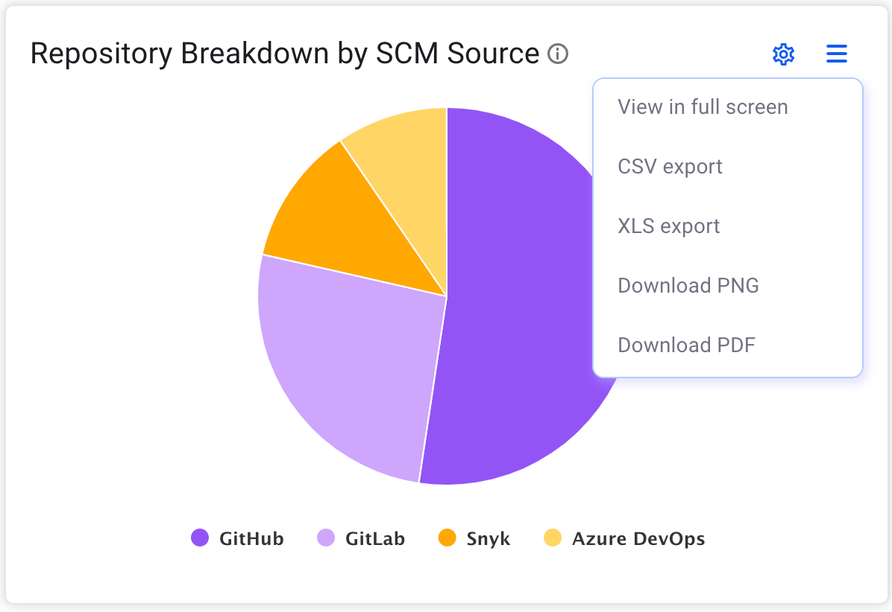

# Dashboard for Snyk AppRisk

## Overview

On the Snyk AppRisk dashboard page, you can add widgets that display an overview of your application and security controls.

You can customize the dashboard widgets as desired. Choose to rename or modify display configurations, or add multiple widget instances.

## Configure a widget

Customize your dashboard with the available widgets. You can change the settings of an existing widget or change the way it is displayed. You have the ability to move a widget around the dashboard, rename it, display or hide the legend, view it in full screen, export or download it. See the [Repositories assets](inventory-for-snyk-apprisk/#repository-assets) section for additional details regarding archived or deleted repositories and the information presented in the dashboard widgets.

### Settings menu

You can make several changes to a widget. All widgets allow you to change the name. Other particular settings are available for each widget. You can access the Settings menu by following these steps:

1. Select a widget and click the **Setting** menu.
2. &#x20;Customize the widget by changing its name or other specific details.&#x20;
3. After all changes are done, click **Apply**.

### Action menu

Access the full list of general options from the action menu. You can access the Action menu by following these steps:

1. Select a widget and click the **Action** menu.
2. Select one of the following actions:
   * View in full-screen
   * CSV export
   * XLS export
   * Download PNG
   * Download PDF

<figure><figcaption>
Snyk AppRisk - Widget action menu
</figcaption></figure>

\
