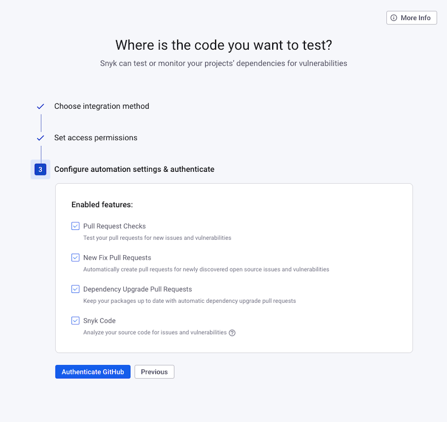

# Level 1: Configure Snyk AppRisk and setup integrations

Start onboarding AppRisk by identifying all inventory code-based assets and detecting which assets have security controls set up.

## Access Snyk AppRisk

You can access Snyk AppRisk from the [Snyk Web UI.](../../../getting-started/explore-snyk-through-the-web-ui.md)

* Access Snyk AppRisk from the Group level of your Snyk Group.
* Ensure you have Group Admin access.
* Click the Snyk AppRisk button to launch Snyk AppRisk.
* A new tab of your browser is opened, displaying the Snyk AppRisk [Dashboard](../dashboard-for-snyk-apprisk.md).

## Setup integrations 

After you ensure you can correctly access Snyk AppRisk, you can start to build your asset inventory by setting up the integrations.


Snyk scan information is automatically imported within two hours after enabling Snyk AppRisk.&#x20;


You can access and configure the integrations from the Integrations view. Select the Integration Hub option to see the list of all available integrations. You can find more details about integration configuration in the [Using the Integration Hub](../integrations-for-snyk-apprisk/#using-the-integration-hub) section.

The default display in the Integrations view includes the configured Snyk integrations. The status of each integration, **Connected**, or **Not connected**, depends on the specific content imported into Snyk.

The integrations view can be configured to apply to your needs, meaning that you can [customize an existing integration](../integrations-for-snyk-apprisk/customize-an-integration.md) or [connect a new SCM integration](../integrations-for-snyk-apprisk/connect-an-scm-integration.md).

<figure><figcaption>
Snyk AppRisk - Integration Hub option displaying the list of available integrations
</figcaption></figure>

After you click on the Integration Hub, a list of the available integrations is displayed. You can add one or multiple profiles, for each integration.&#x20;

### SCM integrations

Use the Snyk AppRisk Integrations Hub to configure your SCM integrations. Note that this is a distinct integration interface dedicated to Snyk AppRisk, separate from the Organization integrations interface.

In each Snyk Organization, administrators have the capability to provide tokens with limited access to the applications utilized by developers.

The scope of the token used in Snyk AppRisk is to provide an overview of the existing assets compared to what is imported into Snyk.

The supported SCM integrations are:

* GitHub
* GitLab
* Azure DevOps (Azure Repos)
* BitBucket

Navigate to the [Connect an SCM integration](../integrations-for-snyk-apprisk/connect-an-scm-integration.md) page for more details about the supported SCM integrations.

### Brokered SCM integration 

When setting up a Snyk Broker, there are some questions you need to ask regarding either standing up a new broker or updating an existing [Snyk broker connection](https://docs.snyk.io/enterprise-setup/snyk-broker):

* Are you hitting any API Rate Limit issues?
* Do you need to update the SCM token to a user that has access to all relevant SCM repositories?
* Do you have more than 1000 repos?

If you answered Yes to any of the above questions, then you need to deploy a new Snyk Broker to accommodate the Snyk AppRisk SCM connection.&#x20;


Snyk recommends creating a new Organization in Snyk specifically for the Snyk AppRisk Broker.


Navigate to the [Snyk Broker - AppRisk](../../../enterprise-configuration/snyk-broker/snyk-broker-apprisk.md) page for more details about installing and configuring Snyk AppRisk using Snyk Broker.\

## Features

You can access the different Snyk AppRisk features on their own screen view, allowing you to focus on each feature at a time.

* [Dashboard](../dashboard-for-snyk-apprisk.md)
* [Inventory](../inventory-for-snyk-apprisk/)
* [Policies](../policies-for-snyk-apprisk/)
* [Integrations](../integrations-for-snyk-apprisk/)

#### Inventory view

The Inventory feature is structured in four sections, each focused on a specific area:

* **Code assets**: provides a list of all your repository assets and package assets found in the repository. Navigate to the [Inventory capabilities](../inventory-for-snyk-apprisk/inventory-capabilities.md) page for a detailed overview of all options available in the Code assets view and to the [Filters capabilities](../inventory-for-snyk-apprisk/search-and-filter-capabilities.md#filters-capabilities) page for more details about the filtering options and how to use them.
* **Organization teams**: provides a list of the repository assets grouped by teams. Note that only SCM organizations with teams and repositories assigned to a team, appear on this layout.
* **Technology**: provides a list of the repository assets grouped by technology, as detected and tagged by Snyk AppRisk.
* **Type**: provides a list off all the discovered assets, grouped by their type.

If you are using Snyk AppRisk for the first time, Snyk recommends you to first use the Coverage filter to determine where you currently have Snyk implemented. Then, you can use the Coverage Gap filter to identify the assets that do not meet the coverage requirements set in a **Set coverage control** policy.

You can use the Coverage Gap filter to:

*   &#x20;Find any asset that does not comply with the Set coverage control policy requirements:&#x20;

    <figure><figcaption>
Coverage gap - Use case 1
</figcaption></figure>
*   Find any assets that do not meet the coverage requirements for Snyk Open Source or Snyk Code, or both of them simultaneously:&#x20;

    <figure><figcaption>
Coverage gap - Use case 2
</figcaption></figure>

#### Tags 

You can use tags to categorize the assets. You can use tags in multiple ways:

* Automatic tags: Snyk AppRisk automatically tags repository assets with information about the used technologies (Python, Terraform, and so on) in the repository and repository latest updates. You can also use policies to tag repository and package assets. GitHub and GitLab topics can also be pulled from the repository and applied as Asset Tags in Snyk AppRisk.
* User Defined tags: you can set up custom tags through policies to categorize your assets beyond the system generated tags. See the [Create policies ](../policies-for-snyk-apprisk/create-policies.md)page for more details.&#x20;

#### Dashboard

You can use the dashboard for a quick overview of your application and security controls. Use the default widgets and customize the displayed information as needed, or add new widgets that meet your needs. See the [Dashboard for Snyk AppRisk](../dashboard-for-snyk-apprisk.md) page for more details.

Here are the available dashboard widgets:

* **SAST coverage**: check which repositories are being covered or not by Snyk Code and Snyk Infrastructure as Code.&#x20;


The SAST coverage widget uses an OR statement, meaning that a repository is covered for SAST if it is also covered for Snyk Code OR Snyk Infrastructure as Code.


* **SCA coverage**: check which repositories are being covered or not Snyk Open Source and Snyk Container. You are able to edit the widget if you want to see either Snyk Open Source coverage or Snyk Container coverage.&#x20;


The SCA coverage widget uses an OR statement, meaning that a repository is covered for SCA if it is also covered for Snyk Open Source OR Snyk Container.


* **Repository breakdown by source**: check which repositories Snyk AppRisk discovered using the SCM integrations (Azure DevOps(Azure Repos), Gitlab, GitHub, BitBucket). The Others categories are repositories that Snyk discovered but did not correlate back to a SCM repository.
* **Technology breakdown**: check the top technology (language) tags of the repositories that Snyk discovered.
* **Asset breakdown by type**: check if the asset is a repository or a package.
* **Repository activity**: check if the repository is active, inactive, or dormant.

