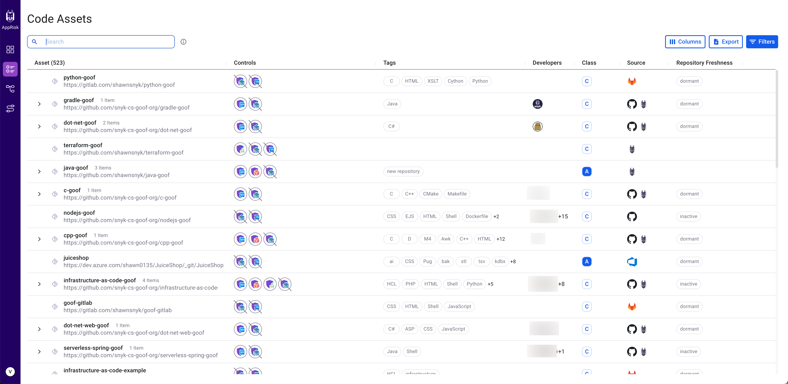

# Inventory for Snyk AppRisk

Snyk AppRisk inventory layouts are organizing your repository assets in meaningful ways, enabling you to:

* Gain full repository asset visibility from your SCM tools, including details about configured teams and repository code committers.
* Track controls coverage for Snyk products.
* Prioritize coverage mitigation efforts according to business impact.

Each line in the inventory represents either a repository asset or a scanned artifact from Snyk that is likely a repository but lacks some identifying information. Scanned artifacts are not supported through Policies.

## Inventory Layouts 

To get better context and clarity over your asset inventory, Snyk AppRisk allows flexible structuring with inventory layouts. Snyk AppRisk includes four inventory layouts, and groups assets by different contexts:

* **Code Assets**: A flat list of all repository assets.&#x20;
* **Organization Teams**: Repository assets grouped by teams. Note that only SCM organizations with teams, and repositories assigned to a team, appear on this layout.
* **Technology**: Repository assets grouped by technology, as detected and tagged by Snyk AppRisk.
* **Type**: All the discovered assets, grouped by their type.&#x20;

Each inventory layout may include different counts of assets and scanned artifacts, depending on the grouping context. Otherwise, all columns and data manipulation features are the same on each inventory layout.

## Assets and their attributes

Every item listed in the inventory is considered an individual asset. Most assets are actual components of the application (code repositories, domains, endpoints, and so on), but an asset can also be a representation of a Group such as the asset type (repository), a group (certain business unit), or even a product. Assets in the inventory are presented with key attributes in the following columns:

* **Asset** - The name of the repository asset, scanned artifact, and the Git remote URL, if available. Scanned artifacts are missing Git remote URLs.
* **Controls** - A report detailing all products detected by the Snyk AppRisk on a specific repository asset and all products that should be covered but are not yet by the Snyk AppRisk.
* **Tags** -  Snyk AppRisk automatically tags repository assets with information about the used technologies (Python, Terraform, and so on) in the repository, and repository latest updates. You can also use policies to tag repository assets.
* **Developers** - Includes the SCM profile details for code committers to the repository asset.
* **Class** - Reflects the business criticality of the asset from A (most critical) to D (least critical), as defined by the user in the Policies view. The class can be manually changed by you or automatically changed by a policy. You can lock the value you have manually set for a Class to prevent policies from overriding it.
* **Source** - Reflects the source of the asset, which can come from Snyk, an SCM, or a third-party integration.
* **Repository freshness** - Reflects the status of the repository and the date of the last commit.

<figure><figcaption>
Inventory view - Key attributes
</figcaption></figure>

### **Asset Sources, Types, and Scanned Artifacts**

Snyk AppRisk derives assets from Snyk automatically, and also from any SCM tools that are onboarded using the Snyk AppRisk Integration Hub. SCM tools from Snyk AppRisk Integration Hub may add additional repositories that aren’t scanned by Snyk, as well as additional context such as teams and code committers.

### Repository assets and scanned artifacts

#### Repository assets

Currently, Snyk AppRisk supports repository assets as an asset type. In future releases, Snyk will add support for additional code-based assets, such as software packages. Repository assets are visible in all inventory layouts and are supported by Policies. To avoid duplication, assets are identified using a unique identifier, which is the git remote URL for repository assets.


If you archive or delete repositories, they are not displayed in the asset inventory and, therefore, not considered to be shown in the dashboard widgets.


#### Scanned artifacts

Snyk AppRisk also includes the concept of scanned artifacts. A scanned artifact is an entity detected by Snyk and cannot be identified as a repository asset because it does not include identifying information, such as a Git remote URL.&#x20;

Scanned artifacts provide users with visibility into what Snyk AppRisk detects from scans but require additional troubleshooting.&#x20;

You can see the scanned artifacts in the Inventory Type view. The scanned artifacts are not supported by Policies. Furthermore, scanned artifacts may include duplicates, as identifying information is missing.

