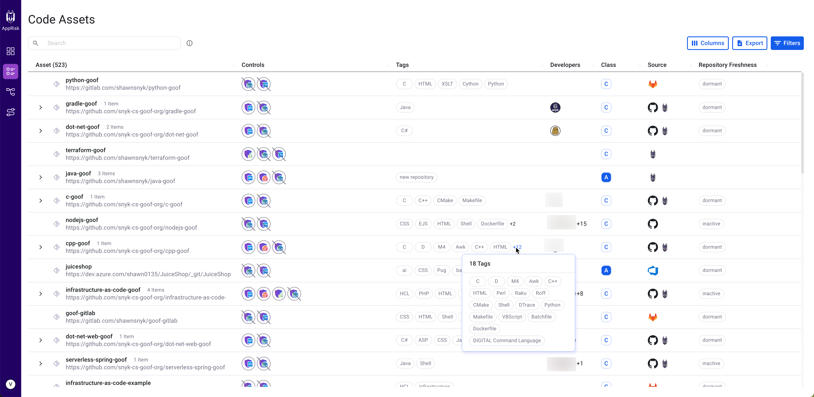
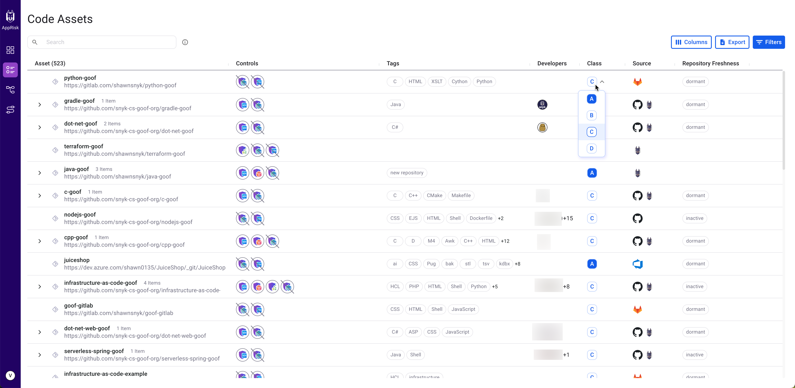

# Inventory capabilities

Each inventory layout is presented in a table format, detailing the available key attributes:

* [Assets](inventory-capabilities.md#asset)
* [Issues](inventory-capabilities.md#issues)
* [Coverage Controls](inventory-capabilities.md#coverage-controls)
* [Tags](inventory-capabilities.md#tags)
* [Developers](inventory-capabilities.md#developers)
* [Class](inventory-capabilities.md#class)
* [Source](inventory-capabilities.md#source)
* [Repository freshness](inventory-capabilities.md#repository-freshness)

## **Asset**

The asset column incorporates the name of the repository asset, package, scanned artifact, or container images. [Scanned artifacts](./#scanned-artifacts) do not have a Git remote URL.

An asset can be the parent of multiple items. Click on the arrow next to the parent asset name to expand the list of all contained items.&#x20;

Learn more about any asset by clicking the name of the asset in the inventory layout. A pop-up screen is displayed with all relevant information on that specific asset.

You can copy the name of an asset or browse the repository. Click an asset and a menu appears at the end of the row. Click the menu, then select **Copy** or **Browse**.

<figure><figcaption>
Snyk AppRisk - Asset options
</figcaption></figure>

### Asset tabs

The asset information is divided into the following tabs:

* **Summary** - a concentrated view of the asset properties. The Summary screen presents you with the following information:
  * Class - specifies the business criticality of the asset.
  * Source - specifies the origin of the asset.
  * SCM Repository freshness - provides the current status of your repositories, including the date of the last commit.
  * Issues - categorizes the identified types of open issues. If you click on the source title or logo, you are taken to the Project page. If there are multiple Projects, it takes you to a page that displays all the issues across all the Projects.

<figure><figcaption>
Snyk AppRisk Inventory - Assets Summary view
</figcaption></figure>

* **Attributes** - miscellaneous attributes, like the Asset ID or Asset Type, that are fetched from the data source, but do not have a dedicated column. The benefit of having this info is not only by presenting it but mostly by making it searchable. You can search for an attribute by either using the inventory search bar or the filters.

<figure><figcaption>
Snyk AppRisk - Assets Attributes window
</figcaption></figure>

### Image assets

You can identify a container image based on the Image ID. If multiple container images have the same Image ID, then only one image asset is generated for that Image ID, enriched with information from all the identified container images for that ID.

Snyk AppRisk retrieves all image assets from Snyk Container. Reimport the images to ensure you scan the latest image. If you run a new scan on a Project that contains image assets, it rescans the same image for new vulnerabilities. To identify new image assets, you need to first reimport, and then scan the Project. Check the [Detect application vulnerabilities in container images](../../../scan-with-snyk/snyk-container/use-snyk-container-from-the-web-ui/detect-application-vulnerabilities-in-container-images.md) for more details.

## Issues

The Issues column is designed to present a comprehensive list of issues that have been identified within your assets. These findings are the result of scans performed by Snyk as well as internal tools you may have deployed. This detailed list not only helps in understanding the security posture of your assets but also in prioritizing remediation efforts based on the severity and impact of each issue. By having visibility into these issues, you can take proactive steps toward improving the overall security of your applications and infrastructure.

The **Issues** column from the Asset view is designed to present an aggregated count of open issues. These counts are carefully categorized based on the severity level of the issues found in assets, their children assets, or associated packages. Specifically, the severity is divided into four distinct levels:

* **C** (Critical): Issues that represent a serious threat and should be addressed immediately to prevent potential exploits or major disruptions.
* **H** (High): These are significant issues that, while not immediately dangerous, could potentially lead to critical vulnerabilities if not resolved in a timely manner.
* **M** (Medium): Issues of medium severity might not pose an immediate threat but are still important to fix as part of regular maintenance to improve overall security and functionality.
* **L** (Low): These are considered minor issues that have a low impact on the security of the system and operation but should still be addressed to maintain optimal performance and prevent future vulnerabilities.

This classification streamlines prioritization, helping you focus on critical areas and optimize remediation.

## **Coverage Controls**

The Controls column displays all of the Snyk products that were executed on a specific repository asset. This column displays, in circles, a logo for each Snyk product. The logo icon itself has an indication of the highest severity of issues from this source. For example, if the highest severity issue is **C** (critical), you can see a red dot on the control icon.

The Controls logos can have one of the following states:

| Logo                                                                                   | Description                                                                      |
| -------------------------------------------------------------------------------------- | -------------------------------------------------------------------------------- |
|  | The Snyk product was executed.                                                   |
|  | The Snyk product was executed but with issues.                                   |
|  | The Snyk product should have been executed but was not executed.                 |
|  | The Snyk product was executed and failed.                                        |
|      | The Snyk product was executed and failed with issues.                            |
|      | The Snyk product was executed and failed due to not being covered by the policy. |

Click a Controls logo to see **Last test** details and the **Issues** count, split by severity. This reflects the most recent time that the asset was scanned by a specific product.&#x20;

<figure><figcaption>
Snyk AppRisk - Controls
</figcaption></figure>

## **Tags**

A repository asset tag can be added through Policies or be system-generated by Snyk AppRisk to provide more context. Click on a tags field to view all tags.


BitBucket cannot automatically detect the language used in the source code from the repositories. In Snyk AppRisk you can only see the language tags that have been manually added for BitBucket. For more information, you can refer to the official documentation provided by BitBucket.


A system-generated tag includes the following information:

* **Technology** - the languages detected by Snyk AppRisk in the source code within a repository asset.
* **SCM Topic** - the topics found in the integrated SCM repositories. Snyk AppRisk currently supports topics from GitHub and GitLab.
* **Asset type tag** - the tag explaining the type of the asset. For example, the container assets will be assigned an image asset tag.&#x20;
* **SCM Repository freshness** - the status of the repository and the date of the last commit.
  * **Active**: Had commits in the last 3 months.
  * **Inactive**: The last commits were made in the last 3 - 6 months.
  * **Dormant**: No commits in the last 6 months.

<figure><figcaption>
Snyk AppRisk - Tags
</figcaption></figure>

### Tag rules overview

System tags are automatically generated from the SCM repositories. System tags can be classified into three main categories:

* Languages:
  * This applies to GitHub, GitLab, Azure DevOps, and BitBucket as long the data is available in the repository.
  * GitHub, GitLab, and Azure DevOps have automated language detection, instead, BitBucket requires users to set up the language in their repositories.&#x20;
* SCM Topic:&#x20;
  * This applies to GitHub and GitLab.
* Multiple different rules based on the words we found in the repositories:
  * This applies to GitHub, GitLab, Azure DevOps, and BitBucket.

### Tag rules related to user

| Rule                                     | Tag             |
| ---------------------------------------- | --------------- |
| The user commit is older than 6 months.  | `Dormant user`  |
| The user commit is older than 3 months.  | `Inactive user` |
| The user commit is newer than 3 months.  | `Active user`   |
| A new user is detected.                  | `New user`      |

### Tag rules related to repository and code project

| Rule                                                                                             | Tag                              |
| ------------------------------------------------------------------------------------------------ | -------------------------------- |
| The word `payment` or `checkout` is found in the repository and code project.                    | `payment`                        |
| Snyk AppRisk found the code project with the code owner.                                         | `codeowners`                     |
| Snyk AppRisk found the word `infrastructure` in the repository and code project.                 | `infrastructure`                 |
| Snyk AppRisk found the word `store` or `cart` in the repository and code project.                | `ecommerce`                      |
| For scanned artifact code project.                                                               | `scanned artifact: packages`     |
| For scanned artifact repositories.                                                               | `scanned artifact: repositories` |
| Snyk AppRisk found the word `upload` in the repository or code project.                          | `upload`                         |
| Snyk AppRisk found the word `demo` in the repository and code project.                           | `demo`                           |
| Snyk AppRisk found the word `billing`, `charges` or `invoice` in the repository or code project. | `billing`                        |
| Snyk AppRisk found the word `account` in the repository or code project.                         | `account`                        |
| Snyk AppRisk found the word `download` or `attachement` in the repository or code project.       | `attachment`                     |

### Tag rules related to metadata

| Rule                                       | Tag                 |
| ------------------------------------------ | ------------------- |
| Snyk AppRisk found pip metadata.           | `python module`     |
| Snyk AppRisk found a browser extension.    | `browser extension` |
| Snyk AppRisk found technologies in use.    | `< technologies>`   |
| Snyk AppRisk found ruby metadata.          | `ruby module`       |
| Snyk AppRisk found languages from the SCM. | `<languages>`       |
| Snyk AppRisk detected a new repository.    | `new repository`    |
| Snyk AppRisk found nodejs metadata.        | `nodejs module`     |

## **Developers**

You can see the list of all developers that worked on that specific asset. The details list includes the SCM profile details for code committers to the repository asset.

<figure><figcaption>
AppRisk - Developers
</figcaption></figure>

## **Class**

Reflects the business criticality of the asset from A (most critical) to D (least critical), as you defined it in the Policies view.&#x20;

You can manually change the business criticality of an asset. Click the criticality level and select another one from the list.&#x20;

After manually setting the value of a class, you have the option to lock the value to prevent any potential overriding by a policy that has the Set Asset Class as an action. You can lock the value from the general or summary views of an asset. You can unlock the class value at any time by clicking the lock icon. A popup is displayed, asking you for confirmation about unlocking the value.

<figure><figcaption>
Snyk AppRisk - Lock the value of a class
</figcaption></figure>

The Asset Class column is also available on the Insights UI for risk-based prioritization, and it has the same functionality as it does here. At the moment, the Asset Class column is available only for repository assets, and applicable only for Snyk Code.


The synchronization between Asset Class and the Insights UI can take up to 3 hours.


The class value can be auto-generated with policies. You just need to create a policy that has as an action **Set Asset Class**.

<figure><figcaption>
Snyk AppRisk - Class
</figcaption></figure>

## Source

The Source column in Snyk AppRisk helps users identify the origin of their assets, which can be directly from Snyk, through SCM systems, or using third-party integrations. This feature simplifies asset management and risk prioritization by providing clear visibility into the origin of each asset and it enables more effective security strategies and remediation efforts.

## SCM Repository freshness

The SCM Repository freshness column provides you with an immediate understanding of the current status of your repositories, including the date of the last commit. This assists you in quickly identifying active and dormant Projects and helps you with the decision-making regarding maintenance, security patching, and resource allocation.

## Source

The Source column in Snyk AppRisk helps users identify the origin of their assets, which can be directly from Snyk, through SCM systems, or using third-party integrations. This feature simplifies asset management and risk prioritization by providing clear visibility into the origin of each asset and it enables more effective security strategies and remediation efforts.

## SCM Repository freshness

The SCM Repository freshness column provides you with an immediate understanding of the current status of your repositories, including the date of the last commit. This assists you in quickly identifying active and dormant Projects and helps you with the decision-making regarding maintenance, security patching, and resource allocation.

\
