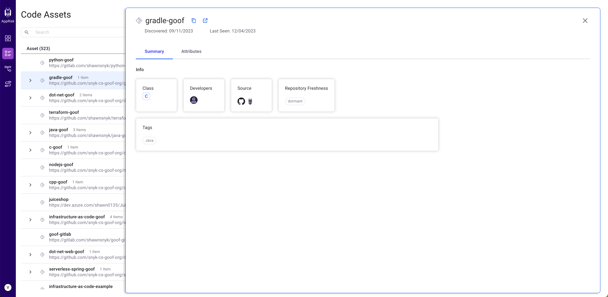
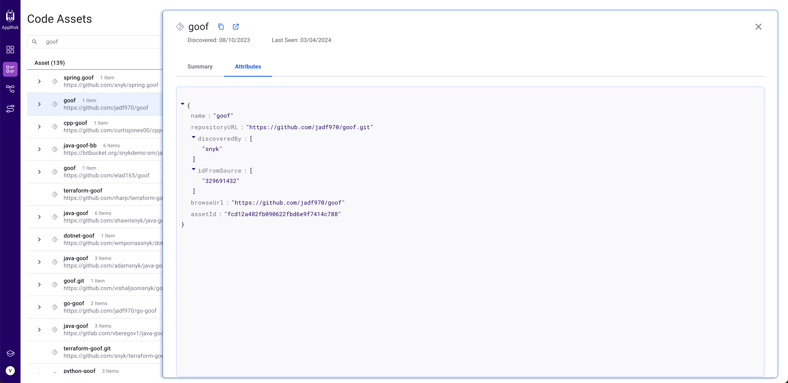
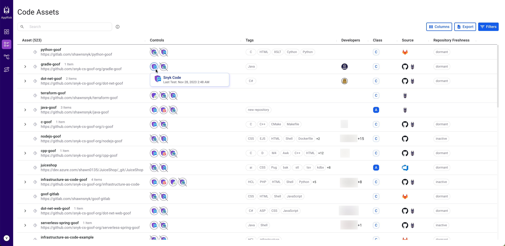

# Inventory capabilities

Each inventory layout is presented in a table format, detailing the available key attributes:

* [Assets](inventory-capabilities.md#asset)
* [Coverage Controls](inventory-capabilities.md#coverage-controls)
* [Tags](inventory-capabilities.md#tags)
* [Developers](inventory-capabilities.md#developers)
* [Class](inventory-capabilities.md#class)

## **Asset**

The asset column incorporates the name of the repository asset, package or scanned artifact, and the Git remote URL, if available. Please note that scanned artifacts do not have a Git remote URL.

An asset can be the parent of multiple items. Click on the arrow next to the parent asset name to expand the list of all contained items.&#x20;

Learn more about any asset by clicking the name of the asset in the inventory layout. A pop-up screen is displayed with all relevant information on that specific asset.

The asset information is divided into the following tabs:

* **Summary** - a concentrated view of the asset properties.

<figure><figcaption>
Snyk AppRisk Inventory - Assets Summary view
</figcaption></figure>

* **Attributes** - miscellaneous attributes that are fetched from the data source, but do not have a dedicated column. The benefit of having this info is not only by presenting it but mostly by making it searchable. You can search for an attribute by either using the inventory search bar or the filters.

<figure><figcaption>
Snyk AppRisk - Assets Attributes window
</figcaption></figure>

You can copy the name of an asset or browse the repository. Click an asset and a menu appears at the end of the row. Click the menu, then select **Copy** or **Browse**.

<figure><figcaption>
Snyk AppRisk - Asset options
</figcaption></figure>

## **Coverage Controls**

The Controls column displays all of the Snyk products that were executed on a specific repository asset. This column displays, in circles, a logo for each Snyk product.

The Controls logos can have one of the following states:

| Logo                                                                                   | Description                                                                      |
| -------------------------------------------------------------------------------------- | -------------------------------------------------------------------------------- |
|  | The Snyk product was executed.                                                   |
|  | The Snyk product was executed but with issues.                                   |
|  | The Snyk product should have been executed but was not executed.                 |
|  | The Snyk product was executed and failed.                                        |
|      | The Snyk product was executed and failed with issues.                            |
|      | The Snyk product was executed and failed due to not being covered by the policy. |

Click a Controls logo to see **Last test** details. This reflects the most recent time that the asset was scanned by a specific product.&#x20;

<figure><figcaption>
Snyk AppRisk - Controls
</figcaption></figure>

## **Tags**

A repository asset tag can be added through Policies or be system-generated by Snyk AppRisk to provide more context. Click on a tags field to view all tags.


BitBucket cannot automatically detect the language used in the source code from the repositories. In Snyk AppRisk you can only see the language tags that have been manually added for BitBucket. For more information you can refer to the official documentation provided by BitBucket.


A system-generated tag includes the following information:

* **Technology** - the languages detected by Snyk AppRisk in the source code within a repository asset.
* **SCM Topic** - the topics found in the integrated SCM repositories. Snyk AppRisk currently supports topics from GitHub and GitLab.
* **Repository freshness** - the status of the repository and the date of the last commit.
  * **Active**: Had commits in the last 3 months.
  * **Inactive**: The last commits were made in the last 3 - 6 months.
  * **Dormant**: No commits in the last 6 months.

<figure><figcaption>
Snyk AppRisk - Tags
</figcaption></figure>

## **Developers**

You can see the list of all developers that worked on that specific asset. The details list includes the SCM profile details for code committers to the repository asset.

<figure><figcaption>
AppRisk - Developers
</figcaption></figure>

## **Class**

Reflects the business criticality of the asset from A (most critical) to D (least critical), as you defined it in the Policies view.&#x20;

You can manually change the business criticality of an asset. Click the criticality level and select another one from the list.&#x20;

After manually setting the value of a class, you have the option to lock the value to prevent any potential overriding by a policy that has the Set Asset Class as an action. You can lock the value from the general or summary views of an asset. You can unlock the class value at any time by clicking the lock icon. A popup is displayed, asking you for confirmation about unlocking the value.

<figure><figcaption>
Snyk AppRisk - Lock the value of a class
</figcaption></figure>

The Asset Class column is also available on the Insights UI for risk-based prioritization, and it has the same functionality as it does here. At the moment, the Asset Class column is available only for repository assets, and applicable only for Snyk Code.


The synchronization between Asset Class and the Insights UI can take up to 3 hours.


The class value can be auto-generated with policies. You just need to create a policy that has as an action **Set Asset Class**.

<figure><figcaption>
Snyk AppRisk - Class
</figcaption></figure>

###

\
