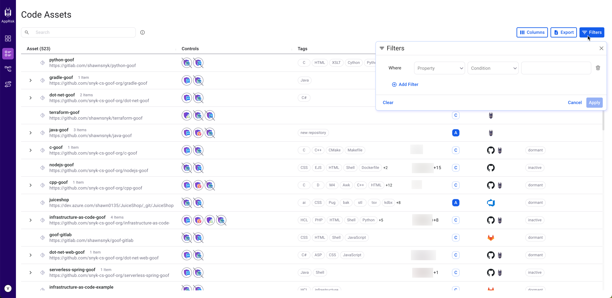

# Search and filter capabilities

Snyk AppRisk provides powerful search and filtering capabilities to help you narrow in on assets for investigation and mitigation.

## Search capabilities

Use the search bar to search for specific keywords across various asset properties. Results can also include data retrieved from the Attributes tab of an asset, not only by the asset name.&#x20;

## Filters capabilities

With this feature, you can [define filters](../policies-for-snyk-apprisk/create-policies.md#define-filters) and filter assets based on highly specific criteria. For example, repository assets that have `AWS` in the name, are classified as either **A** or **B**, and do not have Snyk IaC as a control executed. This can be useful for finding repositories that have infrastructure as code that Snyk IaC is not currently scanning.

Click Filters from the top left side of the screen. A pop-up is displayed allowing you to add new filters. The filter capability enables you to specify one or more sets of criteria as follows:

* **Property** of an asset (such as asset name, class, control executed).
* **Condition** depends on the asset selected (such as `contains` or `does not contain` for `asset name`).
* **Value** depends on the Property and Condition.

<figure><figcaption>
Snyk AppRisk - Filters
</figcaption></figure>

You can add as many filters as needed. To add another filter click **Add Filter,** set the condition as **And** or **Or** and customize the **Property**, **Condition**, and **Value** fields.&#x20;

There are several filtering options:

* **Asset ID -** filter assets by their unique identifier.
* **Asset Type** - filter assets by type.
* **Asset Name** - filter assets by name.
* **Tags** - filter assets by certain categories, for example, tags.\
  Assets have default tags for various use cases, such as tracing active/inactive assets, filtering by specific technology, and more. On top of it, users can create policy rules to tag assets according to their own logic.
* **Discovered** -  filter assets according to duration, since they were discovered.
* **Locked attributes** -  filter assets with locked attributes to identify the assets that are not affected by your policies.
* **Coverage and Coverage gap -** mostly used to answer scan coverage questions.&#x20;
  * **Coverage** means that an asset has been tested by this product at some point in the past.
  * **Coverage gap** means the asset does not meet the coverage requirements as set by the **Set coverage control** policy.


If you use Snyk AppRisk for the first time, start with the **Coverage** filter to determine where you currently have Snyk Implemented.


