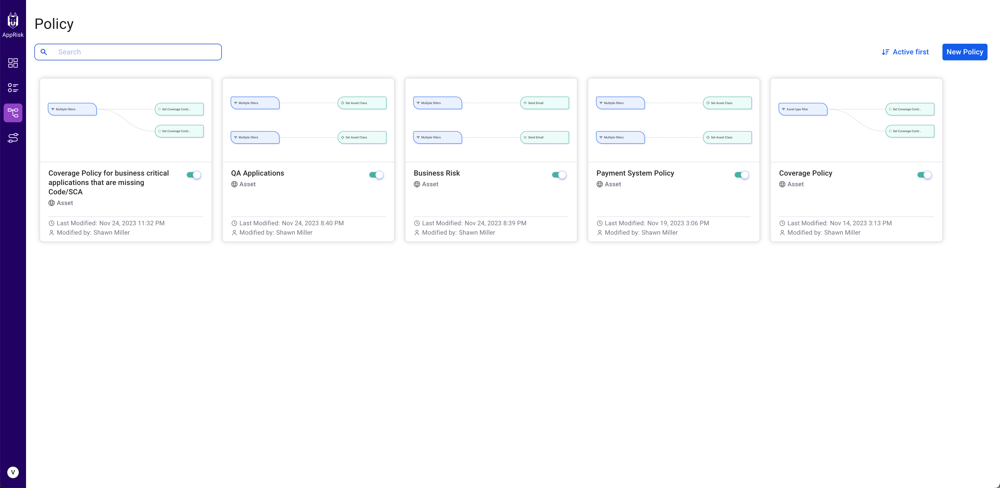

# Implement policies

All policies that you add to a project help you to better monitor your assets and automate the business context by always receiving notifications about occurring changes.

## Policy functionalities

Access the main view of the Policy function to see a list of all your policies and detailed information about them:

* **Policy status** - enabled or disabled.
* **Last modified** - the date the policy was last modified.
* **Modified by** - the name of the last user that modified the policy.

You can hover over a policy to gain access to extra details:

* **Go to flow** - Opens the policy.
* **Details** - Provides details on policy creation and modifications, including dates and creators.
* **Clone** - Duplicates the policy.
* **Delete** - Removes the policy.

<figure><figcaption>
Snyk AppRisk - Policies overview screen
</figcaption></figure>

## Customize a policy

Click any of the available policies to view them in full screen and to access all their functionalities.&#x20;

### Simulate the policy

You can run a simulation to get an overview of how the policy is working. A number is displayed above the policy, indicating the total of assets found matching the criteria you added to the policy.&#x20;

<figure><figcaption>
Snyk AppRisk - Policy simulation
</figcaption></figure>

### Run the policy

All policies are automatically run in a maximum of 30 minutes after creation, then every 30 minutes. You can manually run a policy by clicking Run to apply the policy to your assets. Changes are applied automatically to your assets by implementing the actions you set on the policy.&#x20;

You can also add an **AND** **Send email** or **Send Slack notification** action to be notified after the policy is successfully run.

### Edit a policy

Click Edit to change the settings of your policies. You can change, add, or remove information from both the Filters and Actions fields.


You cannot revert changes to a policy to its initial state.


**Last modified** and **Modified by** fields are updated every time you are making changes to a policy.
