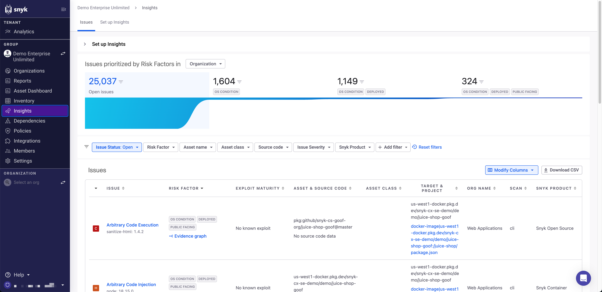

# Prioritization setup: User permissions

Currently, Snyk AppRisk Essentials is available at the Group level, so [grant relevant users the Group viewer or the Organization Collaborator role](../../../../snyk-admin/user-roles/user-role-management.md#manage-roles). This is the minimum required permission, but Group Admins can also view Prioritization.

After users have the right permission, they will see a new **Insights UI** option in the left navigation at the Group level.

<figure><figcaption>
Insights menu option
</figcaption></figure>

