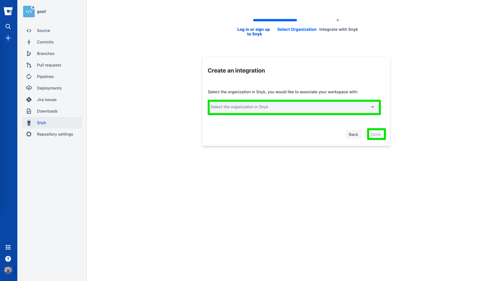
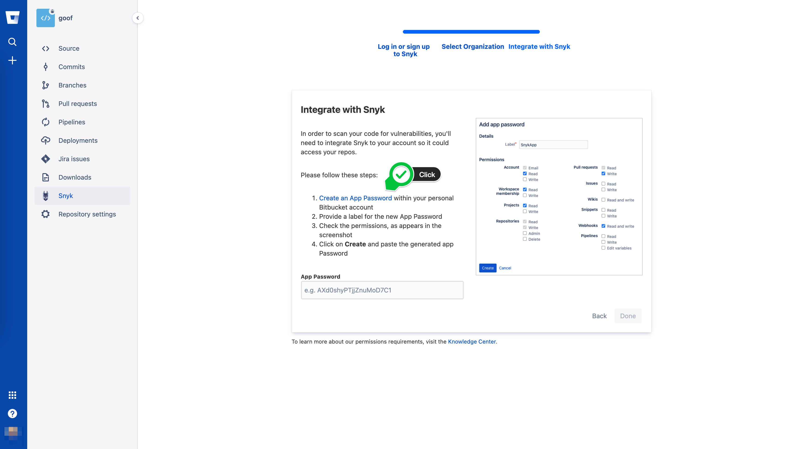
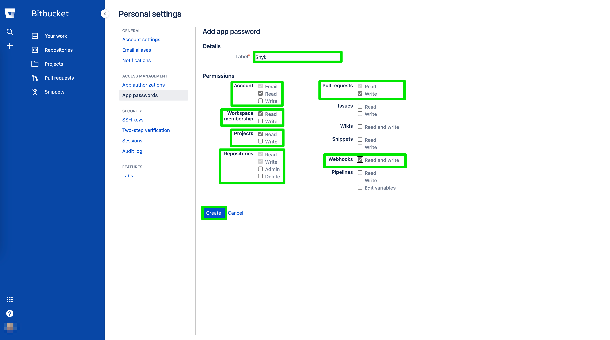
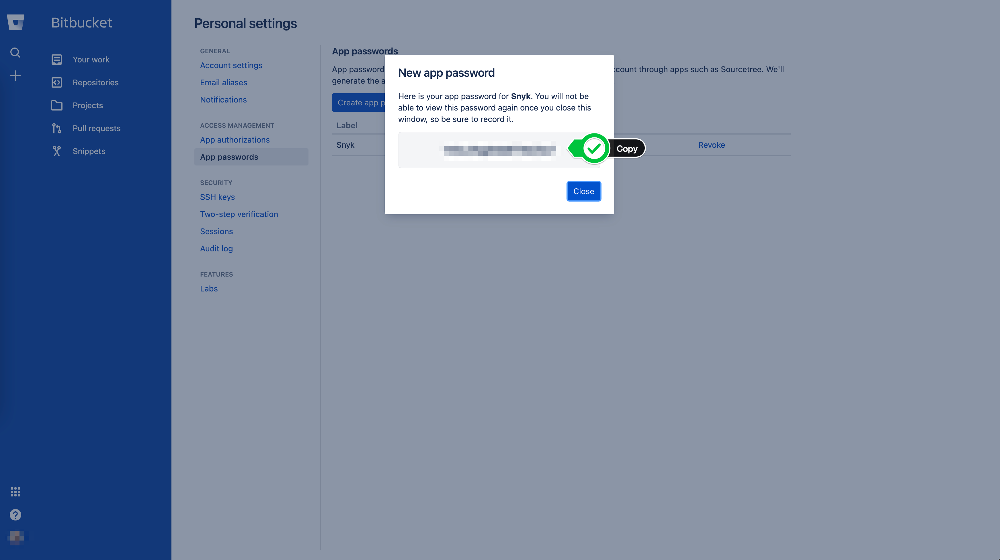
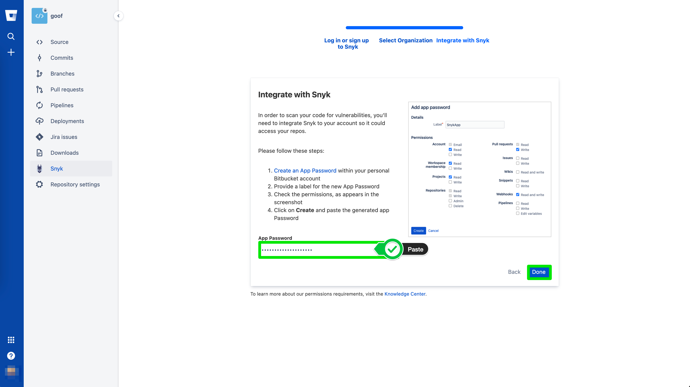

# App Password

The next step is to select which Snyk Organization we want to store our scan results against. Simply use the pulldown menu to select the desired organization and click **Done**.

We will need to generate an [Atlassian App passwor](https://support.atlassian.com/bitbucket-cloud/docs/app-passwords/)d to allow Snyk access to your repository. Click on the **Create an App Password** link as shown below.

You can provide any name of your choosing, but for this example, we are naming our App Password as **Snyk**.


Note the permissions needed above.


When complete, click **Create** and watch for the token to be displayed.

Let's copy the token and go back to our other tab to paste it.

Once you paste the token click **Done**.

