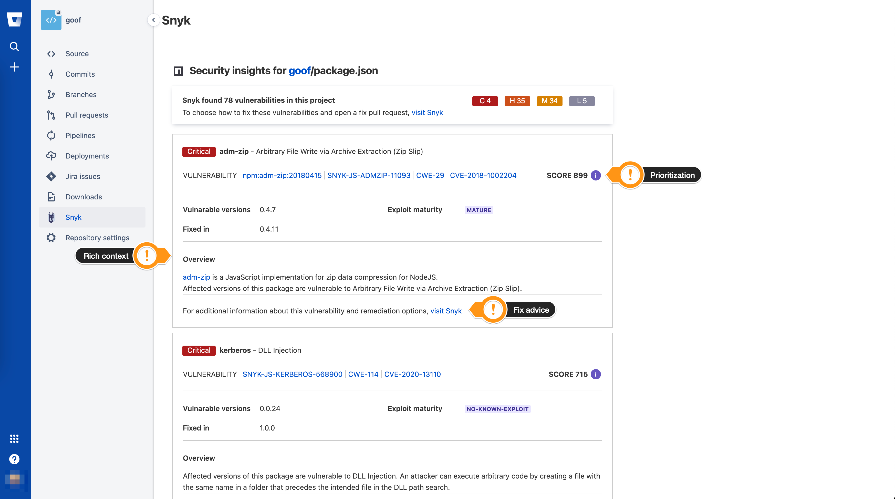
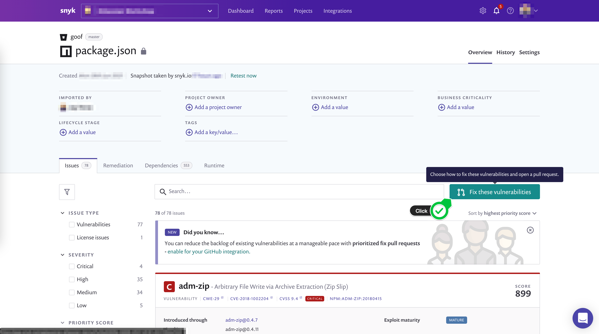
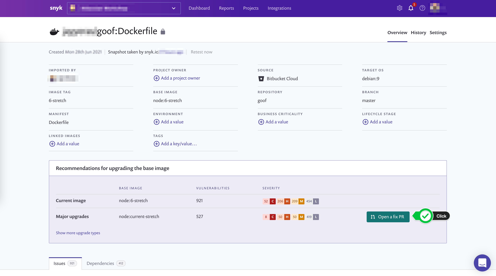

# Findings

Clicking on any of the manifests will expand the results and provide additional information on what was found.

Here we see a list of all vulnerabilities ranked with [Snyk's Priority Score](https://snyk.io/blog/snyk-priority-score/). Our Priority Score algorithm processes a range of data points \(factors\) to generate a score between 0 and 1000. We started with 0-100, quickly realizing that companies aren’t just prioritizing within a project, they’re prioritizing over _all_ their projects. Granularity is key to avoiding the problem faced when using only severity or even CVSS—everything being a top priority! We’ve calculated the weighting of the various factors to ensure that scores have an even spread whilst ensuring that those that pose the greatest risk end up with the highest score.

From this view, you are also presented with contextual information about your vulnerability as well as a link that, when clicked, will take you to **Snyk** and provide you with **fix advice**.

From the Snyk app, you can review recommendations for fixing your vulnerabilities and click the **Fix these vulnerabilities** button to automatically create a **pull request** against your repository.

Similarly, for any **Dockerfile** in your repository, you will obtain insights into how you can mitigate potential security issues with **base image** recommendations and the ability to **Open a fix PR**.

To learn more about Snyk's integration with Bitbucket Cloud please be sure to read our [documentation page](https://support.snyk.io/hc/en-us/articles/360004032097-Bitbucket-Cloud-integration).

