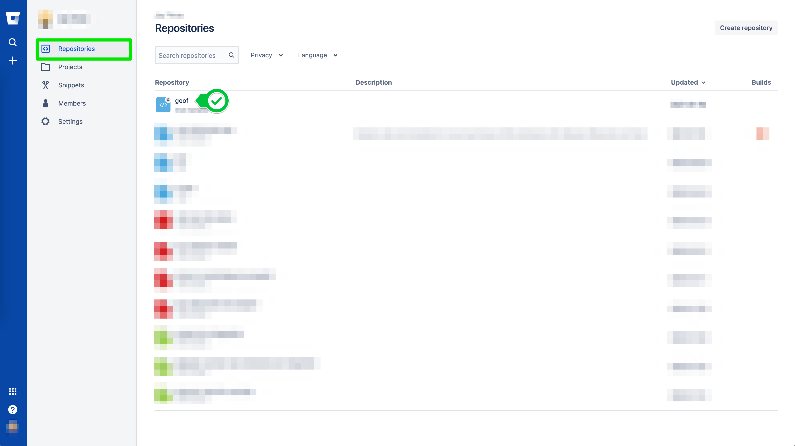
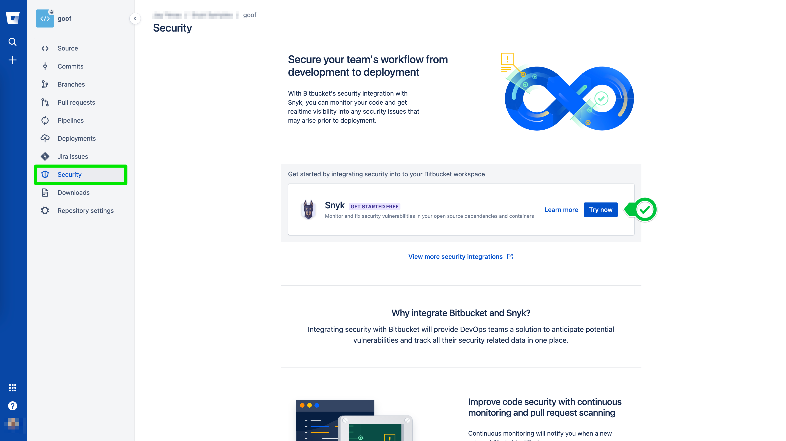
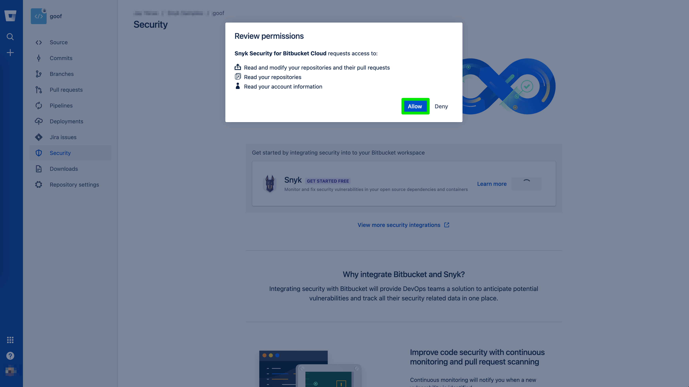

# Getting Started

Enabling Snyk Security for Bitbucket Cloud is seamless. To get started, simply login to your Bitbucket account and select your desired repository.

You will notice a **Security** tab on your left navigation bar. Let's click it!

Here you can read more about Snyk and the value we bring to Bitbucket, but best of all, you can click **Try now** and experience it for yourself!

We are almost there! Just quick glance at some permissions and click **Allow**.

