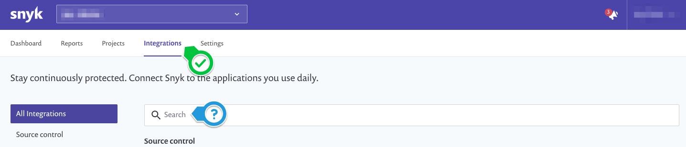
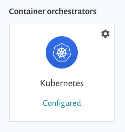
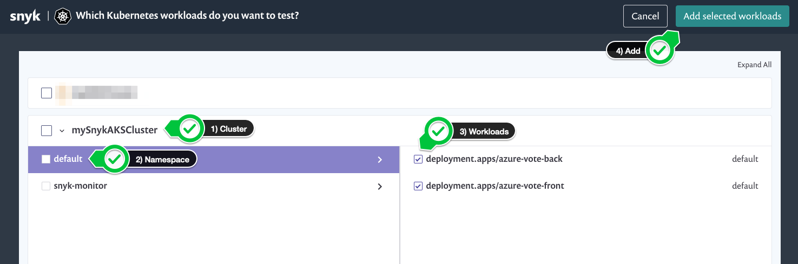
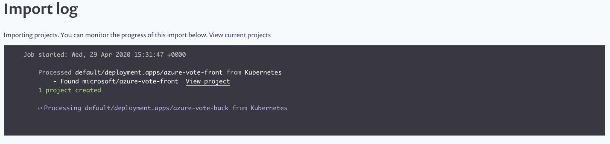

# Add Kubernetes workloads

Now that our controller has been installed on our AKS cluster, we can add workloads for security scanning. Visit the [Snyk Knowledge Center](https://support.snyk.io/hc/en-us/articles/360003947117-Adding-Kubernetes-workloads-for-security-scanning) for additional information on this topic. For the purpose of this section, we will manually add some workloads. To do so, go to the Snyk web console and navigate to `Integrations`.

Either type `Kubernetes` in the search bar, or scroll down.

You can monitor multiple clusters across multiple environments. If your controller is communicating with the Snyk APIs, you will see it appear in the Snyk console. Select the appropriate cluster you wish to monitor, the relevant namespace, and the specific workloads. Finally click the `Add selected workloads` button in the top right corner when you've made all of your selections as illustrated below:

After adding the workloads you will be redirected to the `Projects` page in the Snyk console where you will be able to view the results and take action. You can also view the `Import log` for a detailed status of the progress.

