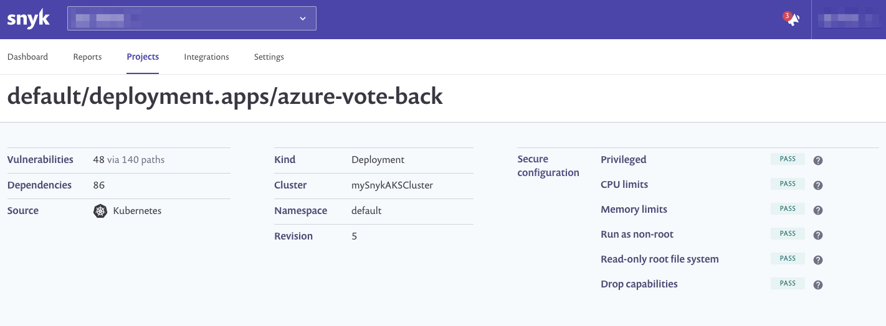

# Fix issues

As we now know, Kubernetes is not secure by default. It is beyond the scope of these exercises to provide a deep-dive on this topic, but detailed documentation on [securing a cluster](https://kubernetes.io/docs/tasks/administer-cluster/securing-a-cluster/) is readily available. Additional reading is recommended on configuring a [security context](https://kubernetes.io/docs/tasks/configure-pod-container/security-context/) for a pod, [pod security](https://kubernetes.io/docs/concepts/policy/pod-security-policy/) policies, and setting [capabilities](https://kubernetes.io/docs/tasks/configure-pod-container/security-context/#set-capabilities-for-a-container) for a container.

However, for the time being, we will introduce a couple of quick changes to improve our security posture. We will accomplish this by adding a few lines to our Kubernetes manifest.

```yaml
securityContext:
  allowPrivilegeEscalation: false
  readOnlyRootFilesystem: true
  runAsNonRoot: true
  capabilities:
    drop:
      - all
```

For your convenience, a sample file has already been created for you containing these changes. It is named [`azure-vote-secure.yaml`](https://github.com/snyk-partners/snyk-azure-resources/blob/master/templates/azure-vote-secure.yaml) and can be found in the [`kube-manifests/`](https://github.com/snyk-partners/snyk-azure-resources/tree/master/kube-manifests) directory of the repository for this workshop.

We will then need to apply this new file to our cluster with the following command:

```bash
kubectl apply -f kube-manifests/azure-vote-secure.yaml
```

We should see an output similar to the following:

```text
deployment.apps/azure-vote-back configured
service/azure-vote-back unchanged
deployment.apps/azure-vote-front configured
service/azure-vote-front unchanged
```

Notice that the `deployment` for both the `vote-back` and `vote-front` applications show `configured` whereas the `service` for each shows as `unchanged`. This is expected since we have defined `securityContext` for these.

We will verify that our changes resolved the issue by checking our project once more. Since we have `snyk-monitor` running in our cluster we are actively monitoring our workloads.



Success! We've been able to identify security issues in our Kubernetes configuration, updating our manifest to include a fix, and applied these to resolve the problem.

