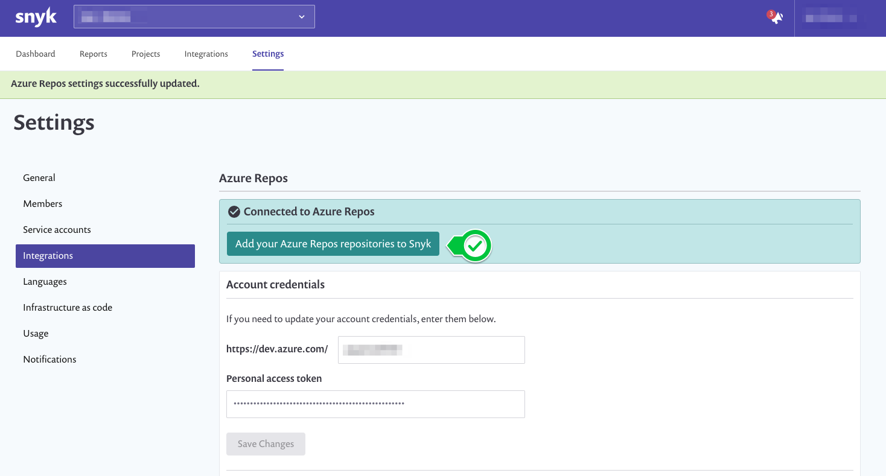
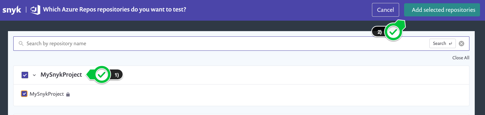
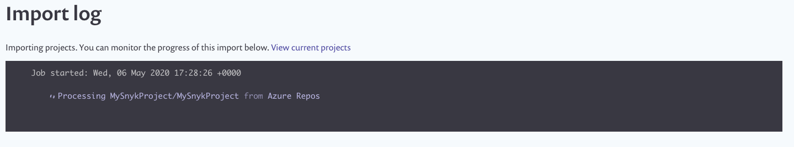

# Add Azure Repos repositories

Now that we've configured our integration, we can click on the `Add your Azure Repos repositories to Snyk` button:

In this case, we only have a single repository `MySnykProject` to scan. However, you can always return and add others. Let's select our repository and click the `Add selected repositories` button as illustrated in the following figure:

Once added, you may optionally browse the status of the import:

