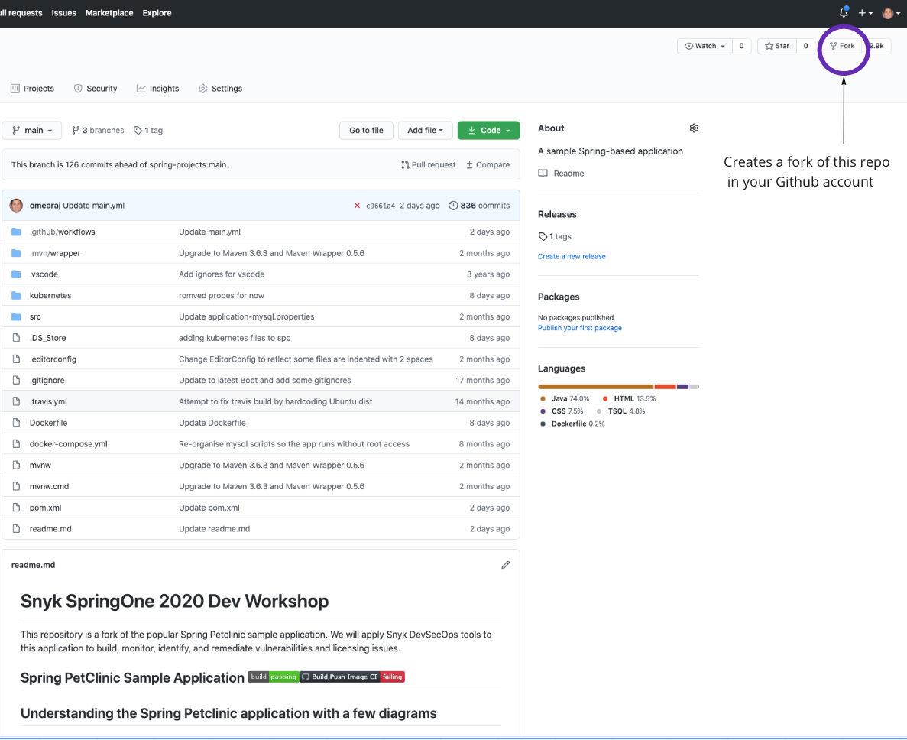

# Create Spring-Petclinic Repo

## Create an SPC repository

1. Open a browser and visit the GitHub[ snyk-partners/spring-petclinic ](https://github.com/snyk-partners/spring-petclinic)repository.
2. Use the fork workflow in the upper right-hand corner to create a copy of the Spring-Petclinic repo in your personal account. \(image 1\)

