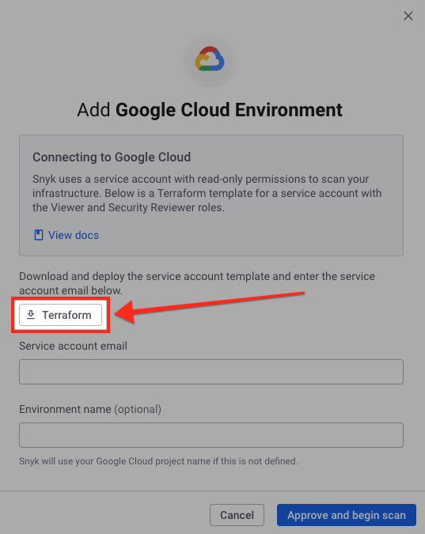

# Step 1: Download service account IaC template (Web UI)

Before you can create a Snyk Cloud Environment, you must download an infrastructure as code (IaC) template declaring a tightly-scoped Google service account that gives Snyk permission to scan the configuration of resources in your Google project.

The template also enables a set of [Google service APIs](https://cloud.google.com/service-usage/docs/enabled-service) for your Google Cloud project. This ensures that Snyk Cloud can utilize the necessary APIs to scan your project's resources.

You will use this IaC template to provision the role in [Step 2: Create the Google service account](step-2-create-the-google-service-account-api.md).

## Download the IaC template

1. In the [Snyk Web UI](https://app.snyk.io/), navigate to **Integrations > Cloud platforms**.
2. Select **Google Cloud**.
3. On the **Add Google Cloud Environment** modal, select the **Terraform** button to download a `snyk-permissions-google.tf` file:

<figure><figcaption>
The Snyk Cloud Add Google Cloud Environment modal
</figcaption></figure>

You can now proceed to [Step 2: Create the Google service account.](step-2-create-the-google-service-account-api.md)


You can also add a cloud environment from **Organization Settings (cog icon) > Cloud environments**. See [View Snyk Cloud Environments](../../view-snyk-cloud-environments.md#add-an-environment).

