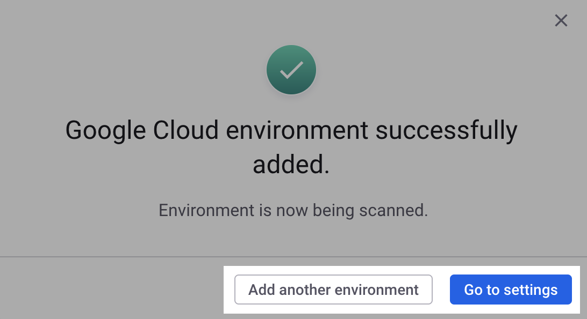

# Step 3: Create and scan a Snyk Cloud Environment for Google (Web UI)


**Recap**\
You have created the Google service account for Snyk Cloud. Now you can create and scan a Snyk Cloud Environment.


To create and scan a Snyk Cloud Environment for Google, you must provide the **Google service account's email address** and your **project ID**.

1. In the Snyk Web UI **Add Google Cloud Environment** modal where you downloaded the service account template, enter your service account email in the **Service account email** field.
2. Optionally, enter an environment name. If one is not provided, Snyk will use your Google project name.
3. Select **Approve and begin scan**.
4. You'll see a confirmation message: "Google Cloud environment successfully added." Select **Add another environment** to return to the **Add Google Cloud Environment** modal and onboard a new account, or select **Go to settings** if you are finished:

<figure><figcaption>
Success message after adding a Google Cloud environment in the Snyk Web UI
</figcaption></figure>


It can take Google 60 seconds or more to create your service account. If you try to create an environment immediately after you create a service account, and you receive a "could not validate credentials" error, wait at least 60 seconds and try again.


## What's next?

You can now view misconfiguration issues in the Snyk Web UI. See [Snyk Cloud issues](../../snyk-cloud-issues/) for more information.
