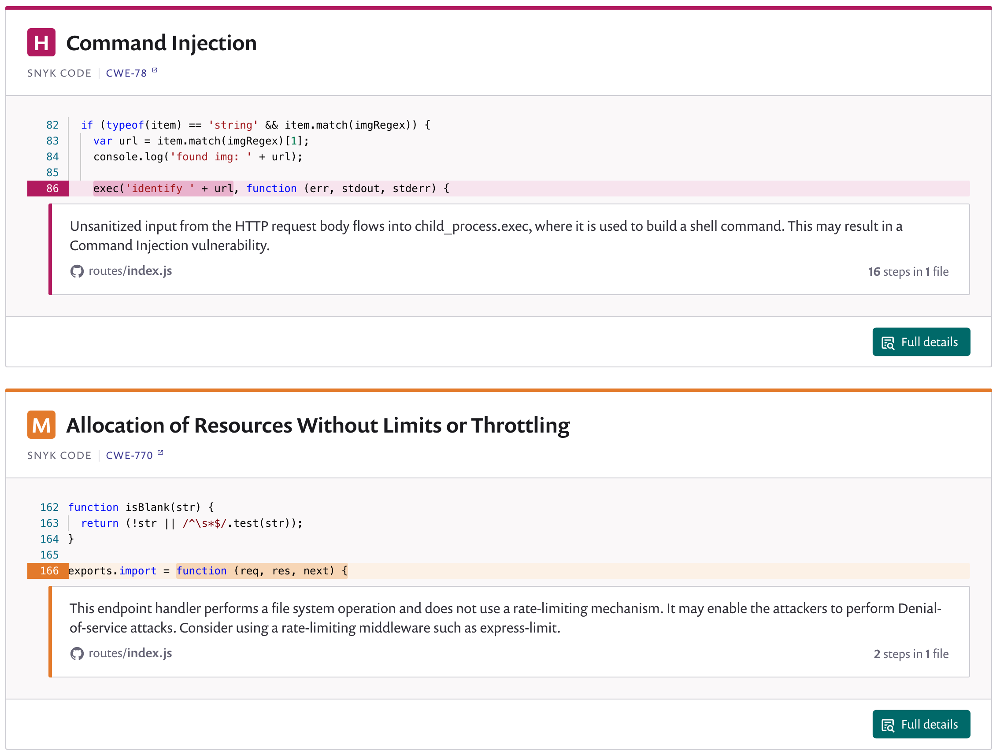

# Exploring and working with the Snyk Code results

## View vulnerabilities

You can now view vulnerability results for imported projects. The **Projects** tab appears by default after import, showing vulnerability information for projects you've imported.

1. Click on an imported project to see vulnerability information for that project, including the number of issues found, grouped by severity :
2. Click on an entry to open the issues view for that entry. For each issue, this shows the exploitable code snippet and a description of the code flaw that may lead to this vulnerability if not fixed:

See [View project information](https://docs.snyk.io/getting-started/introduction-to-snyk-projects/view-project-information) for more details.

## View issue details

Click **Full Details** on an issue to view more details about it, such as:

* **Data Flow**: The issue's taint flow from the source (the user input) to the sink (the operation that needs to receive clean input and can be exploited otherwise).
* **Fix Strategy**: An area that focuses on how to fix the problem with more details, references and code samples related to it.
